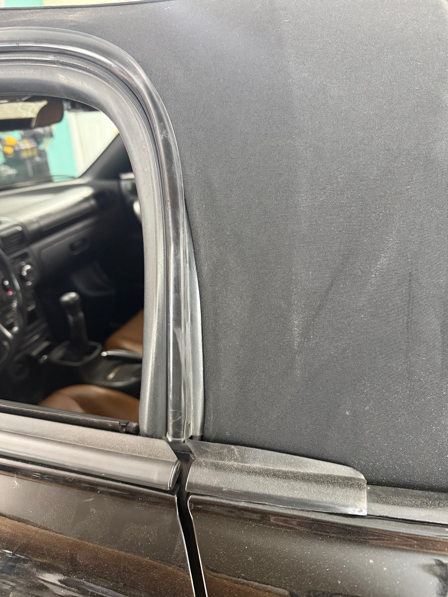
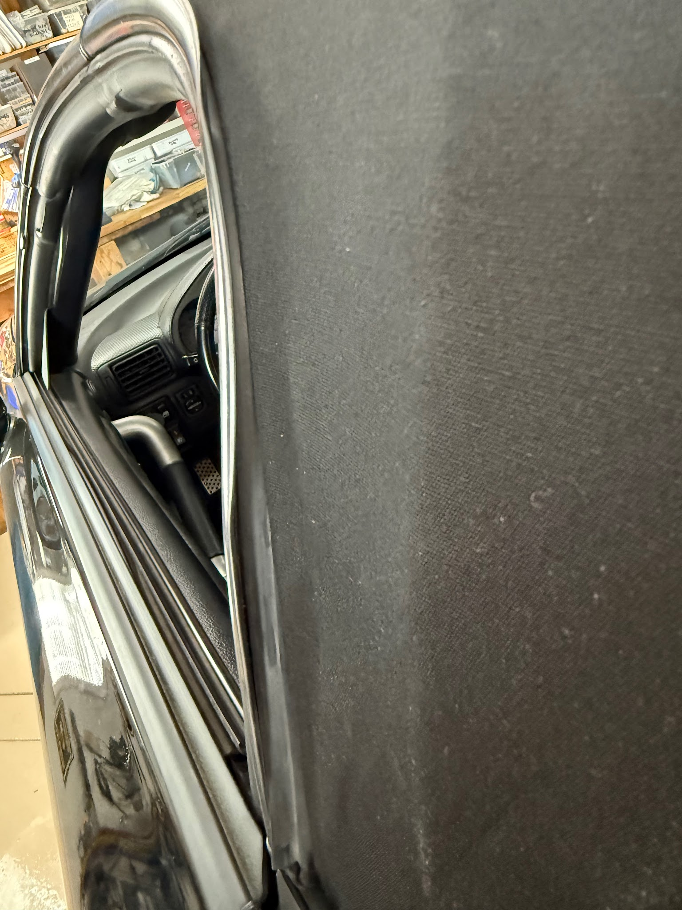
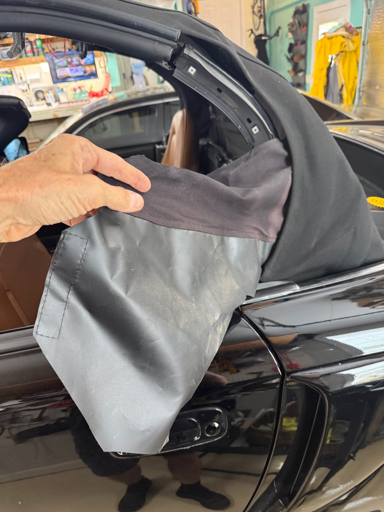
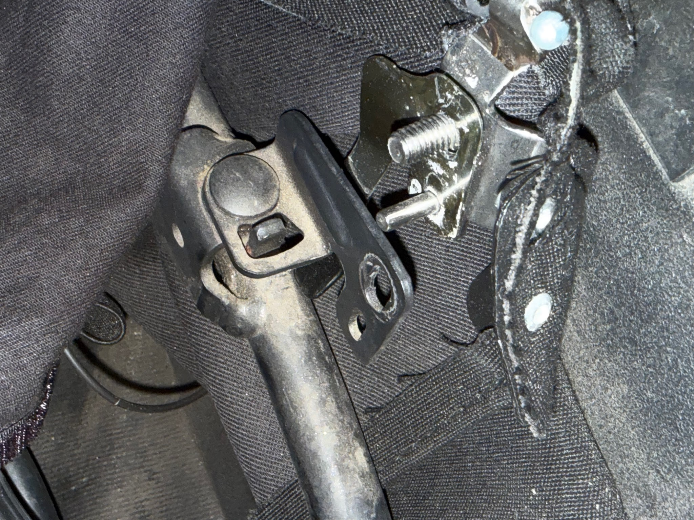
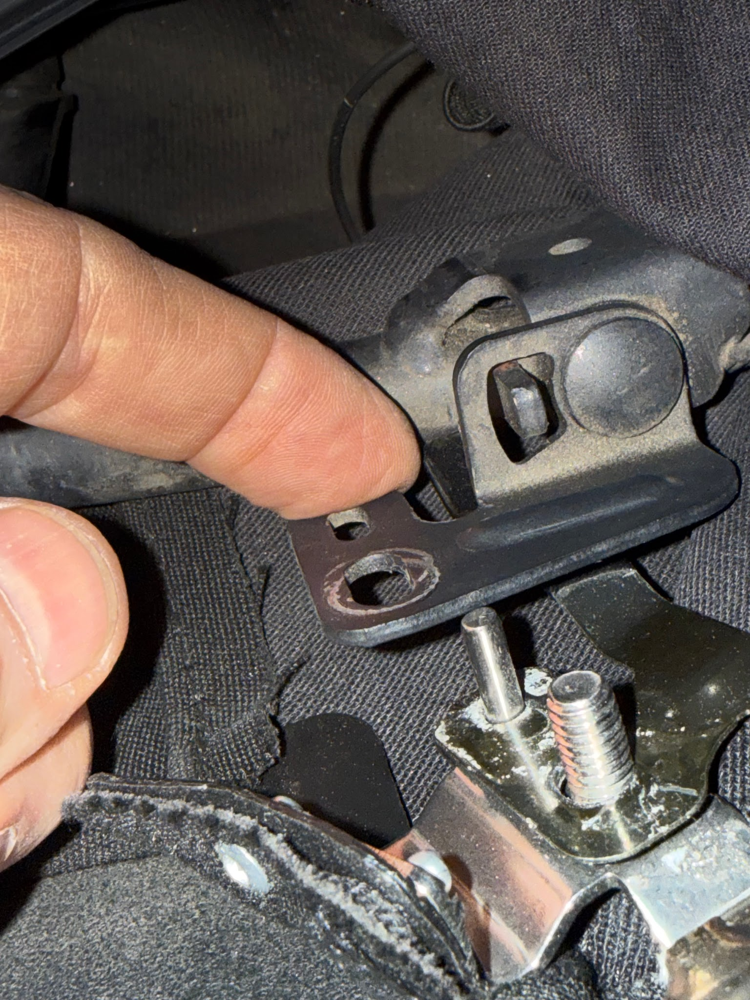
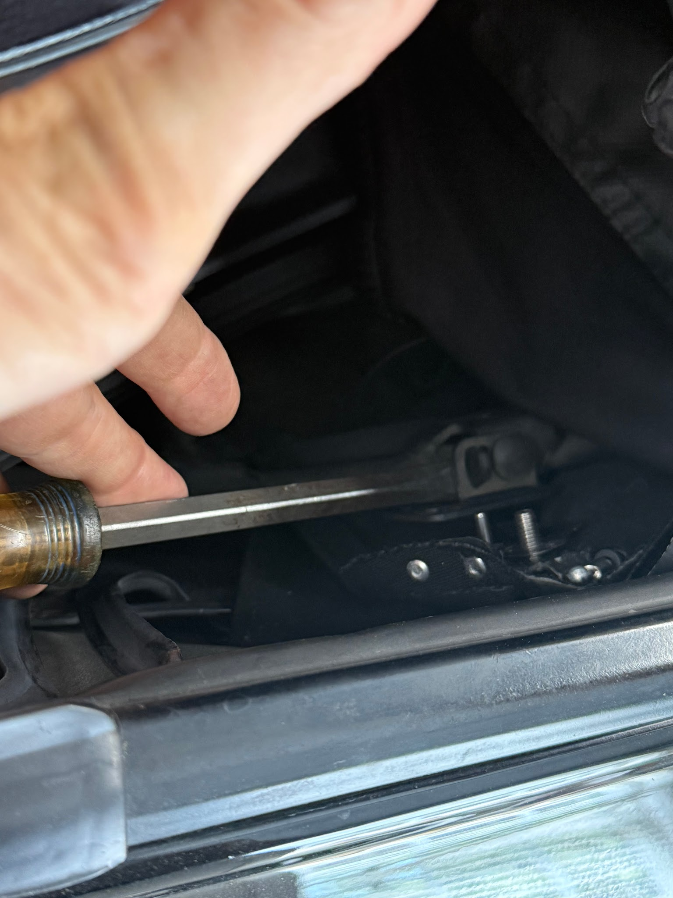
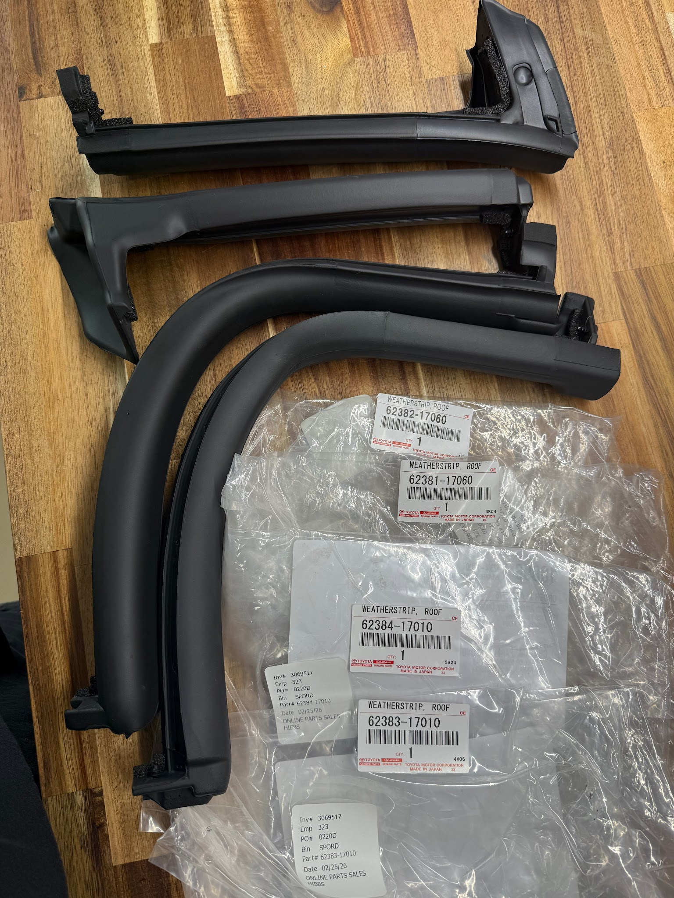
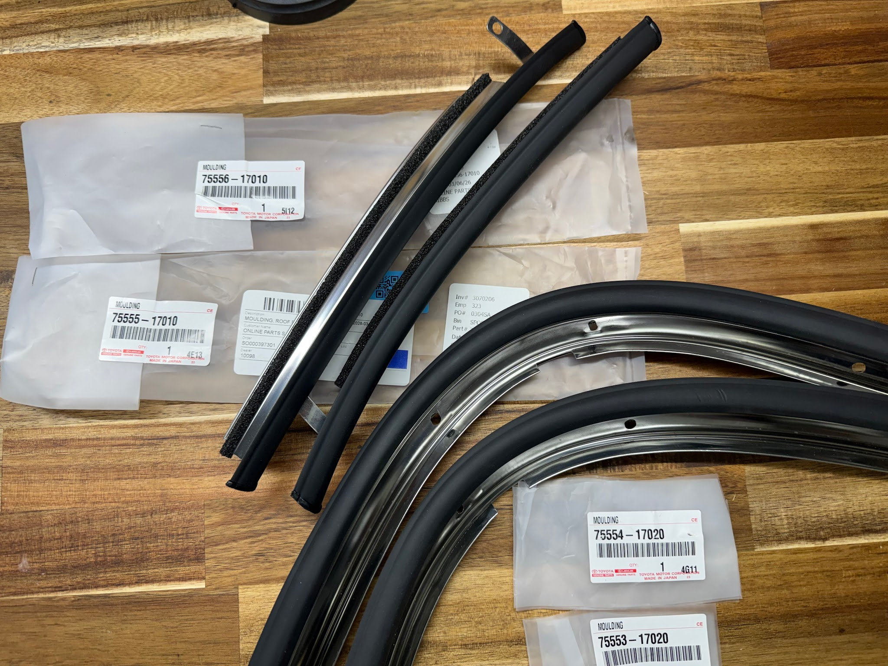
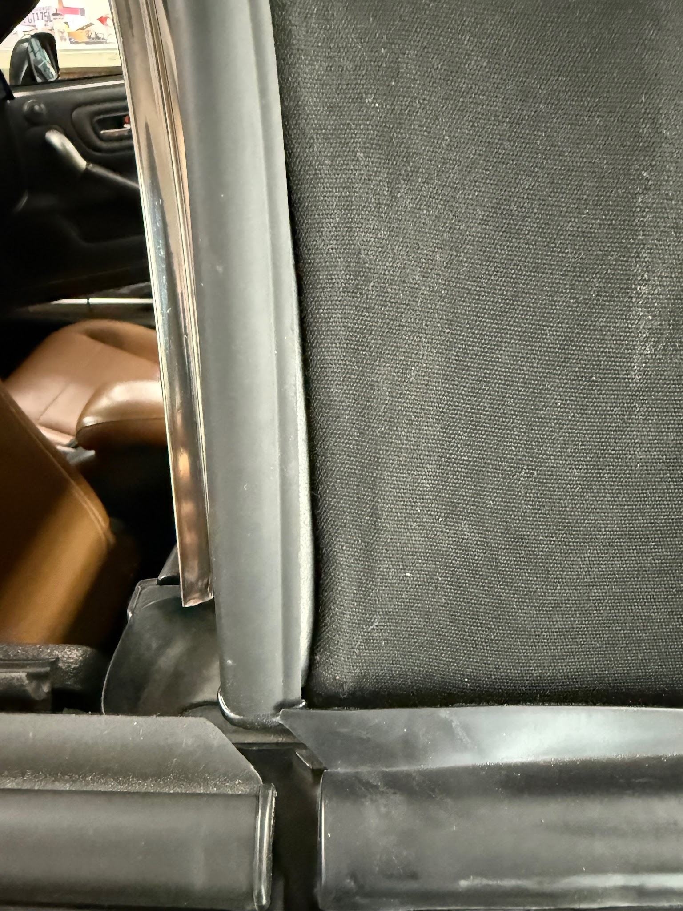

[← Chapter index](../README.md)

# Ragtop Gap Behind the Door

Composed by [cyclehead21@gmail.com](mailto:cyclehead21@gmail.com)

Feel free to copy and share  
Just give me a little credit

## Problem

The ragtop can have a gap at the back edge of the door glass, where the ragtop meets the raingutter.

## Cause

My theory is that the side cable gets caught in the rain gutter as you lower the top. If that happens, and you force the top further open, it will bend the rain gutter and possibly some of the brackets on the ragtop frame. My daughter bent hers very badly when her top was new. Then I bent my own on a cold day. I started to lower the top and it caught halfway down. I gave it a shove and it damaged the driver’s side only.

There are three things that contribute to the large gap:

1. Bent the stainless steel “rain gutter” piece
2. Slightly bent welded bracket on bow #4
3. Stainless steel clip adjusted the wrong way in its mounting slot

## Fix

### Stainless steel rain gutter

The stainless steel “rain gutter” piece is difficult to hammer back into shape if it’s bent. The outer surface has a rubber coating that is easily damaged while hammering.

The stainless steel sheet is very stiff and formed to a complex contour. It is hard to bend it back to the proper shape.

a) Try bending it back to shape. Use a block of wood to protect the rubber surface.

b) Replace the stainless steel piece with a new part

### Bent bracket on bow #4

This bracket is accessible with the top folded open. However you need to get a side flap out of the way for better access. The flap is secured to the diagonal nylon strap inside the top, with velcro on the exterior surface (out of sight). Separate the velcro strip and thread the entire flap out of the car. See photo below.

My black steel bracket was slightly bent downwards (with the top open). I pried it further away from the tube using a large screwdriver. Don’t go crazy, you just want to get a little movement. Prying upwards with the top folded, will translate to forward when the top is up. (You’re trying to move the lower attachment further forward of course.)

### Stainless steel bracket adjustment

The shiny stainless steel bracket is attached to the ragtop (it comes attached to the top). The bracket on bow #4 where it’s attached, has two slotted holes. The stainless bracket needs to be all the way upwards in the slots (full forward). Loosen the 10mm nut and slide the bracket all the way up.

## Photos

This is “before repair”. The gutter is bent in two places and there’s a big gap.

Rain gutter piece is bent:

Separate the Velcro strip from the diagonal nylon strap, and pull this side curtain out. Then you’ll have better access to the metal parts that need adjustment.

The stainless bracket is unbolted from the pivot bracket.

The gap where my finger is, was too small on my car. The bracket had been pushed rearward a little.

I pried the bracket upward using a big screwdriver. Just pry it enough to get a better gap (see my finger in the previous photo)

New rubber seals!

New stainless steel gutters!

After repair, and new parts installed.

---

*Publication status: Initial conversion 0.1. Formatting and cursory editorial check only; detailed technical review is pending.*
