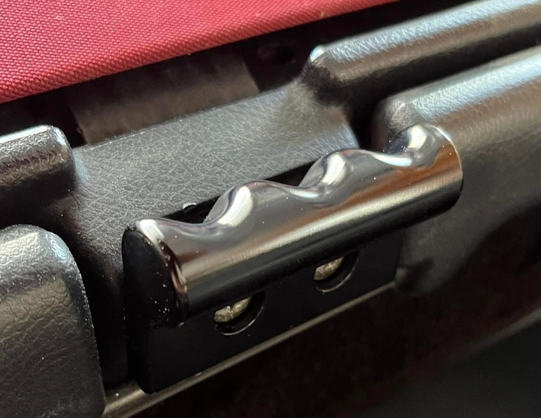
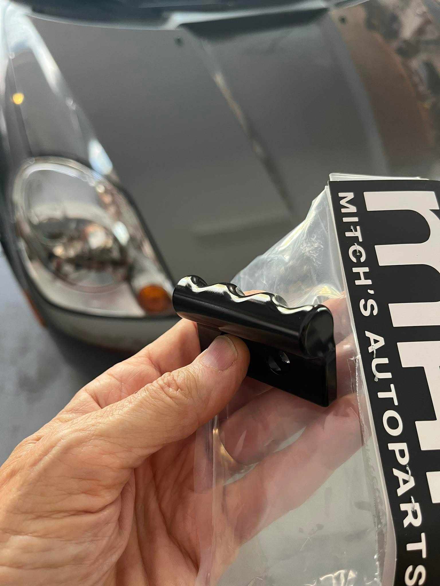
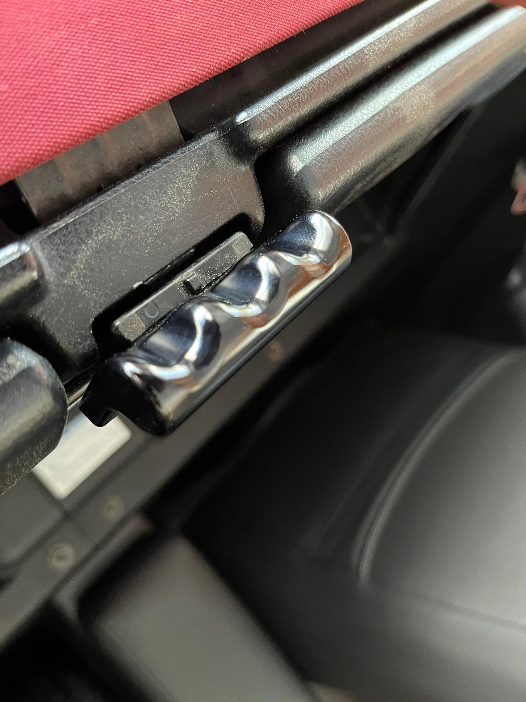

[← Chapter index](../README.md)

# Ragtop Pull Handle

[https://www.mitchsautoparts.com/products/cyclehead-pull-handle-billet](https://www.mitchsautoparts.com/products/cyclehead-pull-handle-billet)

I designed this handle when I got my new 3D printer. The plastic version worked okay, but Mitchs Auto Parts offered to make them out of solid aluminum. Oh my goodness - they are nice!

Glossy smooth handle, made from solid aluminum, with finger grips. It mounts in place of the curved metal handle (the one that always loses its “pull” plate).

Does not interfere with the wind deflector.

Note: I got two of the finished handles in payment off my design. I’m thrilled!

---

*Publication status: Initial conversion 0.1. Formatting and cursory editorial check only; detailed technical review is pending.*
