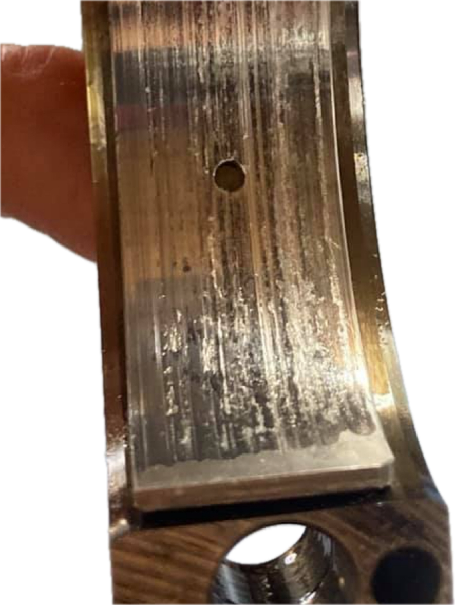
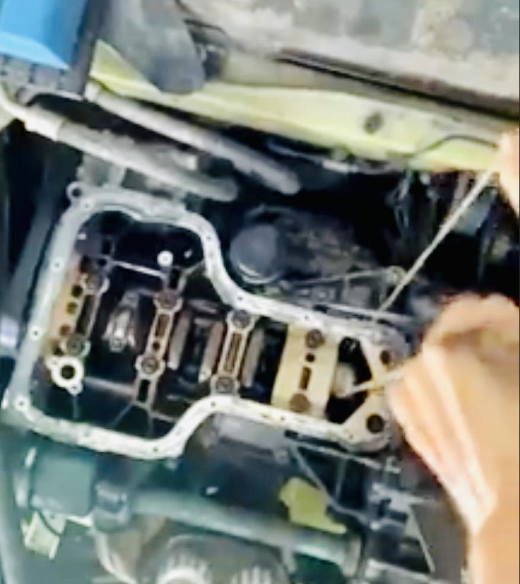
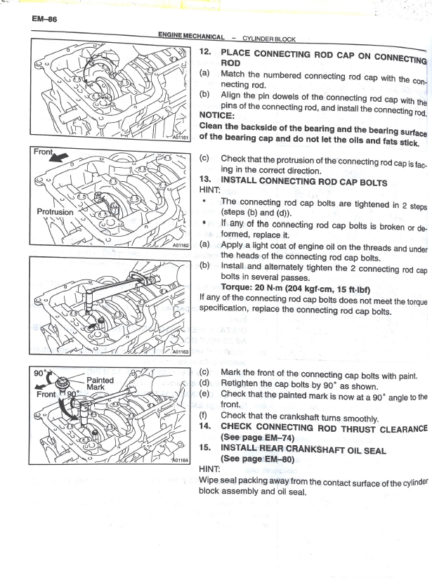
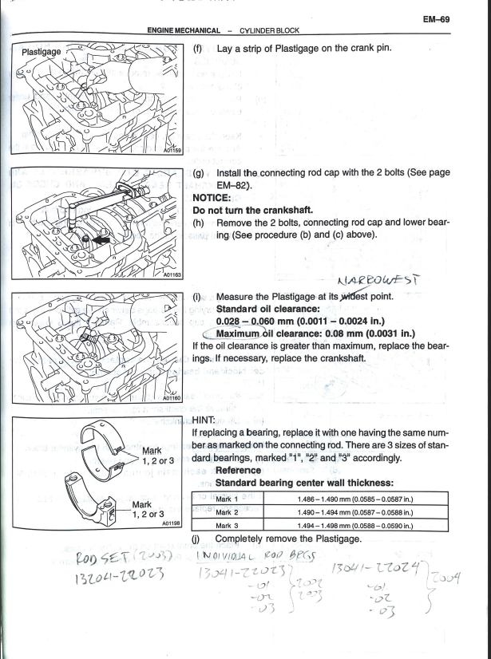
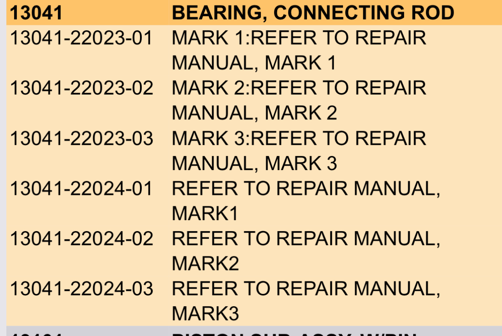
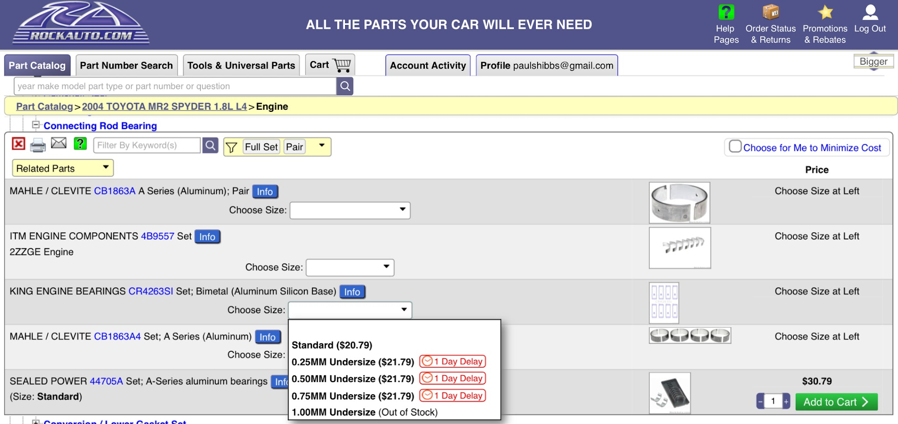

[← Chapter index](../README.md)

# 
Rod Bearings

Compiled by [cyclehead21@gmail.com](mailto:cyclehead21@gmail.com)

Feel free to share, just give me a little credit!

Edited July 2025

I’ve repaired two spyders (so far) with significant rod knock. I replaced rod bearings in #1 and #4 on each engine. BOTH of the cars are running smoothly and reliably to date. 20,000 miles on one of them since the repair was completed!

Rod knock is usually audible with the car at rest, and revving between 2000 to 3000 rpm. The knocking noise appears as you lift off the throttle while “blipping” the gas pedal.

On the spyder, rod #4 is usually the first to experience damage. Rod #1 is probably the second most likely.

[https://www.spyderchat.com/posts/509215/](https://www.spyderchat.com/posts/509215/)

[https://www.facebook.com/groups/ToyotaMR2Spyder/permalink/10158359658738612/](https://www.facebook.com/groups/ToyotaMR2Spyder/permalink/10158359658738612/)

[https://www.spyderchat.com/posts/2151633/](https://www.spyderchat.com/posts/2151633/)

Check rod gaps with plastigage. I fixed two spyders with knocking rods (so far) following Cap’s process, using new max-size rod bearings (“Mark 3” size). I polished the crank rod journals with 600 grit sandpaper and a piece of string and a little dab of oil. I used the string like a shoe-shine-boy to rotate the sandpaper around the journal. Video

[https://www.facebook.com/paul.hibbs.79/videos/10220819065564000/?idorvanity=2305223611](https://www.facebook.com/paul.hibbs.79/videos/10220819065564000/?idorvanity=2305223611)

If the clearances are not perfect, you can use the “aluminum foil” idea to dial in the clearance very accurately. I didn’t have any trouble with the foil staying in position inside the rod cap. Just snap the bearing over it and continue reassembly. The aluminum foil reduces the gap by about .0005. Or ½ thousandth of an inch per each layer of foil. Note that aluminum foil shim(s) are installed ONLY under the rod cap. NOT UNDER THE ROD! Compression loads under the rod (down stroke) are too high and would smash the aluminum shim. Piston return loads (up stroke) under the rod cap are much lower.

Following Cap’s recommendations, I ordered a set of maximum thickness factory bearings to start. (“Mark 3” size). Then I added aluminum foil shims to get the gaps perfectly in blueprint range. Only two of the rods needed shims, (#1 and #4)

## Cap’s Notes

Caps 100,000 Mi Inspection & Service:

[https://www.spyderchat.com/posts/509215/](https://www.spyderchat.com/posts/509215/)

Be Careful and CLEAN... Don't forget the TWO-STEP rod bolt torque process. It will go bad if you forget the second step.. It's happened here before.

Keep the bearing on the wide side of the spec... as an abused crank journal is not round, and it needs clearance to get the oil in.

From Cap's funny-engine noise post:

> "...long RH sweeping turn..." = Starved #4 Rod. It may be slightly loose just now, waiting to explode later on. Cheap insurance is to drop the pan and do the plastigage check.

Caps “Funny engine noise” post:

[http://www.spyderchat.com/forums/showthread.php?28540-How-to-diagnose-engine-compartment-rattles&p=456153&viewfull=1#post456153](http://www.spyderchat.com/forums/showthread.php?28540-How-to-diagnose-engine-compartment-rattles&p=456153&viewfull=1#post456153)

## Toyota Bearing Shell Part Numbers

- -22023 suffix is for 2002-2003 spyders.
- -22024 suffix is for 2004 spyders.
- Verify before you order factory bearings.

Rod bearing sizes from Toyota are:

- Mark I (0 undersize journal diameter)
- Mark II (.008mm undersize journal diameter)
- Mark III (.016mm undersize journal diameter)

Note that aftermarket bearings (bearings not made by Toyota) typically offer “Standard, .25mm, .50mm” undersize etc. The undersize aftermarket bearings can ONLY be used with a crankshaft that has been removed from the car and ground undersize. I suspect that you will get a “Mark I” size factory bearing if you order a “standard” aftermarket bearing. Check using plastigage to be certain!

### Additional Source Images

*The source Word document contains the following four embedded images at the end. They appear black/blank in the source and are preserved unchanged in this conversion.*

---

*Publication status: Initial conversion 0.1. Formatting and cursory editorial check only; detailed technical review is pending.*
