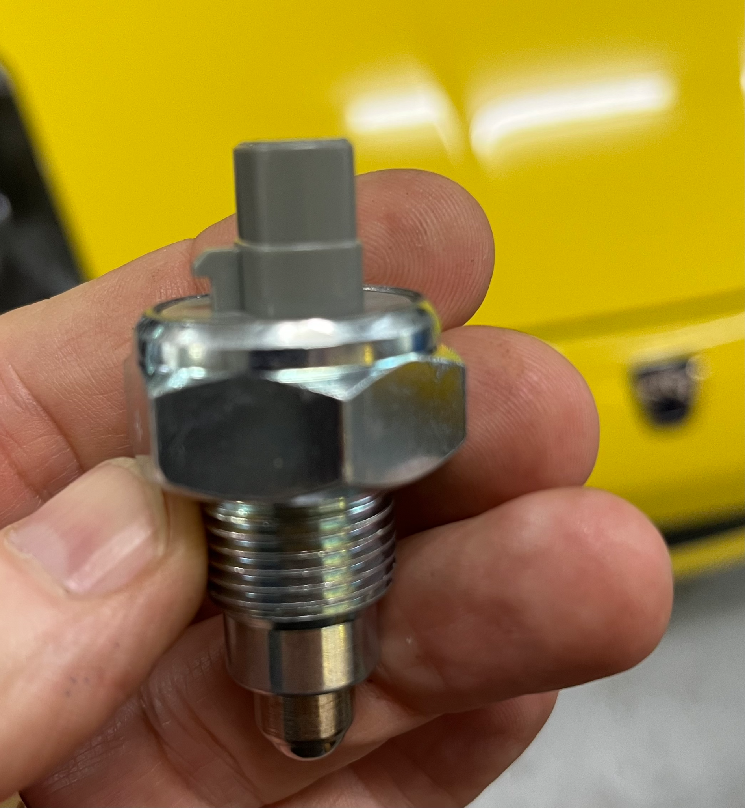
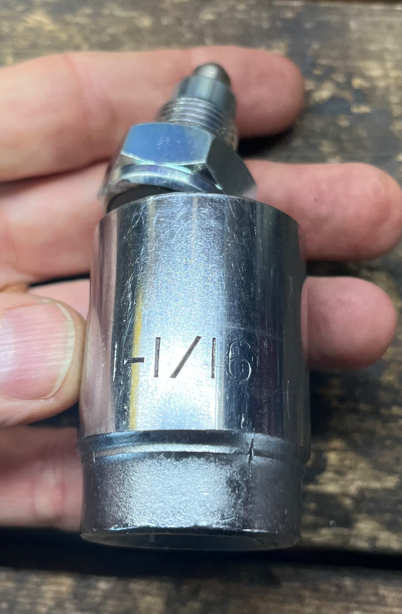
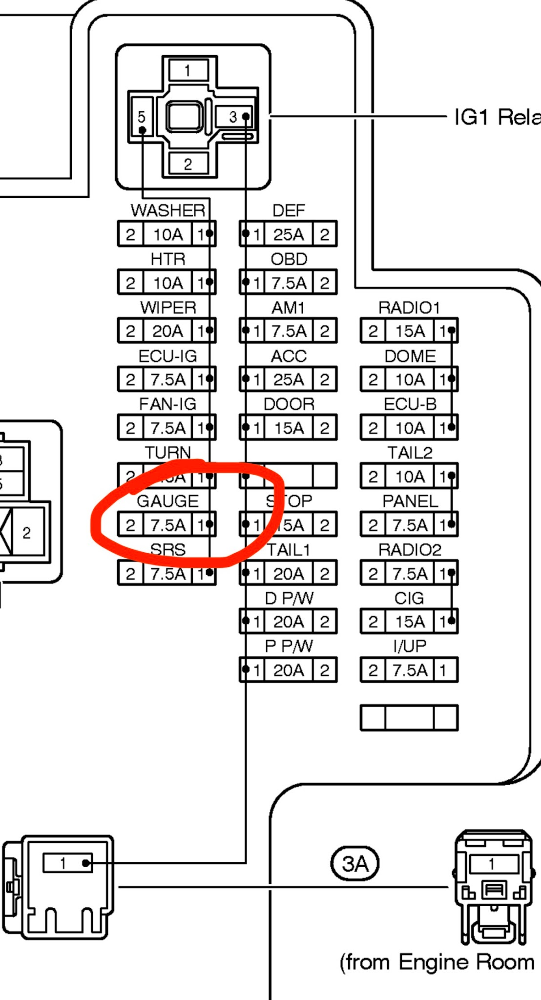
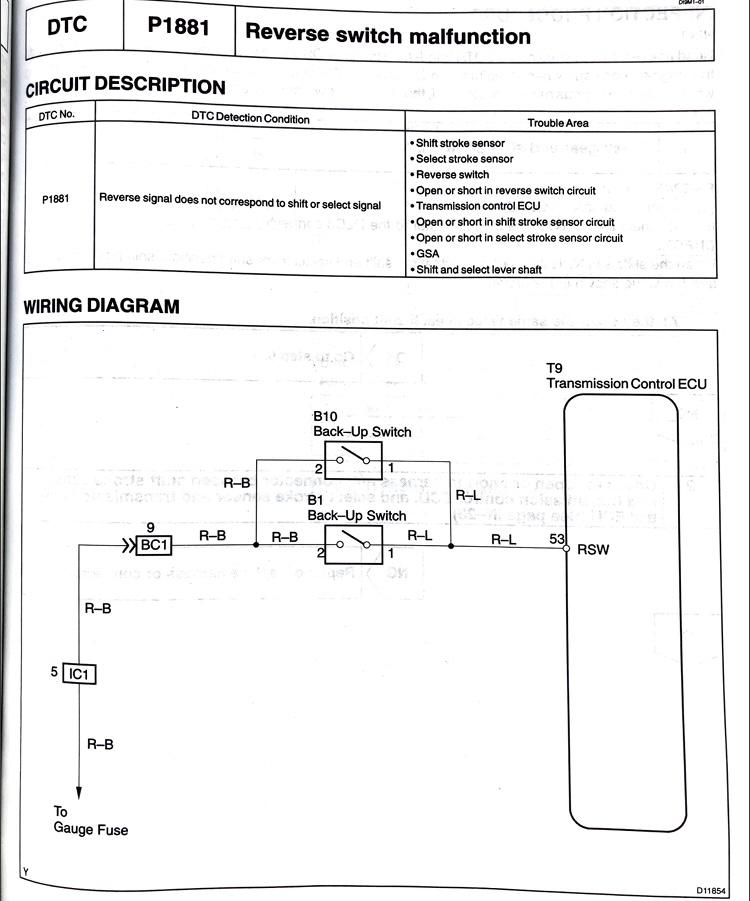
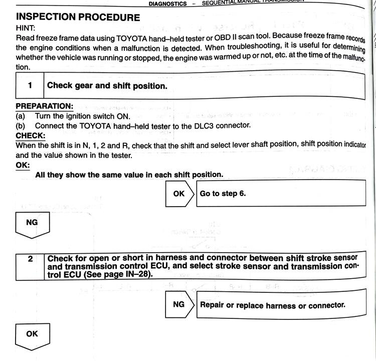
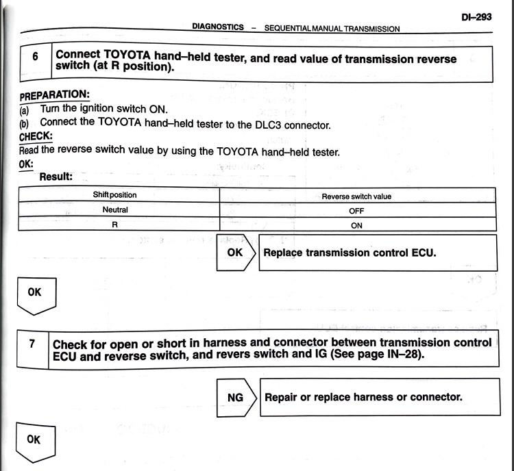
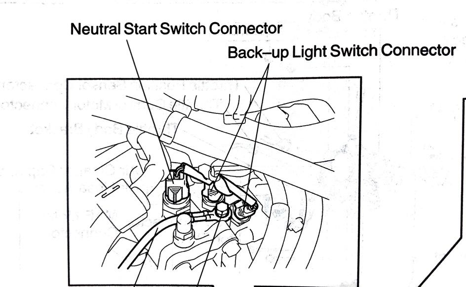
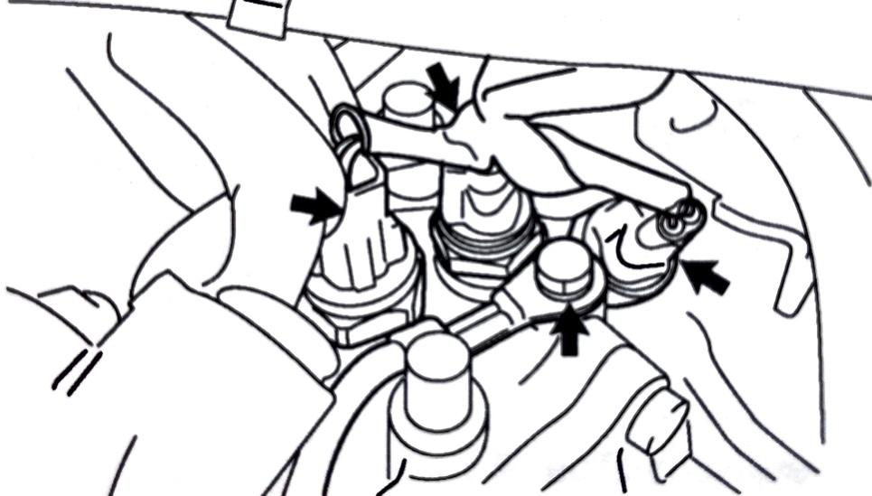
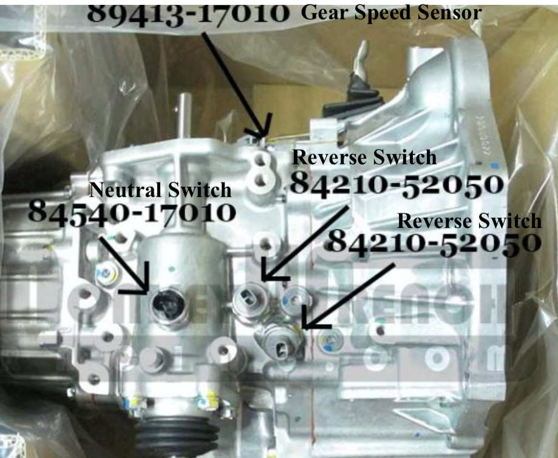

[← Chapter index](../README.md)

# SMT - Reverse and Neutral Switches

Composed by [Cyclehead21@gmail.com](mailto:Cyclehead21@gmail.com), Jan 2023

Feel free to copy and share, just give me a little credit!

 

## Background

There are three switches in close proximity to each other on top of the SMT transmission. One is a neutral-start switch. The other two switches are the “back-up light” or “reverse” switches. (Obviously the term “back up light” is misleading as the TCU uses their input in shifting operations). Sketch below shows which switch is which.

All of the switches are a little difficult to access, as they are buried beneath wire harness bundles. It will be easier to reach them if you remove the top half of the air intake box, and possibly remove the whole air intake tube back to the throttle body. A 1 1/16 inch socket will fit them. (or 27mm socket)

They are easy to bench test since they are simple on/off switches. Use a test light or VOM to check for continuity (on/off) as you press the plunger on the bench.

## Reverse Switch (Part No. 84210-52050)

The SMT system uses two identical switches to confirm the transmission has engaged reverse gear. I’m not sure why they use two of them since either one will satisfy the TCU (both switches are wired in parallel).

Part number 84210-12040 is superseded by part number 84210-52050. This same switch is used on quite a few Toyota models besides the spyder.

Monkeywrenchracing.com has them for $28. Discount websites have them for about the same price. Aliexpress has them for as low at $4.

When the switches fail to close the circuit, it appears to cause trouble with engaging reverse gear only. (Because low hydraulic pressure would result in difficulty engaging both reverse and first gear).

When either of the reverse switches fail by shorting either contact to ground, it will blow the gauge cluster fuse (labeled “gauge”), and will refuse to start the engine. This failure causes one or both pins to short to the switch housing.

The two reverse switches are side-by-side, adjacent to the ground cable that is bolted to the transmission. (See sketch below for location)

**Note:** One time I found a reverse switch that was shorting to ground internally. This blew the “gauge” fuse in the driver’s door fuse box, which locked the gearshift knob! Problem was temporarily fixed by simply unplugging the bad reverse switch. (The other switch continues to signal the TCU and turn on the reverse light bulbs)

Internal parts of a reverse switch. Video: [https://youtube.com/shorts/JVPEPX_VDYU?feature=share](https://youtube.com/shorts/JVPEPX_VDYU?feature=share)

## Neutral Switch (Part No. 84540-17010)

The neutral switch (if failed) will throw a gear warning light (P0850), and disable the starter.

Or… it can also disable reverse gear! My failed reverse switch made it impossible to shift into reverse. It started by acting stubborn, only shifting into reverse after many tries. Then finally it refused to shift into reverse, no matter how many times I tried. (Neutral light flashes when reverse shift fails) I replaced both reverse switches and the problem persisted. Finally resolved when I replaced the neutral switch.

Here’s how a sketchy neutral switch behaves:

[https://youtube.com/shorts/BcdrzBooen8?si=1eR14YmGWKd-gI7f](https://youtube.com/shorts/BcdrzBooen8?si=1eR14YmGWKd-gI7f)

Monkeywrenchracing and the normal toyota parts wholesalers are asking $140 each for this switch! However it is available on ebay for about $27 (from Latvia). Currently it’s also available on Amazon for $30!

This same switch is also used on 2005-2011 Toyota Yaris, 2005-2014 TOYOTA AYGO

Possible alternate part numbers: CITROËN:2257 55, PEUGEOT:2257 55, TOYOTA:84540-70020 (not confirmed)

Facet (made in Italy) Part Number 7.6295.(confirmed)

**Update: CHECK FOR DIFFERENT PART NUMBERS ON 5 speed vs 6 speed transmissions!**

## Random troubleshooting tips

1. The car won’t start if you have the three switches unplugged.
2. The car won’t start if you have both reverse switches unplugged
3. Twice I have seen a reverse switch fail internally! It will blow the fuse powering the gauge cluster, and all instrument needles will read zero. The car will not start. It may throw an error code for reverse OR neutral switch failure. One time this happened with a newly replaced reverse switch. Note: it should be possible to simply unplug the shorted switch and return the car to normal operation - because the switches are wired in parallel.
4. Reverse-gear episode: My SMT would randomly refuse to engage reverse gear. Everything else worked correctly. I assumed one of these three switches was bad, but they all tested good. I even tried replacing all three with new switches. Apparently the “shift” position sensor was acting flaky, sending erratic signals to the TCU. I swapped in a used shift position sensor and (at first) techstream was making me crazy, with failed relearns, dark gear display, randomly shifting into 4th gear. After FIVE repetitions of disconnecting the battery and attempting techstream relearn, it FINALLY ran through the self-relearn sequence and completed with a green neutral light. Success. I believe waiting 45 minutes with battery disconnected was instrumental in the successful relearn.

## Factory manual diagnostic pages

Factory manual diagnostic pages are below:

---
