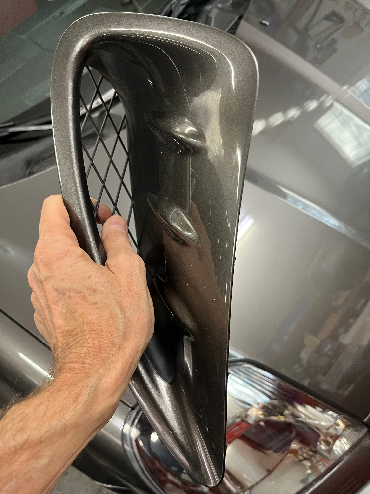
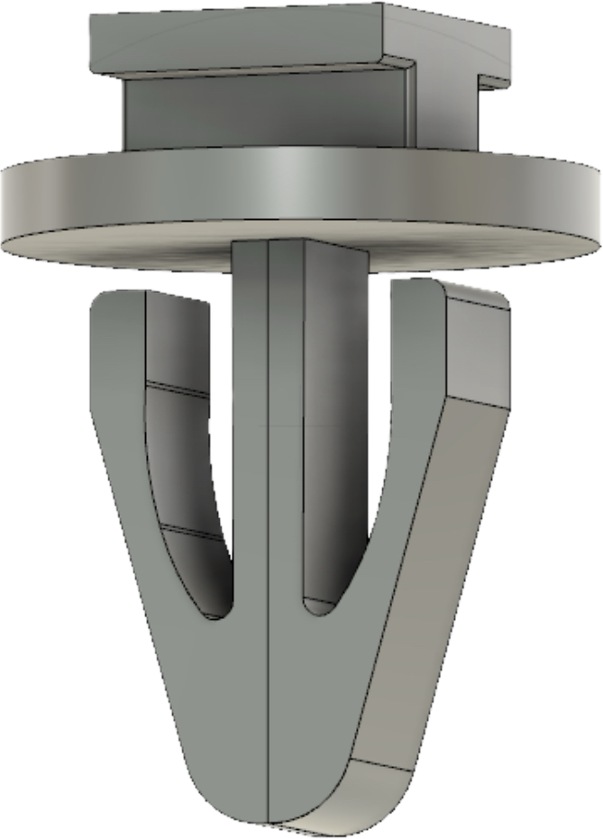
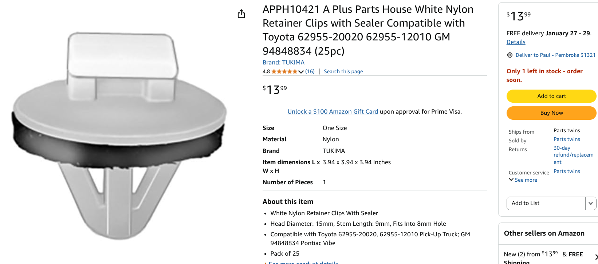

[← Chapter index](../README.md)

# Side Vents - Removal and Clips

Written by [Cyclehead21@gmail.com](mailto:Cyclehead21@gmail.com)

Feel free to share, copy, and duplicate, just give me a little credit

Updated June 2025

The spyder has two vents on the side of the car, just behind the doors.

Prefacelift, and facelift spyders both use the same style of clips to install the vents - even though the vents themselves are quite different in appearance.

Each vent is held with three plastic “barb” clips. After 20 years, they are very brittle and stiff. It is unlikely they will compress and allow you to remove them without breaking, or bending the thin sheetmetal of the fender.

Some youtube videos show how to pry on the front of the vents. This risks scratching the paint, bending the sheetmetal flanges, or tearing the vent itself (the vent has square molded slots for the clips).

The safest way to remove the vents is through the wheel well. Remove the wheel, remove the wheel well liner, then reach inside the fender. Use a pair of wire cutters (side cutters) to cut the end off each plastic clip (3 on each vent). This will cut off the plastic barb and allow you to remove the vent without damage.

Note that the lowest clip is installed vertically, and the two upper clips are installed horizontally.

New clips are installed to the vent via rectangular slots. When all three clips are attached to the vent, you simply press the vent into place and the clips snap into the sheetmetal holes in the fender and hold it securely.

Toyota part number for the vent clips is: **62955-12010**

I have modeled the clips in CAD and have made the STL file available for anyone that wants to print some new clips for pennies.

[Link to the 3D-printable clip model](https://www.thingiverse.com/thing:6951994)

---
