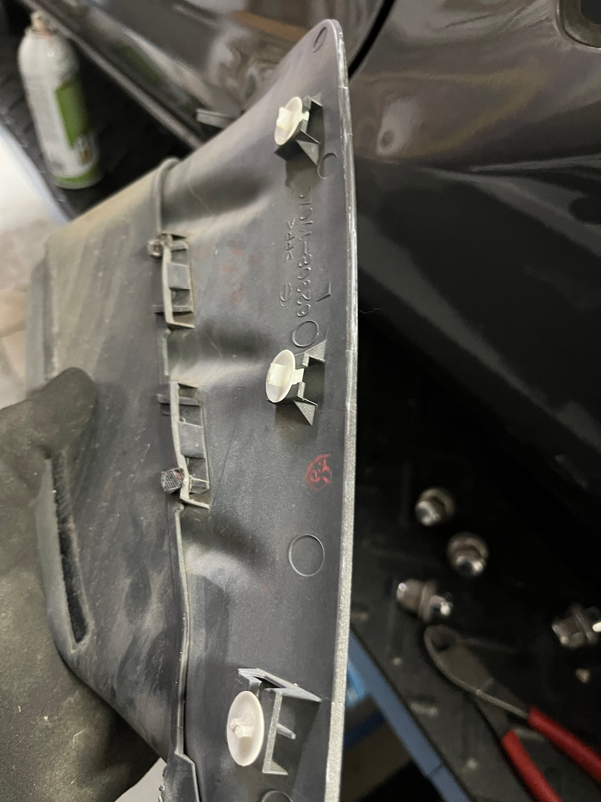
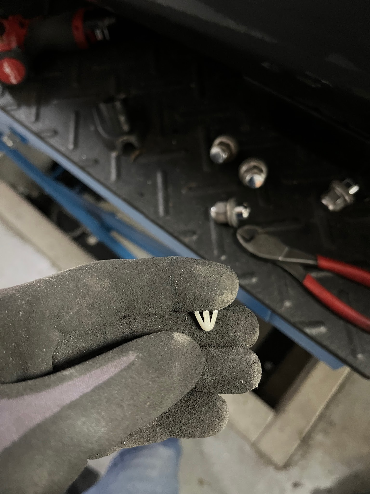
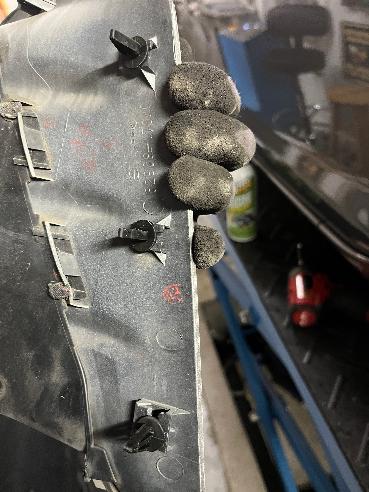

[← Chapter index](../README.md)

# Side Air Vent Removal

Composed by [Cyclehead21@gmail.com](mailto:Cyclehead21@gmail.com)

The air intakes on the rear fenders may need to be removed to access the ragtop drains. They are held in place with three plastic clips on the front edge. The clips are very stiff and usually brittle with age. If you force them, they can damage the plastic air vent or bend the metal flange (plus risk damaging the paint).

It may be possible to squeeze the plastic barbs with a pair of pliers from inside the fender, but access is very limited and completely blind. You must reach your entire arm into the fender from the wheel well to attempt this.

I think it’s easier to cut the tips off the barbs using a pair of side cutters. (Also a blind exercise, also requiring you to insert your whole arm into the fender from the wheel well).

The tips of the clips have all been cut off to allow removal. Notice that the top two barbs are oriented horizontally, and the bottom barbs are oriented vertically.

The tip has been cut off the old clip, removing the barbs.

I designed some 3D printed clips. They are a little longer than the originals. I wanted the barbs to be more flexible.

[Link to the 3D-printable clip design](https://www.thingiverse.com/thing:6951994)

---

*Publication status: Initial conversion 0.1. Formatting and cursory editorial check only; detailed technical review is pending.*
