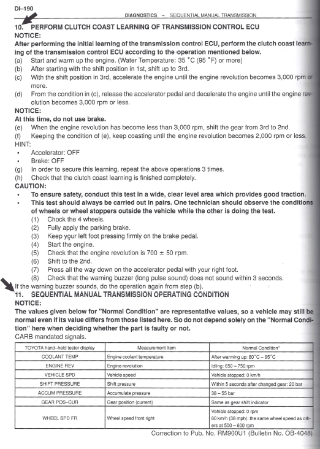

# SMT - Clutch Grab Point Relearn

## Procedure

1. Warm up the car to normal operating temperature.
2. Find a straight stretch of deserted roadway.
3. Engage first gear and start driving.
4. Shift directly from 1st to 3rd gear (hit the shift button twice, quickly).
5. While in 3rd gear, accelerate over 3,000 RPM.
6. Coast without braking until the RPM drops below 3,000 RPM.
7. Downshift into 2nd gear.
8. Coast without braking until the RPM drops below 2,000 RPM.
9. Brake and stop the car.

Repeat steps 3 through 9.
Repeat 3 times.

## Toyota reference procedure

The Toyota procedure is reproduced below.

