# SMT Fluid Discussion

Written by Cyclehead21@gmail.com

Updated September 2026

Feel free to share, copy, and duplicate

Just give me a little credit

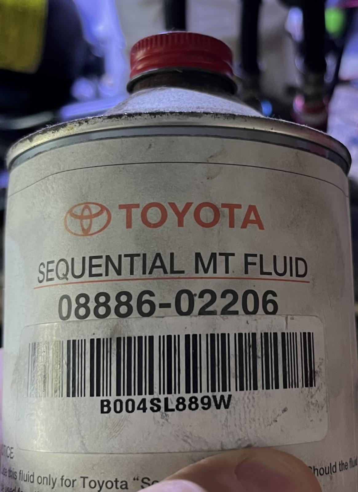

## Contents

- [Conclusion](#conclusion)
- [Discussion](#discussion)
  - [Maintenance](#maintenance)
  - [Misinformation](#misinformation)
  - [Fluid Identification](#fluid-identification)
  - [Stickers Say “Brake Fluid”](#stickers-say-brake-fluid)
  - [Pump Designer Specifies DOT 3](#pump-designer-specifies-dot-3)
  - [Failures](#failures)
  - [Brake System Similarities](#brake-system-similarities)
  - [Observations](#observations)
- [Recommendations](#recommendations)
- [References and Sources](#references-and-sources)
- [Photos and Videos](#photos-and-videos)

## Conclusion

Toyota sells some very expensive, proprietary fluid for the SMT system. However, cheap DOT 3 or DOT 4 brake fluid works perfectly well in the SMT system. Other SMT owners and I have been using DOT 3 / DOT 4 brake fluid for over a decade, and it has worked perfectly well in the SMT system without problems or failures.

## Discussion

### Maintenance

There is absolutely no maintenance schedule recommended by Toyota for the SMT system. Ever. This is a horrible oversight by Toyota, as the brake fluid in the system absorbs moisture. A neglected SMT system will suffer the same failures as a neglected automotive braking system - deposits will form, moisture will damage the aluminum and steel components, etc.

### Misinformation

Toyota publishes misinformation about some features of the SMT system. I assume it is a result of ignorance about how the system functions.

Specifically: The Toyota SMT system maintenance instructions require “depressurizing the system” prior to unscrewing the reservoir cap. However, the plastic cap has a vent hole that is open to the atmosphere! Toyota’s “depressurizing” requirement is simply incorrect.

For a while, I mistakenly recommended mixing “food grade” castor oil with brake fluid to make your own mix of SMT fluid. This was not accurate. Food-grade castor oil is not the same as the ethoxylated/propoxylated castor oil that Castrol adds to the SMT Fluid. It has different mixing and lubrication properties. I quit recommending the mix around 2018 I think.

### Fluid Identification

Definitive identification of SMT Fluid has been located in Toyota documentation:

Toyota’s Japan website publishes the Safety Data Sheet (SDS) for Sequential M/T Fluid 08886-02206. The SDS identifies the product as Castrol TLX 988D, a glycol-based brake fluid containing no more than 10% ethoxylated/propoxylated castor oil (CAS 72986-44-8).

SpyderChat contributors discussed the fluid’s composition using Castrol safety data and information reportedly obtained from LuK.

References:

<https://www.spyderchat.com/posts/792609/>

<https://www.spyderchat.com/posts/1931722/>

<https://www.spyderchat.com/posts/811828/>

<https://www.spyderchat.com/threads/caution-dont-use-pentosin.42728/#replies>

Background info: Castor oil is a vegetable oil, squeezed from castor beans. It was widely used in automobiles, motorcycles and aircraft engines as a lubricant from 1900 -1940s. It is used in old Rolls Royce and Peugeot braking systems as an additive lubricant. Native castor oil suffers from rapid oxidation, gummy deposits, sludge and a tendency to thicken. The SMT fluid instead contains ethoxylated/propoxylated castor oil. Its properties should not be assumed to be the same as those of ordinary castor oil.

The Toyota Japan website below publishes SDS sheets for SMT fluid. The linked page identifies SMT Fluid 08886-02206 as Castrol TLX 988D. (Link to Japanese language site, and screenshot of the same page are shown.) <https://toyota.jp/after_service/tenken/driver/maintenance/sds/>

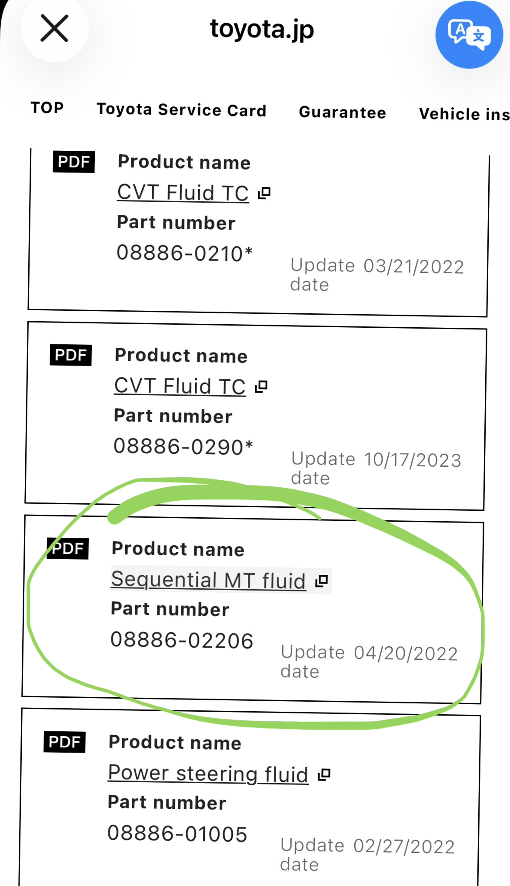

Here is the SDS for Castrol TLX 988D:

(<https://toyota.jp/pages/contents/after_service/tenken/driver/maintenance/sds/pdf/Hydraulic_oil/08886-02206_202205.pdf>)

The SDS states the usage is “brake fluid” and indicates the SMT fluid is supplied to Toyota by Castrol, and the Castrol Chemical/Product name is TLX 988D.

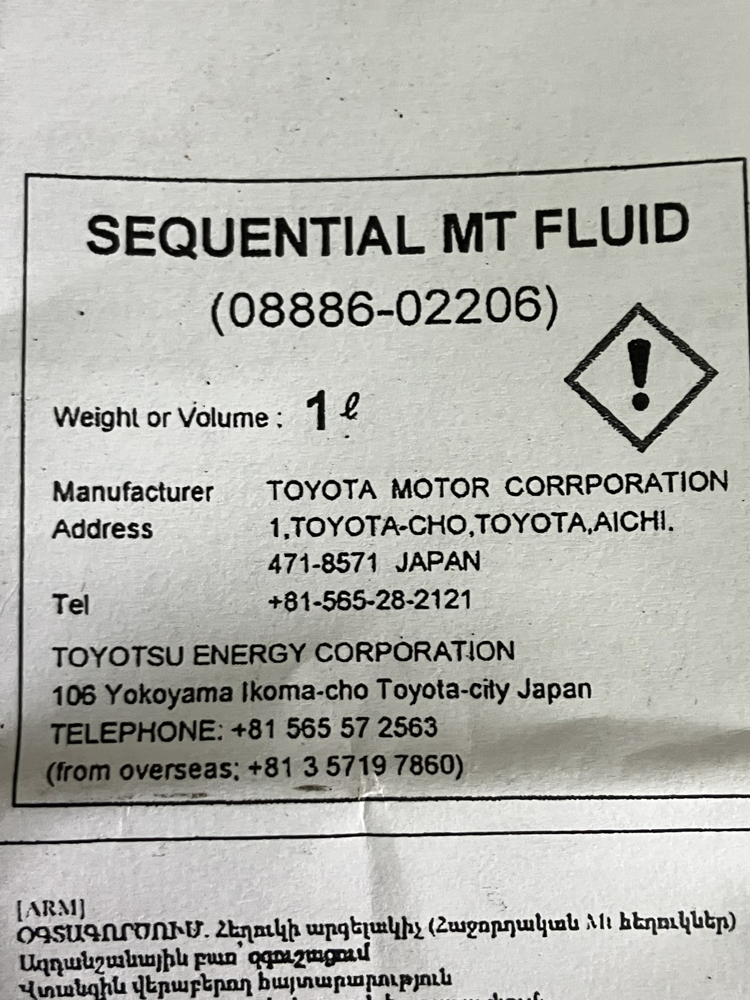

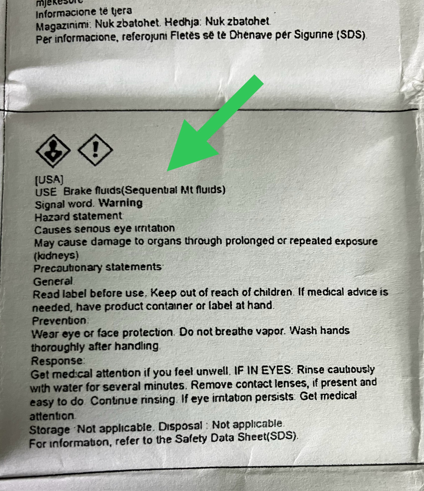

Below is a translation and summary of the SDS for Castrol TLX 988D (in case you don’t read Japanese):

2022 Toyota-hosted SDS

Toyota file path/name: .../Hydraulic_oil/08886-02206_202205.pdf

2022 composition section
Toyota hosts an SDS under the file name 08886-02206.pdf. The 2009 SDS identifies the product as TLX 988D and its use as brake fluid. The 2022 Toyota-hosted SDS identifies the product as Castrol TLX 988D, again describes its use as brake fluid, and lists ethoxylated/propoxylated castor oil (CAS 72986-44-8) at ≤10%.

Toyota source URLs:
 2009: <https://toyota.jp/pages/contents/after_service/car_care/yohin/sds/pdf/Hydraulic_oil/08886-02206.pdf>
 2022: <https://toyota.jp/pages/contents/after_service/tenken/driver/maintenance/sds/pdf/Hydraulic_oil/08886-02206_202205.pdf>

| Japanese SDS text | English translation |
| --- | --- |
| 薬品名 TLX 988D | Chemical / product name: TLX 988D |
| 物質/製剤の使用方法 ブレーキ液。 | Use of substance/preparation: Brake fluid. |
| 発行日 2009 3月 4 | Issue date: March 4, 2009 |

| Japanese SDS text | English translation |
| --- | --- |
| 製品名 Castrol TLX 988D | Product name: Castrol TLX 988D |
| 物質/製剤の使用方法 ブレーキ液。 | Use of substance/preparation: Brake fluid. |
| 発行日 2022 4月 20 | Issue date: April 20, 2022 |

| Japanese ingredient name | English translation | % | CAS |
| --- | --- | --- | --- |
| ひまし油, エトキシプロポキシ化 | Castor oil, ethoxylated propoxylated | ≤10 | 72986-44-8 |

### Stickers Say “Brake Fluid”

The SMT system (with the exception of the HPU pump) was designed and manufactured by LuK Leamington in UK (owned by Schaeffler, with production Bad Homburg, Germany). If you look at any of the four solenoids that are used in the system, you will see a black sticker with silver letters that say “Brake fluid”. These stickers are applied by LuK’s solenoid subcontractor during manufacturing. Pictures are in the “Photos” section below.

(Note: SMT solenoids are manufactured by Magenta/Kuhnke in Germany. The spool valves are designed by LuK (likely designed for the Renault Twingo Easy) and produced by Wema in Belgium.)

### Pump Designer Specifies DOT 3

The HPU pump itself is designed by Parker Oildyne company, and licensed to LuK. Parker publishes cartridge-pump performance data using DOT 3 brake fluid. The cited catalog does not specify Toyota-branded fluid, Castrol TLX 988D, or an added castor-oil ingredient. References: <https://www.parker.com/content/dam/Parker-com/Literature/Hydraulic-Pump-Division/Oildyne-Compact-Piston-Pumps/04---Piston-and-Cartridge-Pump-Section-12-2015.pdf>

<https://www.qcc.parts/oildyne-miniature-piston-pumps-formerly-parker/>

### Failures

Many SMT systems have been destroyed by pouring various automotive lubricants into the reservoir (hydraulic oil, gear lube, automatic transmission fluid, power steering fluid etc). The SMT system seals will swell significantly in the presence of any of these hydrocarbon oils, and will quickly cause leaks and catastrophic failure of the system. (Usually less than a week.) I have personally seen these failures, as I repaired four complete SMT systems destroyed by various hydraulic and gearbox oils.

The sequence of failure is:

1. Rupture of the rubber bladder inside the hydraulic accumulator. This releases a blast of 800 psi nitrogen into the SMT system and typically forces a significant amount of fluid out through the reservoir cap and onto the ground. It may also send chunks of rubber into the system.

2. The O-rings in the quick-connect hose joints will swell and obstruct fluid flow.

3. The O-rings on all four solenoids will swell and may leak internally, upsetting the control-fluid pressures to the clutch and shift actuators.

### Brake System Similarities

The design of the hydraulic actuators in the GSA is the same as the automotive clutch master and slave cylinders, and in braking systems used in billions of cars since the 1930s. The design consists of an aluminum piston riding in an aluminum bore with a lip seal made from EPDM rubber. These automotive brake systems do not use any “special lubricants” in the fluid to aid longevity. They use DOT 3 / DOT 4 brake fluid.

### Observations

I have disassembled dozens of HPUs and GSAs in the course of designing repair seal kits for the SMT system, and dozens of others in the course of repairing SMT Spyders. I routinely find various size flakes of crud inside the HPU reservoir. Some of these form large leaves of “kelp” that were floating in the reservoir, or stuck to the sides of the tank. I also find hard yellow crusty deposits on the GSA actuator pistons and caps. These hard deposits create a rough sealing surface that precludes O-rings and seals from forming a leak-free seal. The rough surfaces promote hydraulic leaks.

I have seen similar crusty deposits in neglected automotive brake systems, but I’ve never seen the large flakes of “kelp”. I wonder if these contaminants are due to the castor oil derivatives in the SMT fluid?

Here is a photo of the “kelp” that I’ve found in most HPU reservoirs.

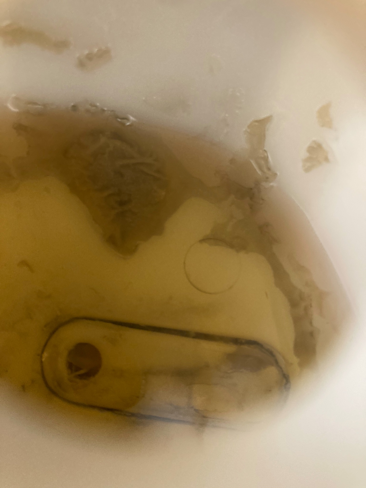

## Recommendations

I recommend that SMT owners use inexpensive DOT 3 brake fluid. I have used it in the SMT system since 2015 and currently use it in all six of my SMT Spyders.

SMT owners have over a decade of experience using DOT 3 / DOT 4 without failures or detectable component wear. Frequent changing of the fluid is really important and the high price of Toyota SMT fluid discourages that. DOT 4 has better performance at high heat levels. DOT 3 tends to absorb moisture more slowly than DOT 4, although the rate depends on the formulation and exposure conditions. ([U.S. Army brake-fluid study, 2019, pp. 29–32; mirrored PDF](https://bike.bikegremlin.com/wp-content/uploads/2024/01/brake-fluid-standardization-for-anti-lock-braking-systems-bfabs-benchtop-testing-report.pdf#page=30)) The temperatures experienced by the SMT system don’t even approach the temperatures of a braking system. High temperature fluid performance is not needed, so it’s better to realize the benefit of less water absorption.

## References and Sources

Over the years, Monkeywrench Racing has published SMT advice that conflicts with manufacturer documentation and my repair and testing experience. I retain the examples below, including earlier wording and screenshots, so readers can see the claims and the reasons I challenge them.

**Page-specific update, September 2026:** The [SMT-fluid sales page](https://www.monkeywrenchracing.com/product/toyota-oem-fluid-smt-transmission-hydraulic-system-1l/) uses shorter wording about moisture absorption and corrosion. The separate [repair/maintenance page](https://www.monkeywrenchracing.com/mr2-s-smt-repairmaintenance/) still carries the brake-fluid/seal warning and the clutch-actuator-rod explanation discussed below.

**Earlier warning retained from the source document:**

>  “*Note* – Use only approved fluid in the SMT system! Some people online have recommended using brake fluid. This will quickly destroy the GSA and HPU ($$$!!!). Use only Toyota OEM SMT fluid.”   

My comments: The Monkeywrench statement is simply false. I have used DOT 3 brake fluid in my SMT Spyder since 2015. My children’s SMT Spyders have also used it without further SMT-system problems after I repaired their original faults. I confirmed with MonkeyWrench Racing that they based their statement on their observations of destroyed seals they discovered in core/returned SMT systems. They did not mention that they had performed any chemical analysis of the suspect fluids. They incorrectly concluded that the cause of the damage was brake fluid, when they should have concluded that “Hydraulic oil” or “Gear lube” will destroy the system.

Monkeywrenchracing caution #2:

> “Maintenance:  The SMT fluid should be flushed and filled every 5 years or 50,000 miles. It is a unique fluid so be sure to use Toyota OEM fluid. It does get dirty and absorbs moisture which accelerated failure (sic) of the HPU and GSA units.”

My comments: This is good advice based on common sense - since (everyone) knows the SMT fluid is brake fluid, and everyone knows that brake fluid absorbs moisture and contaminants over time. Who knows where they cooked up the “5 years, 50,000 mile recommendation”? I recommend changing the fluid every 2 to 3 years if you live in a reasonably dry climate. And more frequently if you live in the tropics. My reasons are just as arbitrary as those of Monkeywrenchracing’s.

To be thorough, MonkeyWrenchRacing makes other misstatements about the SMT system:

> “GSA leaks:  This is generally from the clutch actuator rod rusting, destroying the seal. The rod and seal cannot be serviced so the GSA must be replaced. At this point there is generally other internal rust from neglecting the fluid changes so the unit is not in good shape overall.”

My comments: Again the MonkeyWrenchRacing statement is simply false. There is no “clutch actuator rod” anywhere in the SMT system. (There is however a clutch actuator cable that is coated with plastic, but it never touches any of the rubber seals.) The “clutch actuator rod” function is served by a hydraulic actuator, that uses a bare aluminum piston, with an EPDM rubber seal on a hard anodized aluminum rod, and riding on a bare aluminum bore. THERE ARE NO steel parts inside the clutch actuation system, nor the entire GSA that can rust. The only possible exception is the fluid control solenoids that are made from stainless steel. I have seen minor rust on them if you leave them exposed on a workbench for months and months.

Monkeywrenchracing photographic evidence:

The caution below the photo from the Monkeywrenchracing website is simply false. I have submerged SMT O-rings and seals in brake fluid and they DO NOT swell up as shown in their photo. If you want to see an HPU reservoir seal, and an HPU motor dust cover swell up like the photo, they MUST be subjected to oil. All of the SMT system rubber seals will sit in a jar of brake fluid for years and will never swell up. I’ve done this test myself to confirm. Anyone can perform this simple test if you’re interested. Even Monkeywrenchracing!

Monkeywrenchracing’s false info:

Screenshot from the [Monkeywrenchracing repair/maintenance page](https://www.monkeywrenchracing.com/mr2-s-smt-repairmaintenance/):

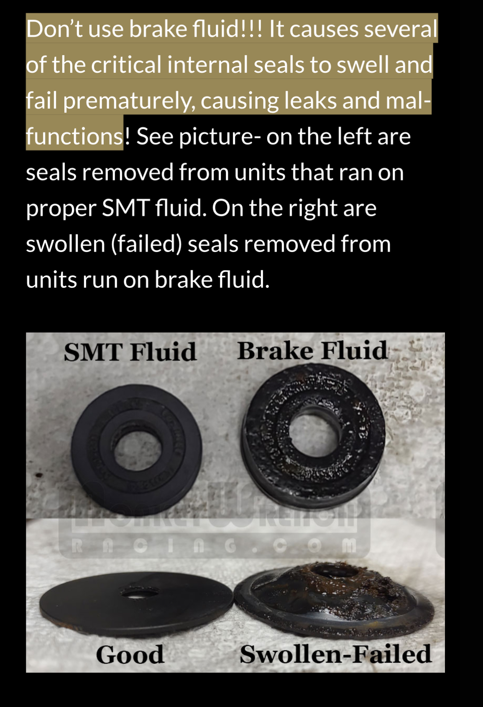

## Photos and Videos

Looking inside an HPU reservoir, showing typical flakes of deposits. Video [HERE](https://youtu.be/Hr0x2ubnAI4).

Closeup of a flaky “kelp” deposit on a Q-tip.

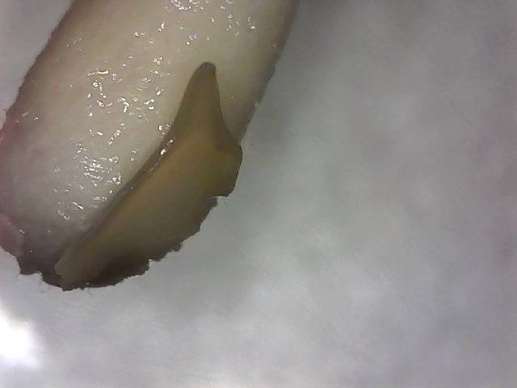

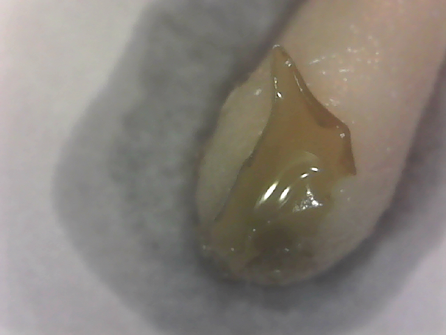

HPU Reservoir cap has a vent hole, open to the atmosphere. This is an ingress for atmospheric moisture.

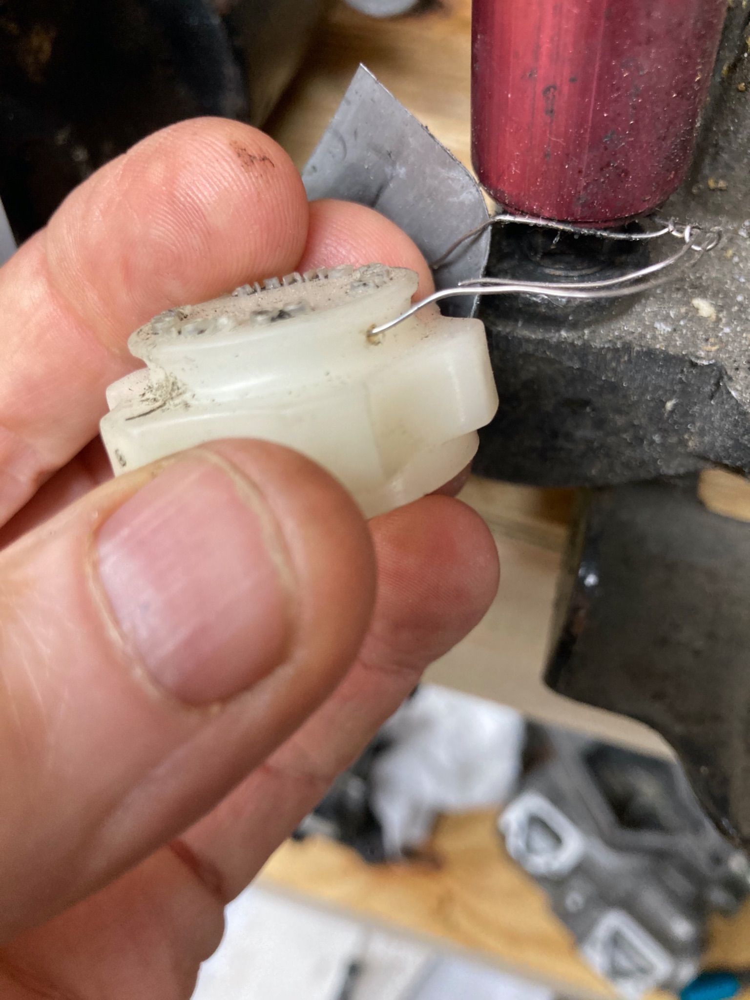

There is a factory “maintenance tool” that covers the vent hole, to minimize leaks during removal of the HPU. (Like turning the HPU upside down to access the quick release fittings.) A fat O-ring serves the same purpose. The O-ring is a temporary vent cover for removal and handling; remove it before operating the system.

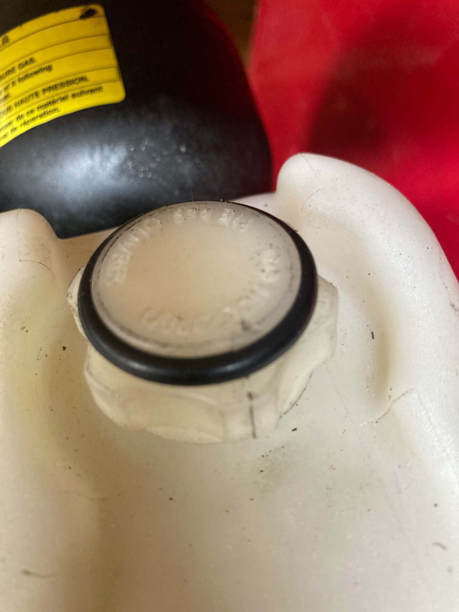

“Brake Fluid” stickers are visible on the HPU and GSA solenoids as supplied by LuK:

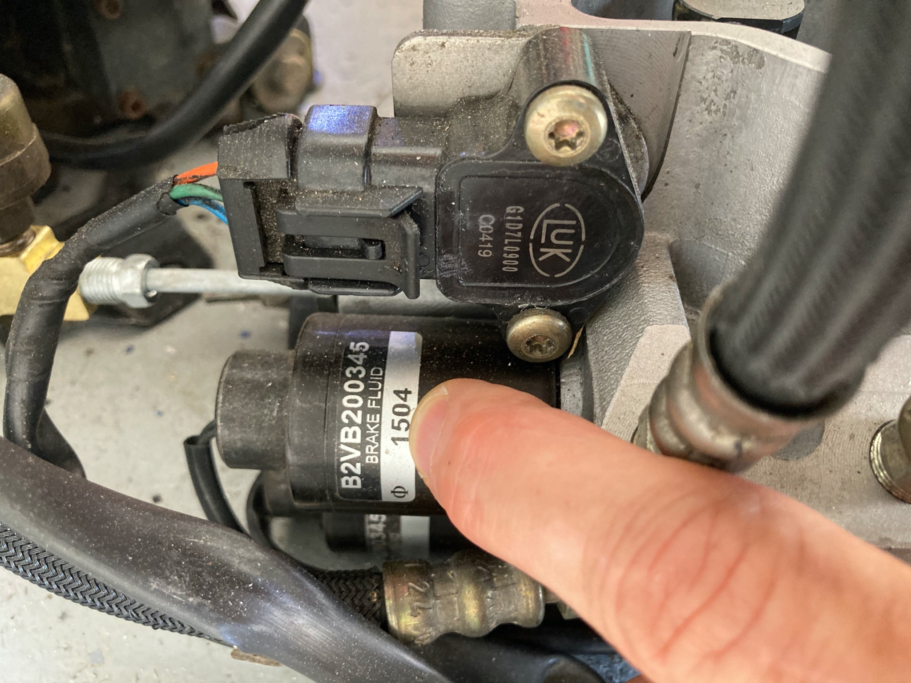

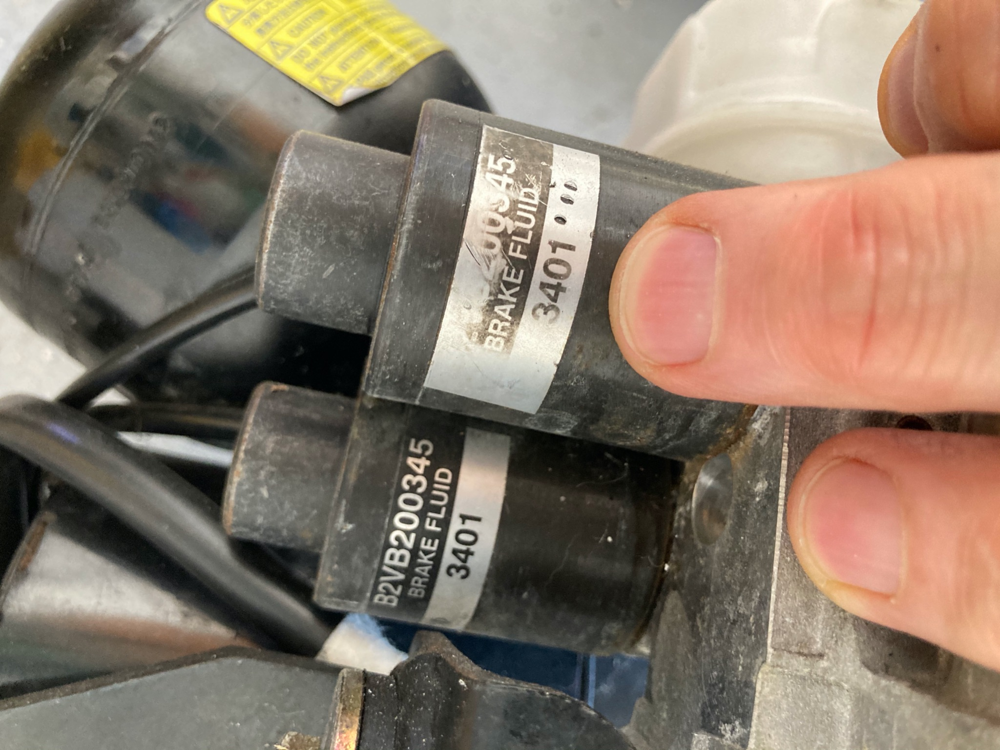

The Factory “Scheduled Maintenance Guide” supplied to the original buyer of SMT Spyders…makes no mention of the SMT system whatsoever.

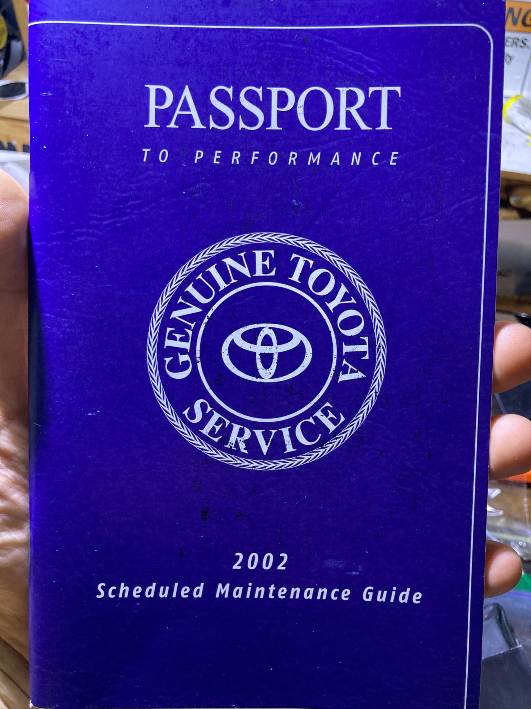

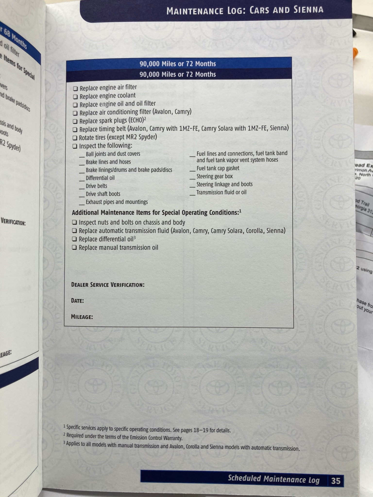

The SMT Owners Manual below warns against “fluid other than Genuine Toyota Fluid” that may hurt durability etc. They were hoping the added castor oil derivative would enhance long-term wear. Based on my own observations, I have seen nothing to support this. SMT systems running for over 10 years on DOT 3 do not exhibit any lost durability.

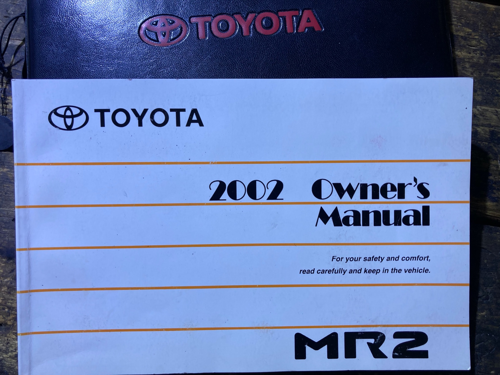

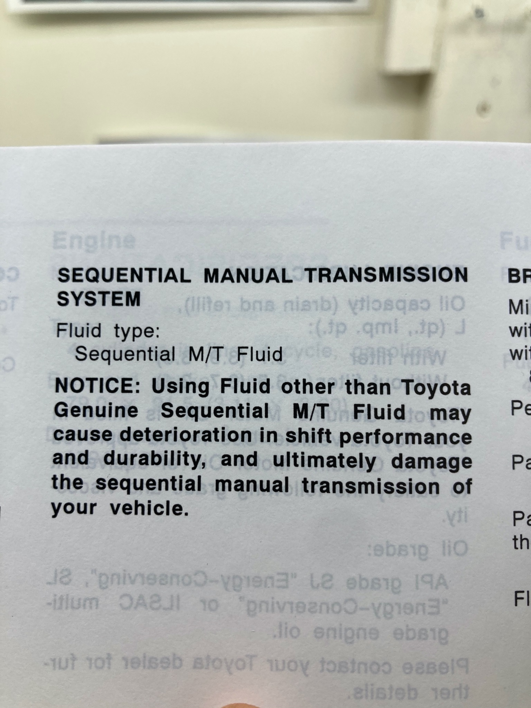

## Afterthought

If you like cheap DOT 3 brake fluid that is relabeled as pricey SMT fluid, then you will absolutely love molybdenum paste that Toyota has relabeled as “SMT Grease”! It is also very pricey.

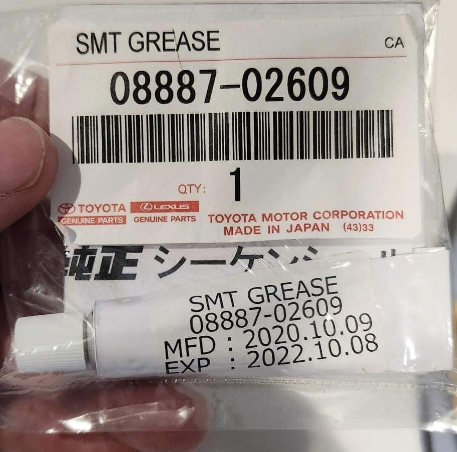
