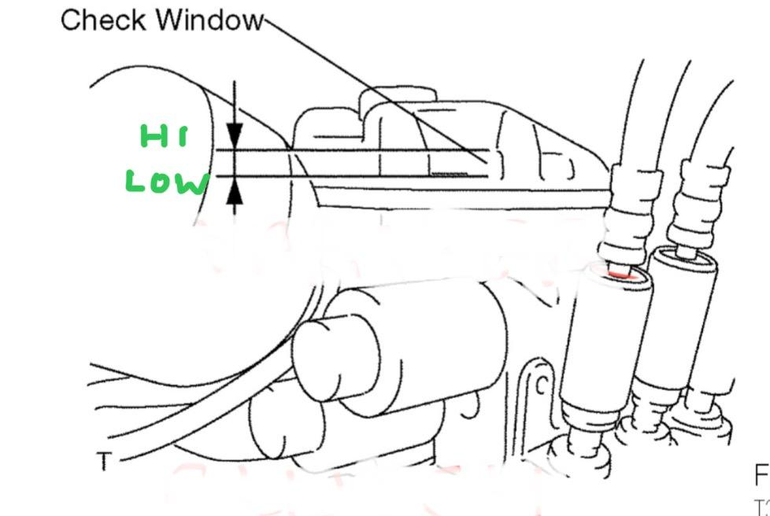

# SMT - Fluid flush

Composed by [Cyclehead21@gmail.com](mailto:Cyclehead21@gmail.com)

## To change SMT fluid

1. Access the reservoir
2. Suck out the old fluid
3. Refill reservoir with fresh fluid
4. Run the pump
5. Suck out the fluid and refill
6. Run the pump
7. Repeat maybe 2-3 times
8. Final fill or top up
9. Reassemble

## Procedure details

[How to access HPU reservoir](https://youtu.be/a9VVG3jBJ3Y)

[How to access HPU reservoir, forgotten steps](https://youtu.be/3p774j8xffU)

Use a turkey baster, Mityvac or similar fluid suction tool to remove old fluid from the reservoir.

Refill the reservoir with clean DOT 3 / DOT 4 brake fluid. Cheap stuff is fine.

> **Caution:** Same as with your brake system, any kind of oil poured into the reservoir will destroy the entire system. NEVER use gear oil, engine oil, hydraulic oil or transmission fluid - only use DOT 3 / DOT 4 brake fluid or the very expensive “Toyota SMT fluid”.

Turn on the ignition and shift into 1st, 2nd, Neutral and Reverse to cycle fluid through the system. Do this maybe 2-3 times to empty the accumulator and trigger the pump to run.

Repeat the process 2-3 times or until the fluid looks clean enough.

For the last fill up, you need to let the car sit overnight so that the accumulator will discharge. (Fluid coming from the accumulator will raise the fluid level in the reservoir.) Next day, you can top up the reservoir to the fill level marks - between the two indents in the plastic reservoir, just above the halfway seam. (Don’t let the pump run!) And reassemble the air box.

> **Note:** If you overfill the reservoir it won’t really hurt anything. But the excess fluid will be pushed out of the reservoir cap and dribble onto the crossmember and onto the floor. It can damage the paint on the crossmember. It will likely happen as the car sits overnight as the accumulator slowly discharges. If it does happen, just rinse the HPU and crossmember with water. No need to disassemble everything.

Record the date you flushed fluid somewhere. I write it on a heat shield where it’s visible without removing any parts. You want to change it again in about 2 years. (Less if you live in the tropics.)

If you care to enter the “magic Toyota SMT system fluid” debate, here are my thoughts on the subject:

[SMT - Fluid Discussion](smt-fluid-discussion.md)

It’s wise to periodically check the lower surface of the GSA for fluid leaks. The system will usually run for quite a long time with a slow leak, but eventually will quit shifting due to low fluid level or contaminated sensors.

[How to find GSA leaks](https://youtu.be/miinrmJShLM?si=-qXUrz9pImgiEmbA)
