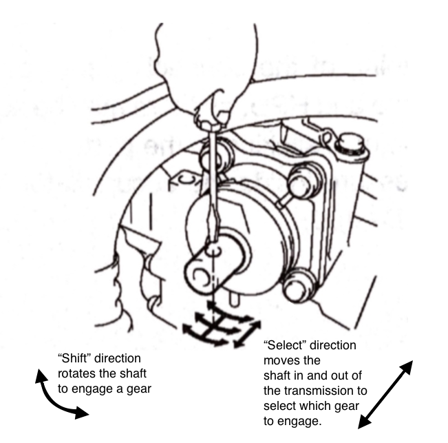
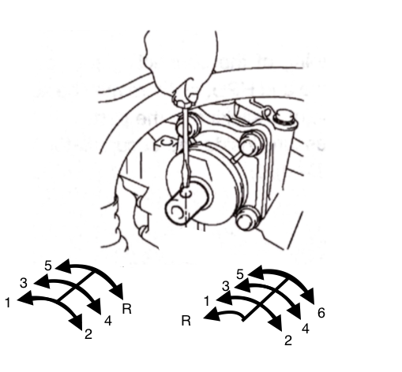
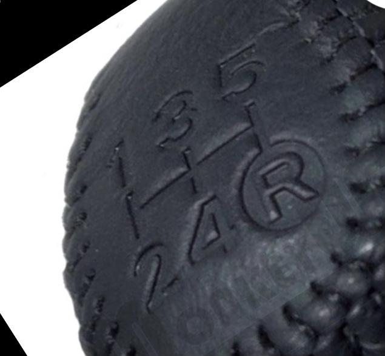
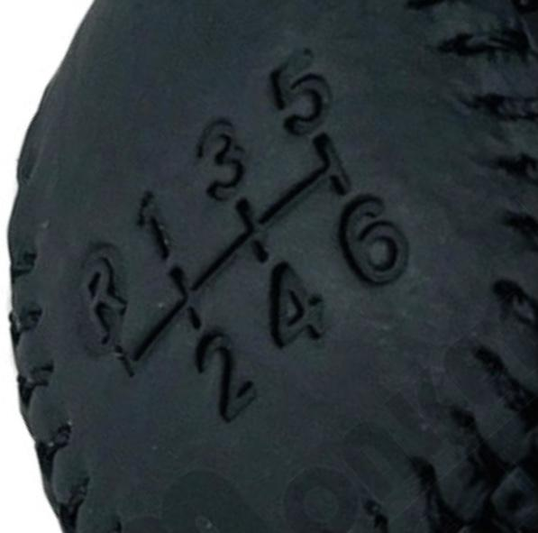

[← Chapter index](../README.md)

# SMT - Stub Shaft - Gearshift Pattern

Written by [cyclehead21@gmail.com](mailto:cyclehead21@gmail.com)

Reach your hand around the exhaust manifold and in front of the air filter box.

Drop a small screwdriver into the open hole on the shifter shaft - like the sketch shows.

The gearshift pattern is the same as a manual transmission - if you think of the screwdriver handle as the gearshift knob, and you are standing at the center of the car and facing left. Don’t forget, the gearshift patterns are different for 5 and 6 speed transmissions.

ie: To engage 5th gear on a 5 speed box, you would move the handle to the far right (push shaft into the transmission), and push the handle away from you (rotating the shaft).

**Note:** “Shift” direction rotates the shaft to engage a gear.

“Select” direction moves the shaft in/out as you “select” the gear that you wish to engage.

---
