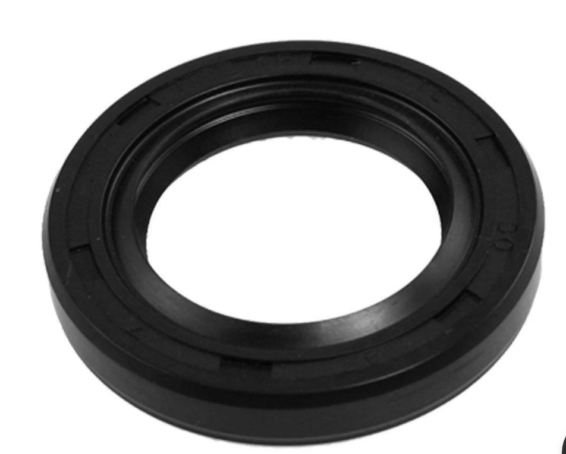
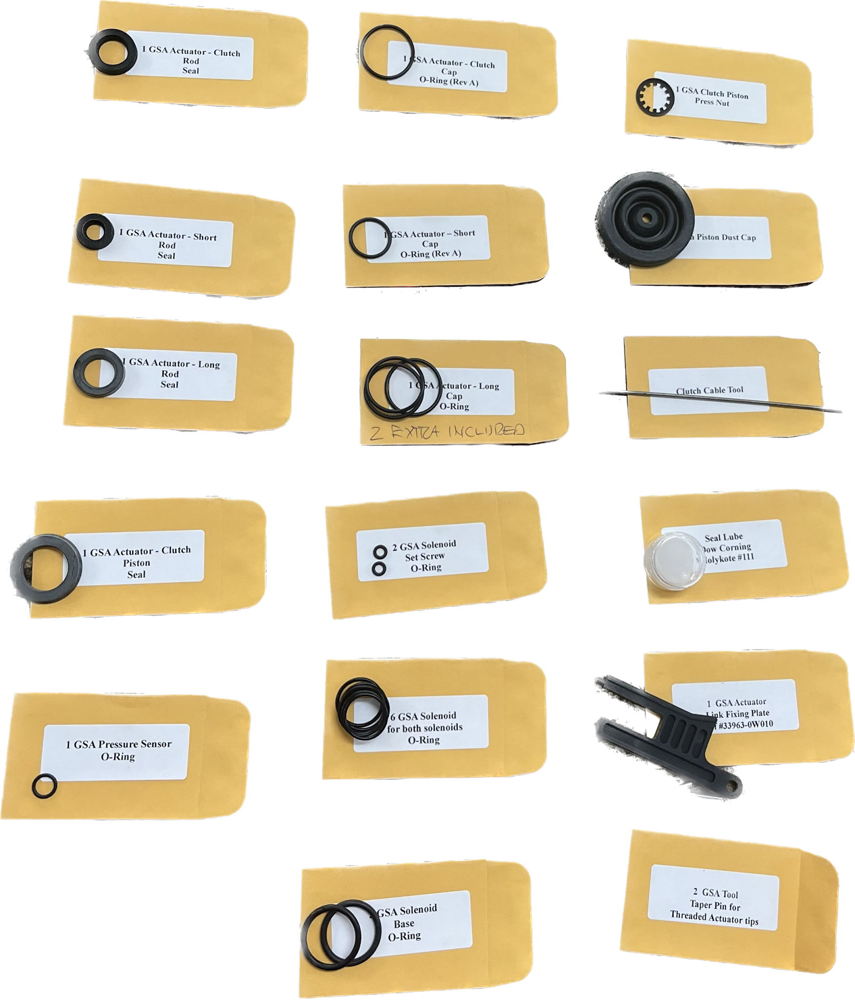
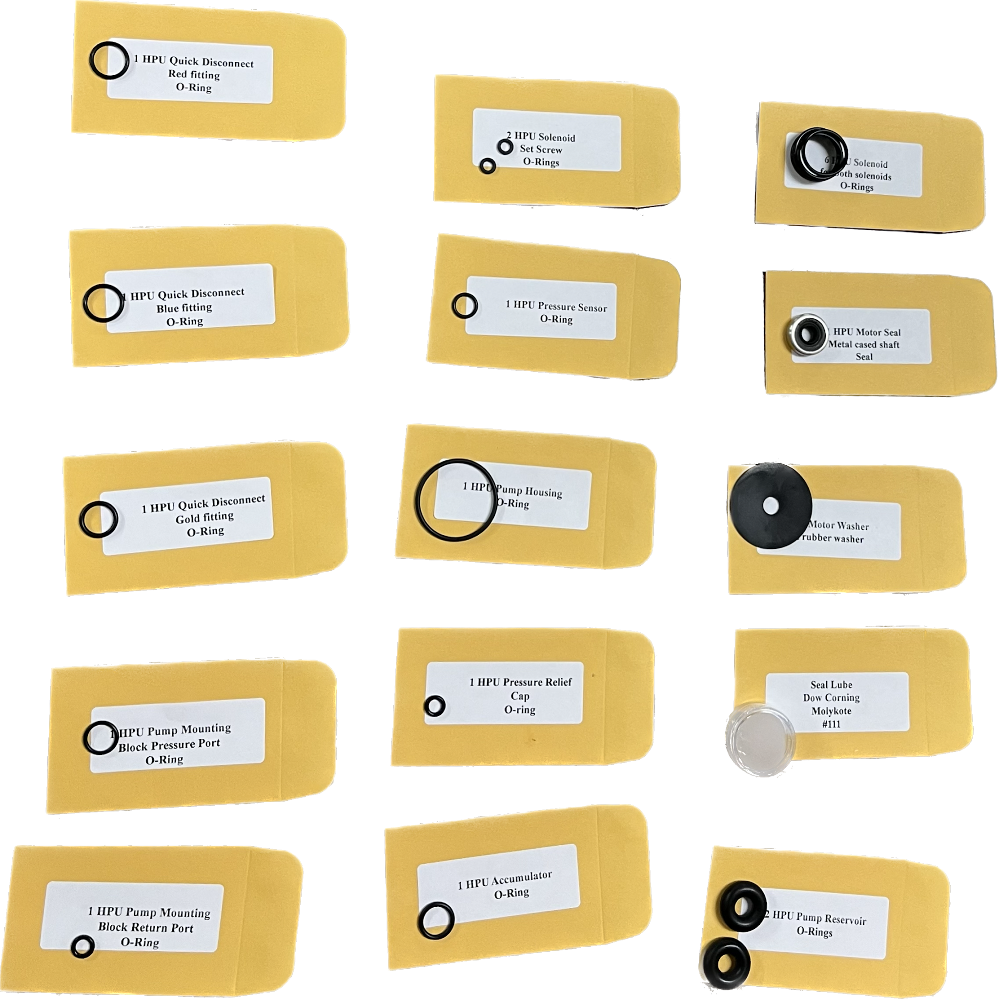

[← Chapter index](../README.md)

# SMT - Seal Repair Kits

[Cyclehead21@gmail.com](mailto:Cyclehead21@gmail.com)

*(That’s not a giant inner tube - it’s a closeup of a GSA lip seal 🙂)*

## Prices

The GSA kit is $95, plus shipping.

This kit includes all of the rubber lip seals and o-rings that are used in the unit, plus a plastic “fixing tool” (to facilitate installation in the car), a rubber dust boot, and two steel “taper pins” (used to disassemble the actuator rods).

The HPU kit is $85, plus shipping.

This kit includes all of the rubber seals in the HPU, including the special metal-cased lip seal with a garter spring - used on the electric motor shaft. It also includes the two updated seals for the plastic reservoir. (The seals were the subject of a Toyota Service Bulletin.)

## Background

The Toyota MR2 Spyder with the SMT transmission, uses an electro-hydraulic system to shift the transmission gears. The major parts of the system are composed of the Gear Shift Actuator (GSA) and the High Pressure Unit (HPU). Both of these components have rubber seals inside that will wear and possibly leak over time (and gearshift cycles). With the help of some smart guys on Spyderchat forum, I have compiled a complete set of o-rings and lip seals necessary to offer Seal Repair Kits for both the GSA and the HPU.

Generally, these replacement seals will only fix leaks.* **If your SMT system is not working correctly, it is very UNLIKELY that replacing all the seals will make the system work again.** Malfunctions of the SMT system are almost always traceable to failed position sensors, pressure sensors, solenoids, reverse/neutral switches, pressure accumulator or cabin gearshift switches.

### Note *

The o-rings on the four solenoids can theoretically wear and leak internally, allowing pressure to bleed from one chamber of the spool valve, into an adjacent chamber. These are the only seals I can think of that could “leak” and not produce a visible drip under the car. I have never found a broken SMT system that was (for certain) failed due to these o-rings.

If somebody has poured gear oil, transmission fluid or any kind of oil into the SMT reservoir, it will have destroyed all the rubber seals throughout the system. These seal kits will allow you to rebuild the GSA and HPU to function again.

## Caution

Both the GSA and HPU contain hydraulic components that operate at 800psi. Hydraulic components cannot tolerate scratches or gouges, most of the parts are made from soft aluminum. No unusual tools are needed to install the seals, however good workmanship methods are critical! I have seen irreplaceable parts get destroyed as a result of deep gouges caused by using pliers on the highly polished actuator rods. Sloppy and careless methods will destroy your GSA or HPU. New parts do not exist.

## Kit Details

I package the o-rings and lip seals in separately labeled envelopes so you don’t have to guess which seal goes where. (Sample photo below) I have written detailed removal, disassembly and repair instructions which I provide to everyone for free. [LINK](https://docs.google.com/document/d/1SOhlqEtVWt5-MFPdrOGkNnpOn9-fyGCZTJISiTKCkVM/edit?usp=sharing)

## Ordering

To order a seal repair kit, email me at [Cyclehead21@gmail.com](mailto:Cyclehead21@gmail.com).

I usually sort your kit together and ship it the next day.

Paypal works best for me, but I can usually manage another system if you have a favorite. If you don’t have a PayPal account, I can send a payment request that will accept a credit card.

## Shipping

I ship via USPS for USA addresses, and UPS/Global Express for Europe, UK, AU, RU etc.,

USA shipping is $10 in a small flat-rate box.

Most Europe and Asia shipping is about $45. I can look up exact prices if you send me your shipping address. International shipping is fine. I need your COMPLETE address with street, city, province, prefecture, state, county, or region, postal code, phone number and email address!

### Expedited or overnight shipping

I can usually accommodate rush shipping. UPS next-day air seems to be pretty reliable, even for Europe and AU.

## GSA Kit Photo

## HPU Kit Photo

---
