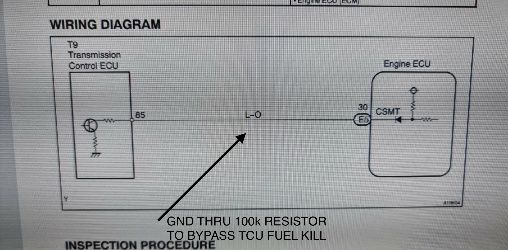
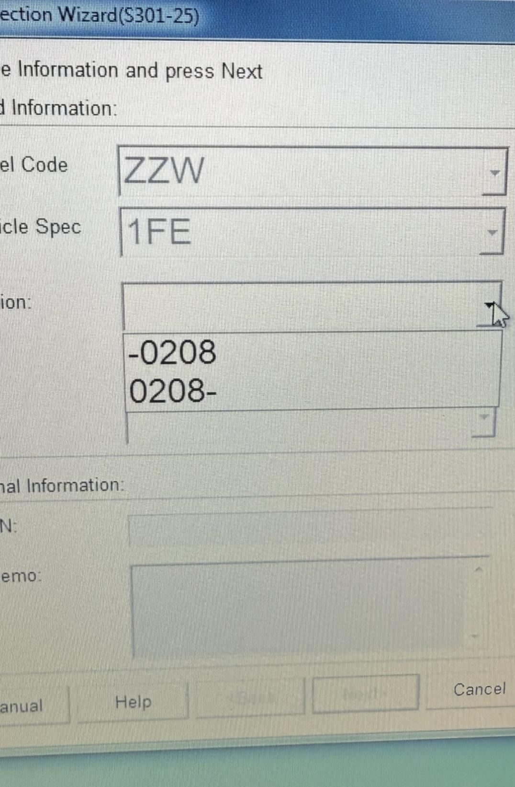
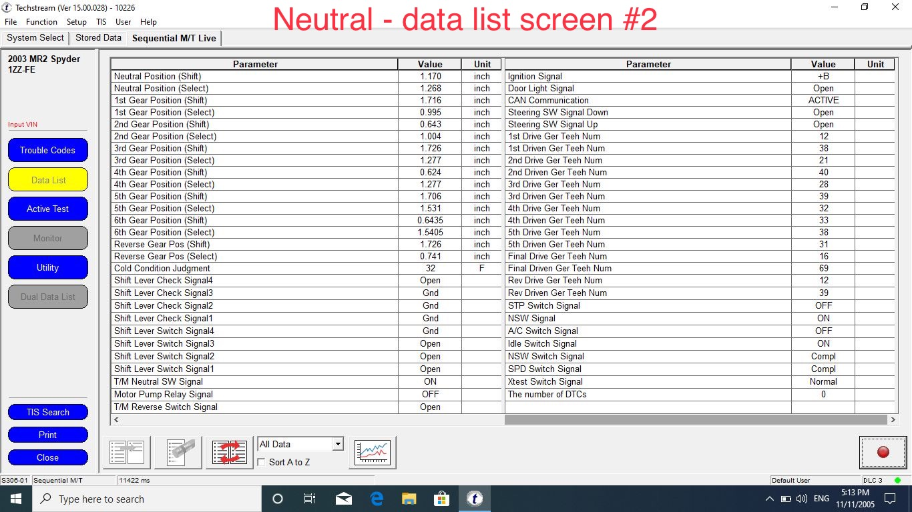
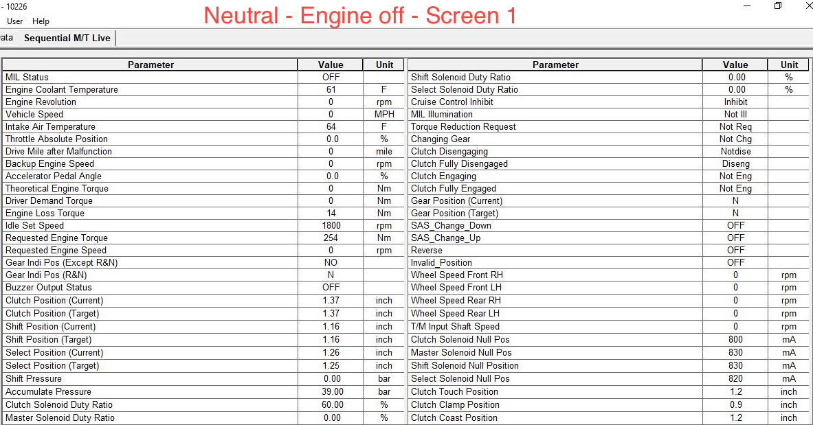
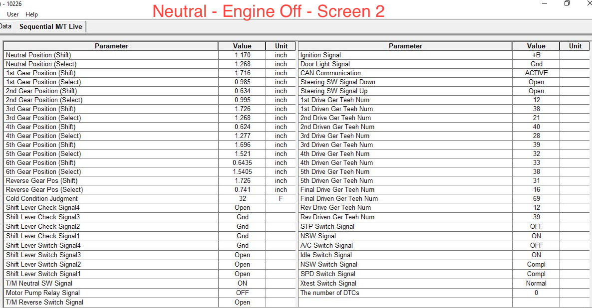
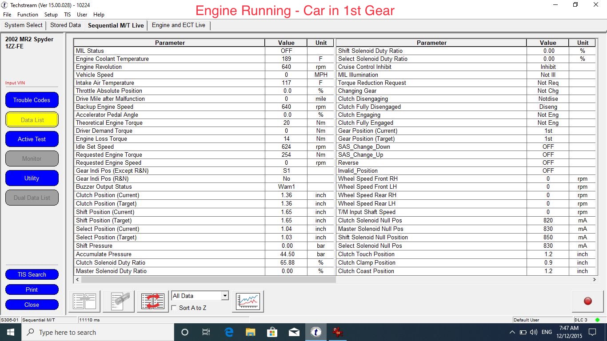
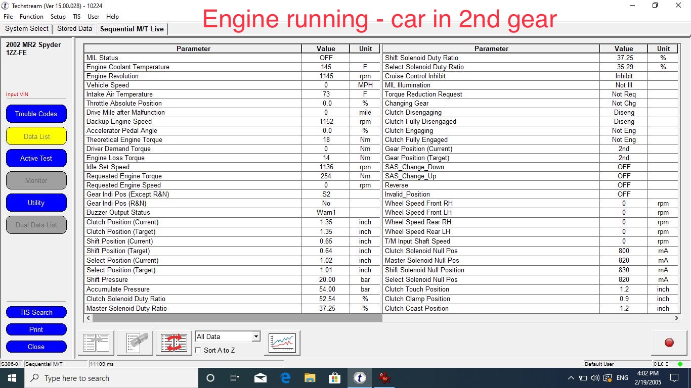
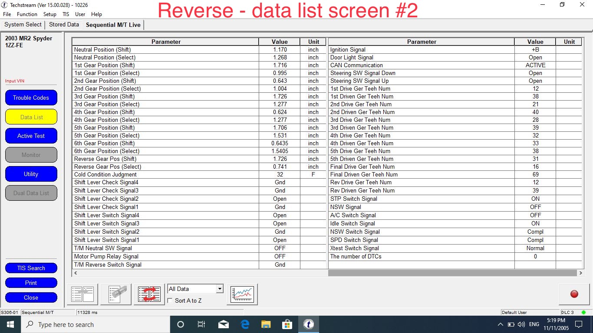

[← Chapter index](../README.md)

# SMT - Tips and Tricks

Composed by Cyclehead

Feel free to copy and share, just give me a little credit!

Please let me know if you find errors.

Updated September 2024

## Contents

1.  General tips:

Flashing green light

Missing green light

Weak Car Battery

Self Relearn

Engine Dies

Failed reverse sensor

Failed neutral sensor

Dark gear display window

Air bubble

Dithering Gearshift (Cycles forever!)

Solenoid failure tale

Bypass fuel cut

2.  Techstream Tips:

Techstream EU vs Japan vs USA

**Techstream Relearn Sequence**

**Data List screen samples**

**Amazon scanner reads TCU!**

## 1. General Tips

### Flashing Green Light

A flashing green light typcally means there is a mismatch between gear requested, and gear engaged. I see this in the morning if I shift into first or reverse before the system has pressurized sufficiently. The green light will flash, and the beeper will sound when I put the cabin shifter into R or 1. To resolve, shift back to neutral and wait for the system pressure to build up. Then shift into first, or reverse again.

### Missing Green Light (and Dark Indicator Window)

This is a more serious error. It means the SMT system is not active for some reason. It will happen when a “fatal error” occurs or TCU has ceased communicating. This usually happens in conjunction with a registered error code, and illuminated SMT warning light.

### Weak Car Battery

A weak battery will cause the system to randomly shift into neutral while driving. 11.2 volts is the cutoff. Below that and the SMT system shuts down, shifts the car into neutral and may kill the engine.

If the battery is weak, the TCU may not boot up upon engine start - and the system will go nuts. I got CEL code P0860 (Gear Shift Module) and P1646 (TCU error), The green neutral light would flash and refuse to show solid green. I could reset by disconnecting battery and trying again with jumpers attached. If I ever got a solid green the car would start normally.

### Self Relearn Procedure

There is a “self relearn” procedure you can run without using techstream software. It is a “self test” mode. I don’t have success getting it to launch reliably. Sometimes it works, other times it wont. I can’t find a reason.

The first step is to disconnect the battery for 45 minutes (maybe sufficient) or overnight (most reliable). Make sure everything is in neutral before you reconnect the battery. Look at the stub shaft and roll the car to verify.

See: How to force neutral

[https://youtu.be/EIIB7LKWX6I?si=56GKKqGmKKF9W_RX](https://youtu.be/EIIB7LKWX6I?si=56GKKqGmKKF9W_RX)

Then reconnect the battery and switch on ignition but don’t engage the starter (don’t start the engine). Wait a long time, like 1-2 minutes. At some point, the car should begin cycling the clutch, and commence shifting into each gear sequentially (6),5,4,3,2,1,R,N and stop with the green light illuminated. Gently rock the rear wheels (or the car) back and forth while it’s shifting gears. This will prevent the transmission getting “stuck on a gear tooth” (due to shifting while the car is stationary). If it does the gear countdown is successful, and if it completes with a solid green light, then you’re all good. If it completes with a flashing green light - then wait patiently for about 15 seconds and the green light should go solid. If not, you’ll need to retrieve the TCU codes using techstream relearn sequence (and the J2534 cable).

Note: The “self relearn” sequence appears to duplicate some of the “full relearn” processes. If it initiates and completes successfully, then I don’t believe that it is necessary to perform a “full relearn”.

### Engine Dies (Fuel Cut)

This indicates a fatal error. Possibly a mismatch between gear selected, and gear engaged.

Error codes P1646 and P1647 means a fatal error was detected. It usually throws these codes when the SMT system cuts fuel supply to the engine.

### Fuel Cut Tale

Yesterday I shifted into first gear very quickly after starting the car in neutral. The engine sputtered and died and the red-gear warning light came on. I switched the ignition switch off, and the red-gear light remained until I closed the door. I shifted back into neutral and restarted the car, and the car drove properly. However the check engine light illuminated. Codes saved were P1646 (transmission Control ECU malfunction) and P1647 (CAN communication malfunction). The car has worked perfectly ever since this event. I think this confirms that 1646/1647 is simply “system is mad”. I suspect the car detected a fatal mismatch between target gear, and current gear and went into shutdown mode. (Because I shifted into 1st gear too quickly!). Moral of the story: Be patient during SMT system start-up. Wait for the red-gear light to extinguish, and for the green light to illuminate BEFORE you start shifting gears.

### Reverse Sensor Error

There are two sensors on top of the transmission that detect (confirm) reverse gear is engaged. They are identical sensors. They are simple push button switches that close contact between two connections. P/N 84210-52050

When one fails, you will likely see two ECU codes (P0860 and P1646). And one TCU code (P0812) that reports a bad reverse sensor.

The system will work fine - until you shift into reverse, when it will illuminate both CEL lights and kill the engine. The car may actually have reverse gear engaged, but since the system cannot not confirm (via the bad switch) it will trigger failure modes and shut down the engine.

### Neutral Sensor Error

There is one sensor on top of the transmission that confirms neutral is engaged. It is a simple push button switch that closes contact between two connector pins. When failed, it generates P0850 (neutral switch) and P0863 (TCU communication). Replacing the neutral switch resolves both codes. P/N 84540-17010

Replacement of any of the three switches is pretty easy. They are all located beneath the air intake tube, just after the air filter box. Remove battery, top half of the air box and maybe the air intake rubber tube (for easier access). Requires a 1 1/16 socket.

All three sensors can be bench tested by pressing the plunger and watching for continuity across the two pins. Depressed should close the contact between the two pins.

More details on these switches [here](https://docs.google.com/document/d/141oDsngYmsW6J4AebyGyAsUkGYOWjnagLtWDFc2zz0E/edit).

### Dark Display Window

This usually happens along with codes P0860 and P1646, where the TCU has gone into shutdown, and quit communicating with the ECU. But not necessarily! I’ve seen this, with NO error codes. I resolved the latter case by disconnecting the battery for 20 minutes. Upon reconnection (with everything in neutral), the system went into the self-relearn sequence by itself. Indexing through all the gears 6,5,4,3,2,1,R,N and terminating with a solid green light. Success. Moral of this story. It never hurts to clear the ECU/TCU by disconnecting the battery for 20 minutes and trying again. Always get everything into neutral before reconnecting the battery.

### Air Bubble

Twice now, I have replaced seals in an SMT system. Then days (and 75 miles later) the car suddenly has an SMT system fail! Each time the car regained its wits after a few hours, reset, and began working flawlessly again! I am convinced that there was an air bubble buried in the system somewhere, and it finally hit a solenoid or something critical, and the system shut down! Each time the problem was a fluke. It never happened again! Moral: if you open the system, be prepared for an unexpected failure. Just one.

### Dithering Gearshift

This is a failure mode that is very frustrating because there are no clues to identify the problem. (No error codes!)

The symptom is: Upon connecting the battery, the system will start humming and the GSA will direct one of the SMT functions to cycle back and forth repeatedly ([dithering](https://www.motioncontroltips.com/when-is-dither-helpful-in-motion-control-systems/)). It can be either the clutch, shift or select functions, depending on which function has failed. The dithering will continue forever - even with the ignition key removed! It will cycle x times, run the pump for a few seconds, then go back to dithering, and repeat this cycle until the battery dies.

Videos:

[Failed “select” system](https://youtube.com/shorts/FIn7FZe-jTg?si=j0kNwHn4Ymtd4rOY)

[Failed “shift” system](https://youtu.be/klTWU05JaDk?si=KBb9bLjT0agxdtRC)

This is due to a solenoid failure, or an air pocket in the system. Whichever system is affected is the system that will be dithering (clutch, shift or select).

I’m still trying to isolate a similar behavior when a position sensor is “out of range”.

My current theory is: a bad position sensor won’t keep cycling with ignition off. I have not confirmed yet!

For reference: The Clutch solenoid resides on the HPU. The Shift and Select solenoids reside on the GSA. Select system = shifting the stub shaft in/out longitudinally. Shift system = rotating the shaft.

When the GSA is in this failure mode:

1.  Techstream Data List displays “Shift System Target 0.00” AND “Select System Target 0.00”). I have not confirmed what a clutch system failure displays.

2.  Disconnecting the battery to clear memory will not change the behavior. It will commence dithering promptly when the battery is reconnected.

3.  Techstream relearn sequence will not interrupt or cure the dithering behavior.

Solution: Change out the bad solenoid, or keep struggling and cycling the system in an attempt to chase the air pocket out of the system. Sadly I have not determined a definitive test or inspection criteria to distinguish a bad solenoid from an air pocket. One suggestion is to apply a vacuum to the HPU reservoir to aid in pulling an air pocket to the surface. I have not attempted this yet.

### Solenoid Failure (With Position Sensor Failure) Tale

I’m writing this one down to remind myself, and maybe help somebody else.

I got a spyder that wouldn’t run. The car was cycling the clutch three times, then run the HPU, then repeat…until the battery died. I solved that problem by replacing the clutch position sensor. The old position sensor failed the total resistance test. Then the fun started. The shift window and green/orange lights were all dark. If I ran techstream/parts replacement routine, the system would come back to life. Gear window illuminated and green/orange lights all functioned. However, I found that shifting into reverse, the wheels (in the air) would spin forward! If I engaged reverse with wheels on the ground, I could feel the car lightly trying to roll forward (as if the someone was feathering the clutch). When I shifted through the gears 1,2,3,4,5,6 everything looked great, until I drove the car. 5th gear indicated was actually 3rd gear (I think)! The car was selecting the wrong gear, even though it indicated what I expected. Whenever I turned off the car and re-started - the displays would again be dark, until I re-ran techstream or the self-relearn sequence. I tried two additional TCUs with the same result. All the while, the SMT warning light was illuminated, yet there were NO pending or registered SMT error codes showing! I finally decided it must be a malfunctioning solenoid, sending pressure the wrong way somehow. So I replaced the GSA with another. The minute I switched on the ignition with the new GSA the car commenced the “self relearn” sequence and ended with a solid green light. Success! The SMT light extinguished, and the car ran perfectly after that.

### Disable Fuel Cut

The SMT system will cut fuel supply to the engine when it detects “fatal” errors. You may be able to bypass the fuel cut (not tested yet!) by grounding this wire through a 100k ohm resistor.

## 2. Techstream Tips

### Techstream Versions: EU vs Japan vs USA Configurations

Techstream has different versions it uses to read Europe, Japan or USA ECU and TCU. Usually you just select your region (area) when you install techstream, and you can forget it. However, if you ever need to toggle to a different region, you can do that. Open techstream and connect to your car. Select “Setup/Techstream Configuration” at the top. It will ask you to select your “area” (Japan, North America, Europe, Other). After selecting it will take you back to the registration screen and ask for a “new key”. To get past this…close techstream and re-launch it using the special shortcut you made on your desktop. That will bypass the registration screen, and it will remember the new “area” that you selected.

In USA versions you will select the year your car was manufactured. On EU and Japan versions it will ask you to select before or after facelift. Ie: -0208 or 0208-? Meaning before or after August 2002. Select the option appropriate for your car. (Confusing in USA because we put month first, and year last.)

### Techstream Relearn Sequence

Caution: If your car is running properly except for one problem (ie: engine dies when you select reverse gear), then running the relearn sequence will likely disable your car completely. The relearn sequence compares all the sensor and switch readings to a table of parameters. If one component is out of range parameters, it will disable the whole SMT system by killing the gear indication display window and killing the green neutral LED (dark display). You will not be able to restore it back to the “running properly except..” state. Your only option is to correct the faulty sensor or component and perform a full relearn sequence. Apparently the SMT system does not do a full detailed parameter check during normal operation - only during a full relearn. Lesson: If your car is shifting gears, but exhibiting an error - don’t run relearn until you’re fairly certain you have fixed all the damaged parts in the system.

Video showing full-relearn steps: <https://youtu.be/-j8v-1GpMc4>

The actual path to the Techstream sequence is “SMT System/Utility/Parts Exchange”. Most people call it the “full relearn” sequence. (This is different from the “self relearn” process that does not require the use of techstream software)

Disconnecting the battery overnight is a good practice before running techstream. Use the time to fully charge the battery, And verify that the SMT reservoir has sufficient fluid in it.

Caution: Never pour any type of oil or transmission fluid or power steering fluid or hydraulic fluid into the reservoir! The system runs on brake fluid. Seriously.

Verify the transmission and cabin shifter are both in neutral.

(If the car rolls freely, then the transmission is in neutral)

(If the cabin shifter is locked, you can free it using the tiny trap door by the shifter. Press a screwdriver into the hole, and it will free the shifter handle, allowing you to put the shifter in neutral)

Ignition on, shifter in neutral

Prompt: Reset “Transmission Control ECU”

During this step the gear indication window is likely black

No green neutral light, nor orange reverse light

Ignition off

“SMT ECU Learning”

15 second countdown timer

Ignition on

At this point your green neutral light may be on, or off.

If (1. Green light on), then some of the behavior after this is not seen.

If (2. Green light off) then the extra behavior is seen.

Press “Next” and a 60 second countdown timer will start.

If 1. - then the green neutral light will stay illuminated and you won’t see anything other than the countdown time progress.

If 2. - then during the last third of the countdown, the car will shift into each gear sequentially (6),5,4,3,2,1,R,N and stop with the green light illuminated

Note: This appears to be the standard “self relearn” sequence because it will commence stepping through the gears, regardless of whether or not you hit the “next” button that starts the 60 second countdown, or not.

Prompt: “Start the engine and run for 10 seconds”

If 1. - You’ll just see the neutral light stay illuminated, no change.

If 2. - The beeper will beep, and the neutral light will flash. Usually in about 6-8 seconds the neutral light will go solid, and the beeping will stop.

Prompt: Verify steady green neutral light

“Drive the car 4-21 mph in first gear” step

Until the red “gear” warning light illuminates for 1 second.

This step does not require techstream hookup. It will complete regardless.

It’s okay to reverse the car out of a parking spot, then drive forward. After about 10 seconds of driving slowly, the red gear light will illuminate for maybe 2 seconds and extinguish.

This happens very quickly, like about 20 yards. You can also accomplish this step with the rear wheels in the air if you prefer, just engage first gear and run it slowly for a few seconds, until the red gear light flashes on and off.

### Data List Screens

(Note that the screen shots below appear very fuzzy when viewed on a cellphone. I think google reduces the pixels. Try viewing on a desktop machine to see screenshots clearly. )

These “live data” screens are helpful when isolating which function is causing trouble, when CEL codes are too generic. I have copied the Data List screen from a properly functioning SMT system. Screens show settings with the car in first gear, reverse, and neutral.

Note that the data is very slow to update. It can take 15 seconds for a new pressures or switch positions to update and reflect the new information on your laptop.

#### NEUTRAL - Engine Running

#### NEUTRAL - Engine Off

#### FIRST GEAR

#### SECOND GEAR

#### REVERSE

This \$125 scanner from Amazon appears to read TCU codes and perform the full relearn. Ancel TD700

https://a.co/d/4168cmC

---

*Publication status: Initial conversion 0.1. Formatting and cursory editorial check only; detailed technical review is pending.*
