[← Chapter index](../README.md)

# Solenoids

Composed by Cyclehead

Updated August 10, 2025

Feel free to copy and share, just give me a little credit!

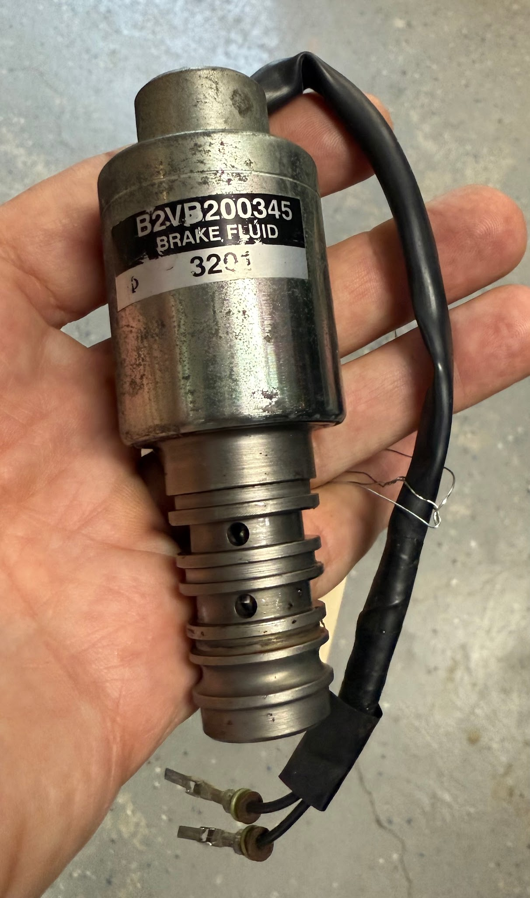

## Contents

1.  Background

2.  Design

3.  Function

4.  Tests

5.  Failures

6.  Disassembly

7.  Repairs

8.  Reassembly

9.  Photos

## 1. Background

The SMT system uses four solenoid/spool valve assemblies to control pressure flow. The HPU uses two solenoids, and the GSA uses two more. They are all identical. New solenoids are not available from Toyota, nor from LuK. It’s possible that some other LuK designs use a similar component, but I haven’t found one yet. SMT solenoids were manufactured by Magenta/Kuhnke in Germany. The spool valves were designed by LuK (likely designed for the Renault Twingo Easy) and produced by Wema in Belgium.

## 2. Design

The solenoids consist of an electromagnetic coil on one end, attached to a hydraulic spool valve on the other end. The center plunger (armature) is moved in and out by the electromagnetic coil, pushing on the hydraulic spool that opens and closes a port that regulates fluid flow to the actuator. Solenoids run on 12V power supply with variable current flow, and (like all electromagnetic coils) the polarity doesn’t matter.

The coil is housed in a thin metal canister. The edges of the canister are bent over (rolled edge) to keep it secured to the cylindrical barrel.

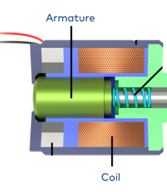

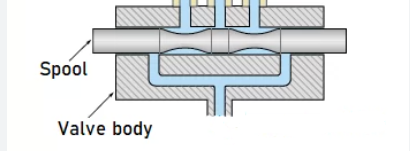

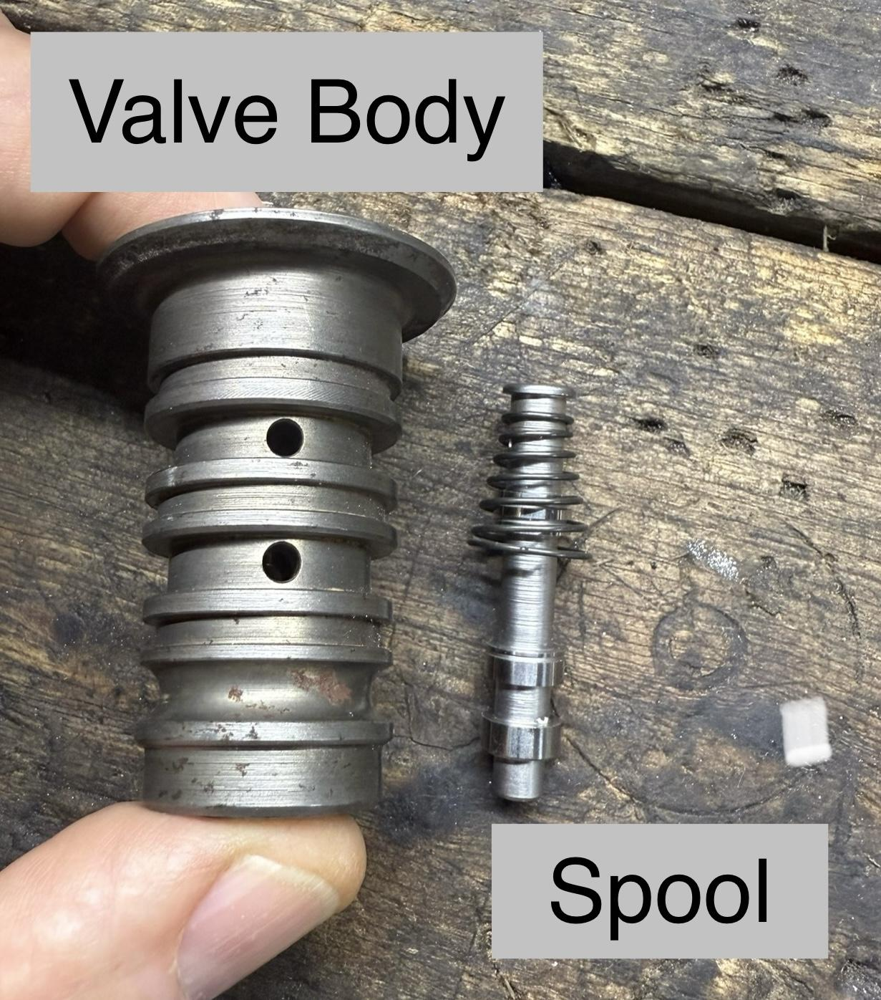

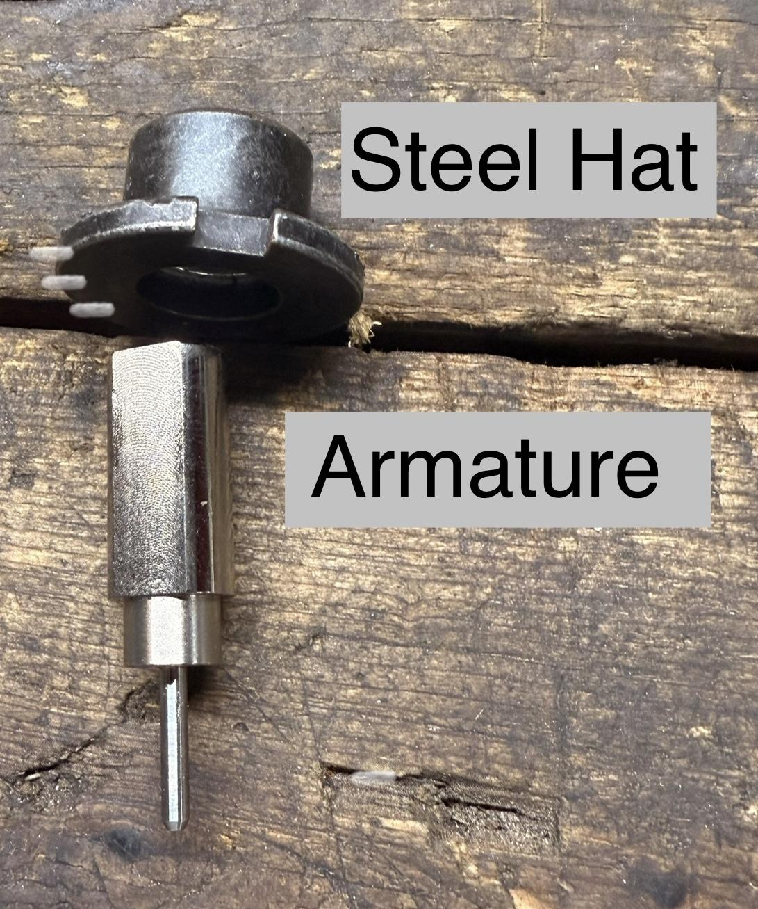

## 3. Function

The HPU uses two solenoids: a clutch solenoid and a “master” solenoid. The master solenoid sends pressure from the HPU to the GSA to power and monitor all GSA functions. The clutch solenoid sends pressure directly to the clutch actuator on the GSA. (bypassing the master solenoid). The GSA uses two solenoids: the “shift” solenoid and the “select” solenoid.

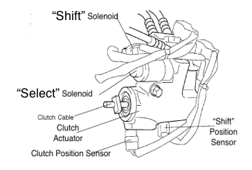

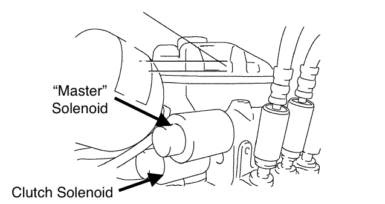

The hydraulic spool rides inside a cylindrical barrel with two ports drilled through the side. When the coil is energized, the spool is extended, opening the fluid control port to send pressure to the actuator and make it extend.

The TCU modulates the current flow (amps) to the coil, allowing the plunger and spool to “hover” in the desired position. The current is modulated at 50hz (dithering current) to ensure smooth response. The position sensors provide feedback of the actuator positions (in real time) back to the TCU. Thus the TCU controls the position of the shift/select actuators, and the clutch actuator.

The spool valve opens around 0.80 A to 1.0 A current at 12V. When TCU reduces the current, the spool retracts to stop the fluid flow. When the TCU increases the current, the spool extends to allow fluid flow.

## 4. Tests

### 4.1 In the Car

#### 4.1.1 Coil Resistance

You can access the HPU solenoid pins at the large gray connector by the HPU.

You can access the GSA solenoid pins in the row of connectors by the firewall (forward of the battery, directly above the GSA). GSA solenoids connect through the white connector with four pins. This one is pretty hard to reach.

The BGB specifies that the resistance through the coil should be 5.30 to 5.88 ohms at 70F temperature. It also specifies the solenoid can be tested by applying 12v to the coil, and listening for a “click” as the plunger strokes to its full travel position.

Neither the “clicking noise”, nor the resistance check comprises a definitive test of a solenoid. The BGB (Big Green Book - Factory repair manual) tests are rudimentary, and won’t reveal a sticky solenoid. Unfortunately the TCU is also capable of only detecting a dead short or open circuit - and unable to detect a sticky solenoid.

#### 4.1.2 Techstream Data List Behavior

”Null Current” values for each solenoid can be monitored on the Techstream/Data list screens. You must isolate specific sensors on the techstream/data list for faster data updates. (Full screen updates will refresh too slowly to observe a fluctuating null current reading) The four readings in this video were selected and displayed on a dedicated view in techstream by hitting the red arrow icon at the bottom of the Data List Screen. [https://youtu.be/lGOos4RFcn8?si=J6X57OtlabmTzi6c](https://youtu.be/lGOos4RFcn8?si=J6X57OtlabmTzi6c) In this video, the Shift solenoid is bad, and the Select solenoid is questionable. The clutch solenoid is only moving +10mA so it’s okay.

A good solenoid “null current” should be somewhere between 750mA and 1000mA. The reading must be stable. If the null current is jumping around more than +/- 10mA, then that solenoid is bad, likely sticking.

A solenoid that behaves correctly will display a steady current (null current reading will not fluctuate more than +/- 10mA).

If a solenoid is sticking, the TCU will apply varying currents to try and position the valve properly. If the solenoid is not responding properly (sticking), it will apply various currents as it tries to get the solenoid to respond. A sticking solenoid will (almost always) display a jumpy “null current” reading in Techstream Data List. The exception is; some marginal solenoids will only stick when the engine is hot.

### 4.2 Bench Testing

Bench testing is required to confirm a sticky solenoid, or to confirm you have fixed a sticky solenoid before you reinstall it in the car.

Bench testing requires a [controlled power supply](https://www.amazon.com/dp/B0DSM7FT22?ref_=ppx_hzod_title_dt_b_fed_asin_title_0_0&th=1) and a [USB microscope](https://www.amazon.com/dp/B00XNYXQHE?ref_=ppx_hzsearch_conn_dt_b_fed_asin_title_2). Each of them cost about \$50 on Amazon. Use the power supply to hold constant 12V, while you vary the current supplied to the solenoid. Use the microscope to observe the spool’s motion. Set up the microscope to look inside the fluid port closest to the tip of the spool valve. I use a magnetic base from a dial indicator to hold the solenoid securely. I have my microscope mounted to a small adjustable stand.

This video shows how I’ve been bench testing: [https://youtu.be/R0jOCH2TRsY](https://youtu.be/R0jOCH2TRsY)

#### 4.2.1 First Motion

Apply 600mA to the coil and see if the spool moves at all. If not, increase the current in 50mA increments until you see the spool move. Dial in the current to determine the minimum current required to make the spool move reliably. (Sometimes the spool will barely move, or wait a second and then move. This current is too low.) Record the “first motion current”.

#### 4.2.2 Null Current

Apply more current until you observe the spool completely closing off the open port. Reduce the current by 30mA, and confirm that a small sliver of gap appears at the edge of the port. Record the “null current”.

#### 4.2.3 Check Current Values

First motion current should be roughly 600-700mA. Lower is better. (Any higher current, and it’s too close to operating currents for the Null function.)

Null current should be between 750-1000mA. I try to hit about 900mA because I don’t yet have good correlation between this bench test, and the TCU reported currents. (900mA on the bench will result in roughly 820mA reported by the TCU).

#### 4.2.4 Adjust, Clean or Repair the Solenoid

If current values are not in the ranges noted, then you have to fix the solenoid. It must be adjusted, cleaned, or disassembled and repaired. After cleaning/fixing, repeat all the bench test steps to see what your new current values are. Keep trying until you get them in the correct range.

## 5. Failures

### 5.1 Shifter Shaft

I have seen this failure mode many times. The stub shaft on the back of the transmission will jiggle (in/out or right/left). It will repeat this motion maybe six times. Then the HPU pump will run to re-pressurize, and the cycle will start over. This cycle will continue AFTER THE KEY IS REMOVED FROM THE CAR. It will continue until the battery is dead. Explanation: The TCU is performing a self-test. During self-test it cycles the solenoid and looks for the anticipated actuator motion, and the corresponding pressure fluctuation (via pressure sensors). Sadly, if one of the self-tests fails, it will try and try again. Forever. It will not even trip an error code! You can usually see which solenoid has failed by looking at the “null current” results in techstream datalist section.

How to see Null Current results: [VIDEO LINK](https://youtu.be/ZmnFEVtx-hI)

[https://youtu.be/ZmnFEVtx-hI?si=AkoF1CNltBW4gqFm](https://youtu.be/ZmnFEVtx-hI?si=AkoF1CNltBW4gqFm)

Example of a bad solenoid null current readings: [VIDEO LINK](https://youtu.be/lGOos4RFcn8)

[https://youtu.be/lGOos4RFcn8?si=DmVEY25w2nuCGkr4](https://youtu.be/lGOos4RFcn8?si=DmVEY25w2nuCGkr4)

Example of failing clutch solenoid self test:

[https://youtube.com/shorts/3lk-fIoSqRc?feature=share](https://youtube.com/shorts/3lk-fIoSqRc?feature=share)

Example of failing “shift” solenoid self test: [https://youtube.com/shorts/px4tLPCnUSA?si=7SSkISiQUzO7KY8i](https://youtube.com/shorts/px4tLPCnUSA?si=7SSkISiQUzO7KY8i)

Example of failing “select” solenoid self test:

[https://youtube.com/shorts/FIn7FZe-jTg?si=UqEl1CAn_sgKqLuf](https://youtube.com/shorts/FIn7FZe-jTg?si=UqEl1CAn_sgKqLuf)

[https://youtube.com/shorts/FIn7FZe-jTg?si=MsP0Hqz30DIsx2hs](https://youtube.com/shorts/FIn7FZe-jTg?si=MsP0Hqz30DIsx2hs)

### Air Bubble Caution

It is possible that a dithering shifter shaft can result from air in the system. I have seen this twice. I replaced a solenoid in the system, and the car shifted perfectly. But, within 100 miles of driving, the system went stupid - gear light came on and it quit shifting. Both times, I simply let the car sit for 30 minutes and restarted. The problem never happened again. It may be possible to preclude this by removing air from the system by applying vacuum to the HPU reservoir. I have done this once using an AC system vacuum pump that pulls a vacuum on the reservoir. Alternatively, you can try manually pushing the shifter shaft through the gears to help push air out of the system. Personally, I usually ignore it and am prepared for a hiccup in my travels if it should happen following an HPU or GSA repair.

### 5.2 O-Rings

The spool valve has o-rings on the outside. These trap fluid pressure adjacent to each port. If an o-ring on the spool valve is leaking pressure, then the solenoid will not be able to properly manage fluid flow. Yet the solenoid will not leak fluid externally. I think it is very unlikely that any solenoid problems are due failure of these o-rings.

### 5.3 Wiring Damage

The wires leaving the coil are susceptible to damage as they exit the metal canister. If the solenoid gets bumped it can cut the wires. The most common internal damage happens when the wires get pulled partially out of the solenoid, causing a short, or broken wire to the coil inside. Wiring problems can be repaired by opening the coil, soldering the wire and reassembling.

Electrical short due to pulling on the wires:

[https://youtube.com/shorts/I9jMTVv1XvI?feature=share](https://youtube.com/shorts/I9jMTVv1XvI?feature=share)

### 5.4 Sticky Plunger

I have seen this problem quite a bit recently! The solenoid “armature” gets stuck inside the “top hat” portion of the solenoid. The armature must (obviously) be free to move when the coil is energized. (The armature presses on the spool to regulate fluid flow.)

Video: [https://youtube.com/shorts/IXQj_Ap2oso?si=dHPvdaBHqE2KW4Ph](https://youtube.com/shorts/IXQj_Ap2oso?si=dHPvdaBHqE2KW4Ph)

My theory is that the surface coating inside the sleeve bushing is degrading and swelling, causing the ID to get smaller and seize the plunger.

Sticky spool valves and/or sticky plungers are responsible for failures where the GSA will continually cycle the shifter shaft. When this happens, the GSA will pulse the shifter shaft about 6 times, then run the HPU pump, then cycle the shaft again, over and over until the battery dies. It will continue this cycle EVEN WITH the ignition key removed. See video links above.

I believe that bits of contamination in the reservoir, or possibly really old Toyota SMT fluid can also cause trouble. It is common to see large floating flakes (that look like green seaweed/kelp) in the reservoir of a neglected system. I always wonder how the system handles this crap as it flows through the HPU pump and solenoids. The reservoir has no filter on the pump intake - only on the return port!

## 6. Disassembly

The first step is to get the solenoid separated from the connector. Don’t cut the wires. Instead, de-pin from the white connector. After repairing the solenoid, it can be used in any of the four solenoid positions - they are all identical. After repairing, push the pin back into the connector and reinsert the white plastic separator.

[https://youtube.com/shorts/mWsilJvGuRs?si=cRkG2kPJNcBSSFbF](https://youtube.com/shorts/mWsilJvGuRs?si=cRkG2kPJNcBSSFbF)

Caution: There is no reason to remove the threaded tip of the solenoid - by removing the spring safety clip and unthreading the end cap (4mm hex). If you remove this piece, you must thread the cap inward (tighten) until it bottoms out, and RECORD THE NUMBER OF TURNS. Then match the exact position of the threaded tip during reassembly. There is a spring under the cap, and LuK has it adjusted to provide the proper spring preload. (Unless you are purposely trying to change the solenoid null current.)

Caution: The thin metal of the coil barrel may crack if you chisel it apart and reassemble it more than once.

### 6.1 Coil Removal

If the solenoid has a short or open circuit, then you need to remove the steel cap (top hat) adjacent to the wires to accomplish repairs to the electrical coil. This can be done by using a narrow, screwdriver or chisel to bend the flange of the metal canister away and free the steel top hat. Use a hammer to tap the chisel into the gap and bend the metal lip very slightly open. Don’t bend the lip any more than necessary to free the cap. It doesn’t need to move very far! [https://youtube.com/shorts/j9rQX0YJPk4?si=ZCYLn1Glx1_5hNI8](https://youtube.com/shorts/j9rQX0YJPk4?si=ZCYLn1Glx1_5hNI8)

There is an EPDM o-ring on each end of the plastic coil spool. (two total) It is probably okay to re-use the old o-rings. Note that they ride in a groove in the plastic. Watch for the tiny “washer” on the armature (steel plunger) tip. It is a one-way fluid valve.

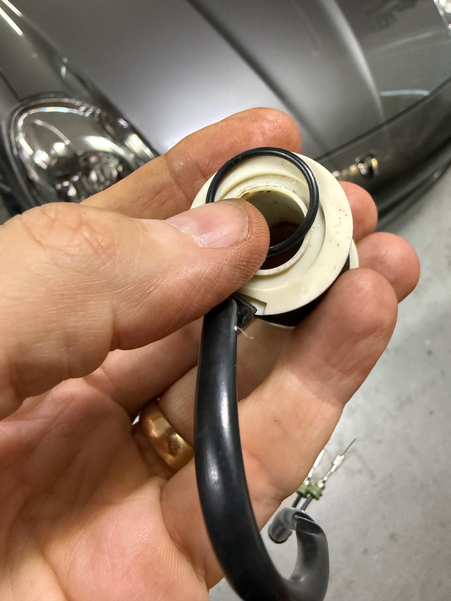

### 6.2 Spool Removal

Chisel the metal canister open to release the spool valve. This can be done by using a narrow screwdriver or a narrow chisel to bend the flange of the metal canister away and free the spool valve. Don’t bend the lip any more than necessary to free the cap. It doesn’t need to move very far!

The spool valve has one EPDM o-ring.

[https://youtube.com/shorts/j9rQX0YJPk4?si=E624CSxj9UoQWmQq](https://youtube.com/shorts/j9rQX0YJPk4?si=E624CSxj9UoQWmQq)

## 7. Repairs

If the coil shows an open circuit or dead short, go to the coil wiring paragraph below.

If the solenoid sticks when hot, or shows an unstable Null Current in techstream, go to the bench testing paragraph below.

### 7.1 Coil Wire

Wiring repairs on the coil are pretty easy to fix (after the solenoid is disassembled) albeit a little small to work on. The two black wires are soldered to copper winding conductors and taped to the surface of the coil. If one is pulled loose, just solder it back. Then wrap some electrical tape around the coil. Go over and under the soldered ends to keep them separated.

### 7.2 Sticky Spool

If the solenoid is sluggish or jammed, it is usually due to the steel plunger getting stuck in the “top hat”. However it’s also possible that crud or loose particles are jamming up the motion of the spool.

This spool was rusted and stuck inside the valve body. I chucked it into my drill, and spun it, while scrubbing with some scotchbrite for a few seconds. It worked fine after reassembly.

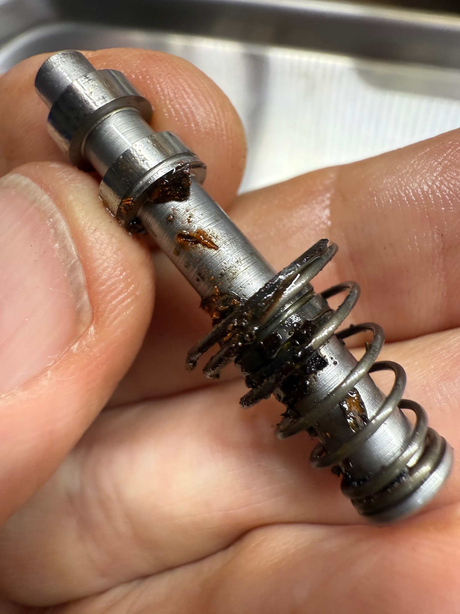

#### 7.2.1 Cycling the Solenoid

It may be possible to free the spool without disassembly by submerging the spool valve (solenoid tip only) in a cup of brake fluid, and energizing the solenoid repeatedly to extend and retract the spool. This may free up the spool, if it was stuck due to small contaminants or particles. To attempt this, you can use an [adjustable 12v turn-signal relay](https://www.amazon.com/dp/B0CJLVSSJY?ref_=ppx_hzsearch_conn_dt_b_fed_asin_title_1&th=1) to cycle power to the solenoid, while holding the tip of the solenoid in some brake fluid.

#### 7.2.2 Exercising the Spool

Another idea without disassembling the solenoid, is to energize the coil and push on the spool repeatedly by hand. This seemed to free up the solenoid on one repair I did, allowing it to move with lower amperage. Insert a 2.5mm drill bit into the tip of the solenoid. It will slide inside the spool and bottom out. Keep the coil energized with 12v, while you push the drill bit in and out of the solenoid a few dozen times by hand, overcoming the force of the electromagnet. This will cycle both the spool and armature through their entire stroke, and possibly flush out any contaminants or particles.

#### 7.2.3 Sanding the Top-Hat Bushing

The last option is to chisel the top hat out, and check/fix the steel plunger clearance inside the sleeve bushing. [https://youtube.com/shorts/j9rQX0YJPk4?si=dudPXwCtIfQHa3Rq](https://youtube.com/shorts/j9rQX0YJPk4?si=dudPXwCtIfQHa3Rq)

After the top-hat is removed, you can insert the armature (plunger thing) into the top-hat and see if it is too tight. The armature must be free to move via electromagnetic force.

Use some 400 grit sandpaper on your pinkie finger tip to sand the inside diameter of the bushing in the top hat. Check the fit periodically. You should not need to sand it for more than maybe 10 minutes. Flush any crud from the remainder of the solenoid while it’s apart. Note that there is another EPDM o-ring still inside the solenoid, so don’t use petroleum products to flush the interior of the solenoid.

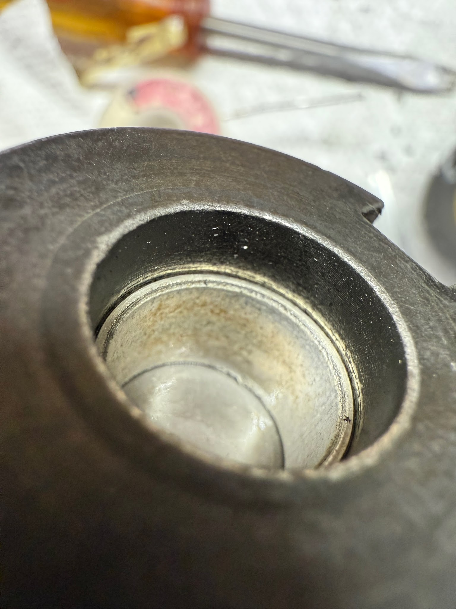

The last two solenoids I repaired, I used a dremel with a home-made flapper wheel to slightly open up the bushing ID. (400 grit sandpaper taped to a dremel tip.)

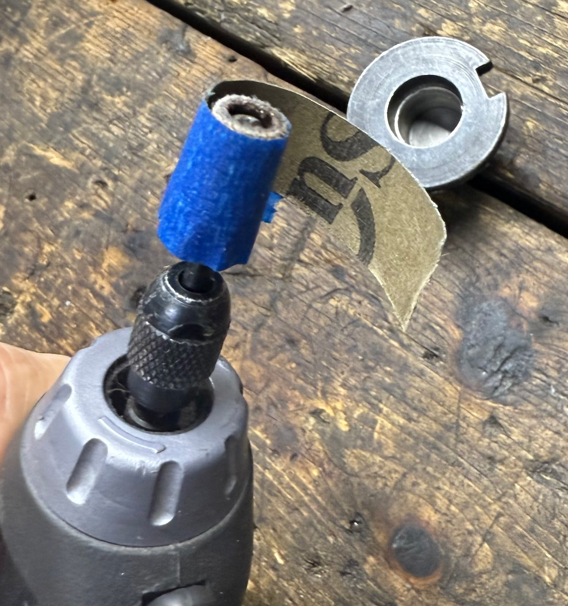

## 8. Reassembly

Watch for the tiny silver washer on the armature (coil plunger) and get it back where it belongs. (photos below) Dig out the two o-rings and clean them up or replace them with new EPDM o-rings (18.77mm x 1.78mm work fine). Scrub up the inside of the canister if there is rust where the o-ring needs to seal. I used some hemostats and a chunk of scotchbrite to scrub the bottom of the canister. Use some assembly lube like Dupont MolkyKote \#111 Compound to hold the o-rings in their grooves as you reinstall the coil.

You can grind and re-chamfer the edge so the steel top-hat with a grinding wheel to make the existing chamfer a little bigger. This will make room for a larger bent lip on the canister, plus allow it to bend in a slightly different spot to avoid cracking the canister (barrel).

Clamp the entire solenoid, end-to-end to compress the internal o-rings as you hammer the canister lip closed. Hold a heavy hammer on one side of the barrel as you hit the opposite side with a lighter hammer to work the lip back into position. (Like doing sheetmetal body work). Finish up by tapping the lip straight down to clamp the cap tightly. [https://youtube.com/shorts/tg23eDBYT-M?si=SV1a5SwiHujTe8El](https://youtube.com/shorts/tg23eDBYT-M?si=SV1a5SwiHujTe8El)

### Spool

Reinstall the o-ring, or replace it with a new EPDM o-ring (18.77mm x 1.78mm). Hammer the flange tight same as above: Clamp the length of the solenoid to compress it together and squeeze the o-ring. While it’s clamped, hammer the flange back to trap the spool valve.

### Caution

After chiselling the coil barrel apart to remove the top hat or the spool and valve - check the overall length of the reassembled solenoid. **Solenoid overall length must be 4.02-4.03 inches.**

I had one solenoid that measured 4.06 inches overall, and it would not function properly - until I discovered that the barrel was not tightly hammered onto the top-hat. It would compress a little (.030 inches!) when I squeezed it in a bench vice. This solenoid functioned perfectly after I clamped it in a vice, while doing some more aggressive hammering on the coil barrel.

This video outlines the internal parts and reassembly:

[https://youtu.be/b1yjvBsOGPM](https://youtu.be/b1yjvBsOGPM)

### Caution

If your freshly repaired solenoid will not be reinstalled in a car promptly, you must keep them very dry! The solenoid has an internal steel spring that will rust and seize the spool. I have my repaired solenoids tucked away in a covered jar with dessicant.

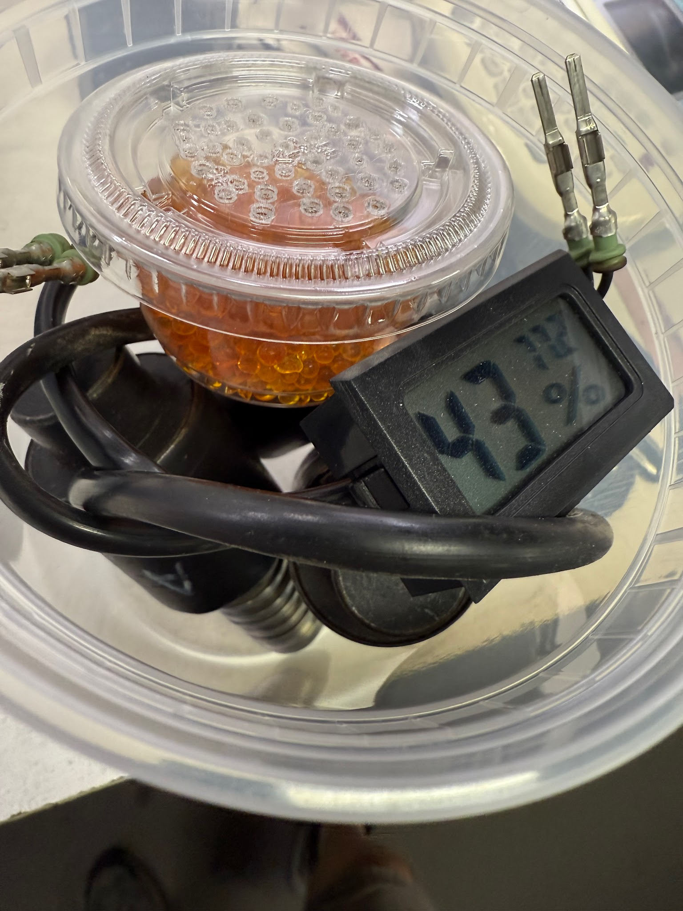

## 9. Photos

On the HPU, the “Master” solenoid is the upper one, and Clutch solenoid is the lower.

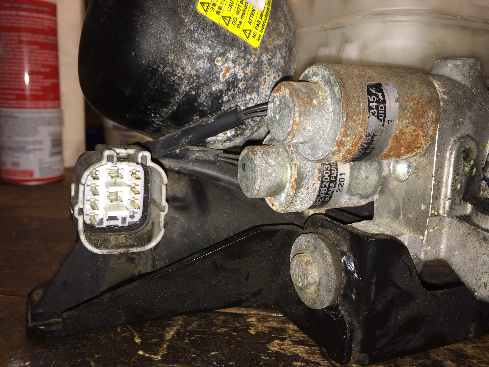

On the GSA, the “shift” solenoid is higher. The “select” solenoid is lower, directly adjacent to the clutch actuator. 

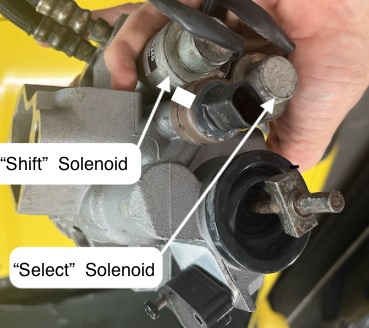

Here is a disassembled (and destroyed) solenoid. Notice the thin metal canister (barrel) that houses the coil, and the very rusty portion of the spool valve adjacent to the flange. The metal flange on the spool valve case is very thick, so it can tolerate some pretty aggressive smashing with a screwdriver and hammer to remove it from the HPU housing. The thin canister cannot tolerate abuse, be gentle with it. The electrical wires are absolutely delicate. Do not pull or twist them. The silver “armature” is barely visible at the top of the photograph. Sorry this photo does not show the steel “top hat” that belongs at the very top of the photo.

---

*Publication status: Initial conversion 0.1. Formatting and cursory editorial check only; detailed technical review is pending.*