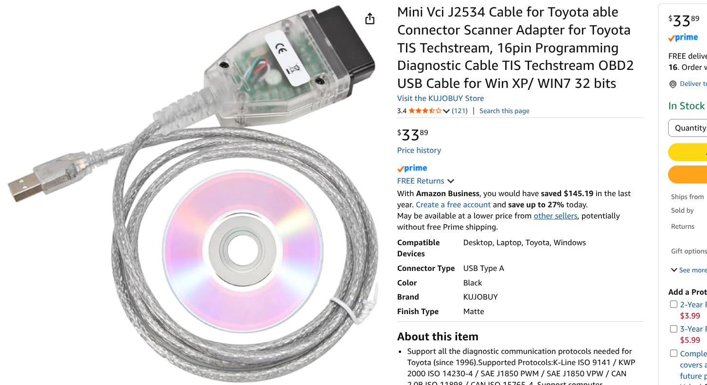
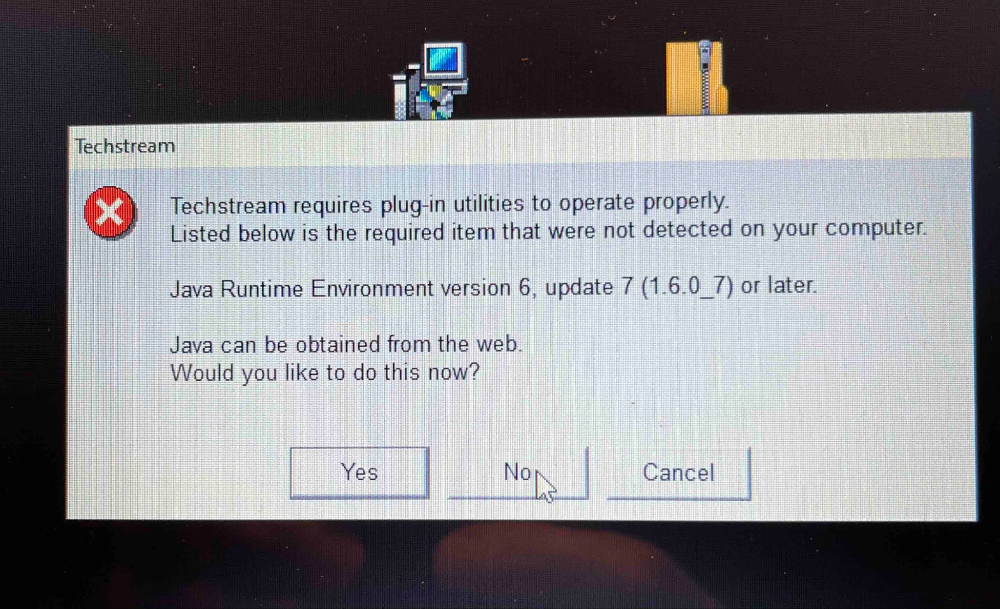
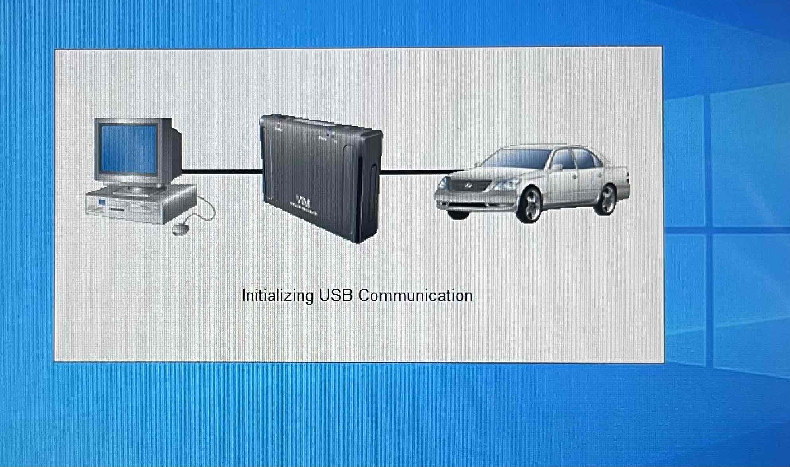
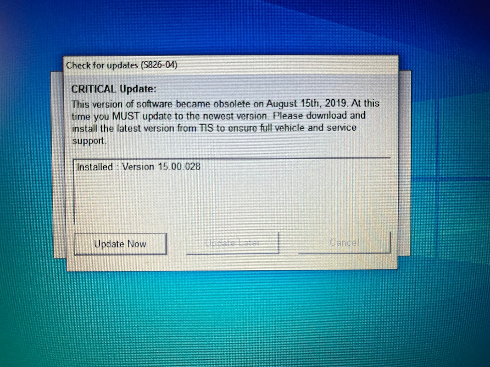
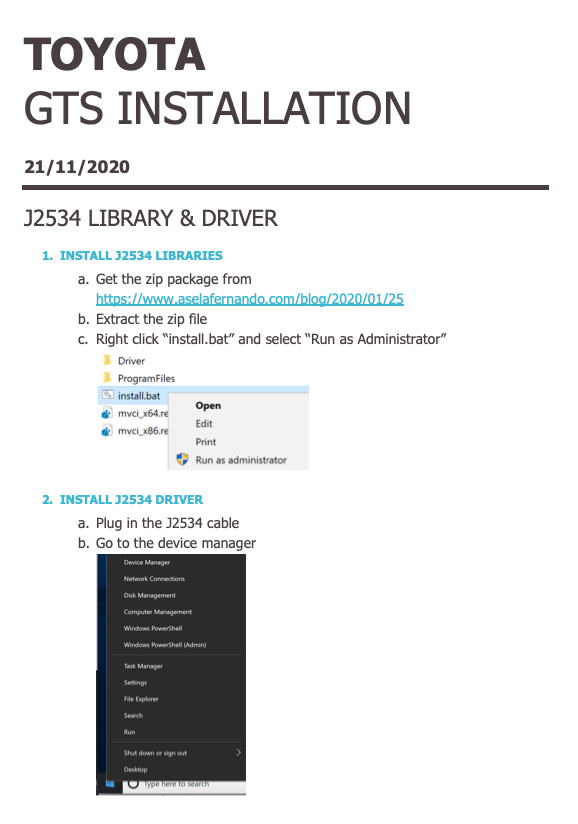
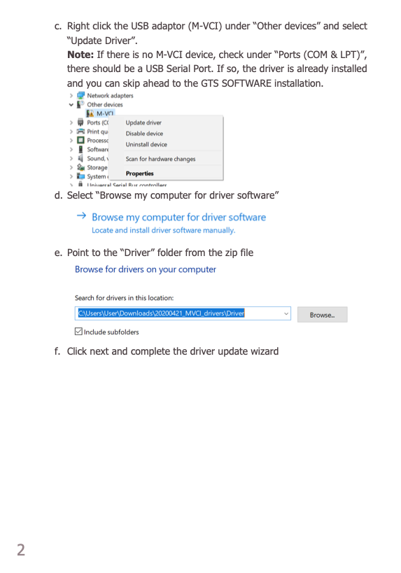
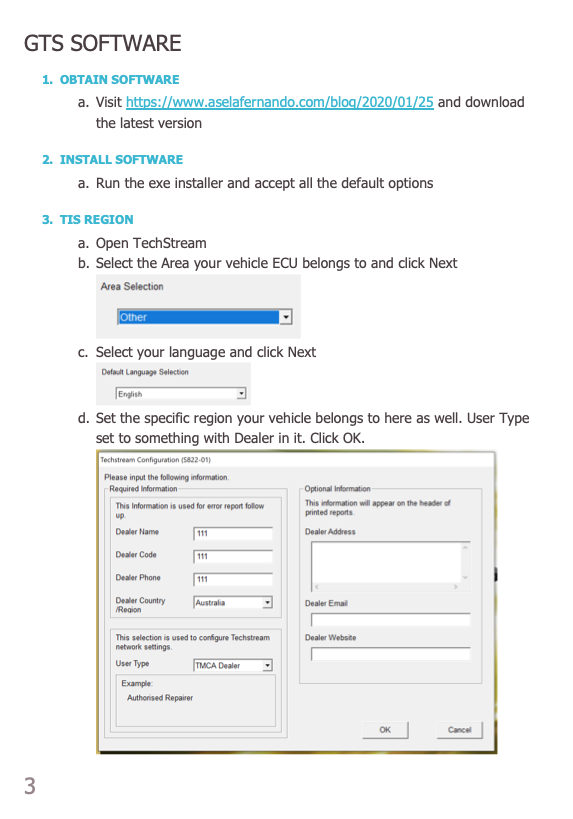
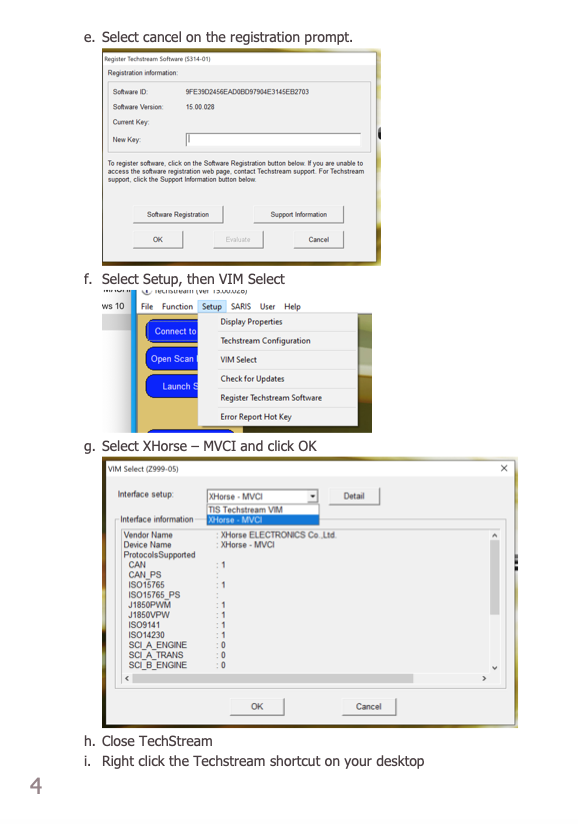
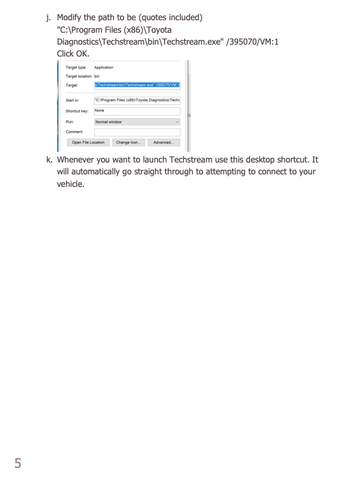

[← Chapter index](../README.md)

# Copy of Asela Fernando’s Techstream Installation Instructions

This procedure shows how to download a copy of Techstream software directly from Toyota’s website. Then download a batch file that Asela wrote. The batch file bypasses the registration screen (and the \$\$\$ fee). I think this method is safer than using the chinese software that comes with the J2534 cable from Amazon. I’ve read that those discs can be loaded with spyware.

Note: it’s best to run this software on a spare / old windows laptop that is dedicated for that purpose. You need to set the computer’s date-clock to something like 2005 to fool the software. It’s also helpful to keep the laptop’s WiFi access turned off so it won’t keep prompting you to download a newer version.

### Techstream File and Drivers Download: [here](https://www.aselafernando.com/files/20211208_MVCI_drivers.zip)

### Asela’s Instructions

[**https://www.aselafernando.com/files/Toyota%20GTS%20Installation.pdf**](https://www.aselafernando.com/files/Toyota%20GTS%20Installation.pdf)

Per Asela, his batch file will work fine with Windows 7,8,10 and 11. It will work on 32 or 64 bit laptops.

Update Jan 2026:

Asela has revised his installation procedures here: [Link](https://www.aselafernando.com/files/Toyota%20Techstream%20Installation%2020251229.pdf). I have not used his updated procedures or his updated batch file. I believe some of the manual steps have been streamlined and automated. If so, then some of my tips below will not be needed. I’ll update my tips as soon as I try his new process.

---

## My Notes and Tips

### OBD Cable from Amazon

Mini Vci J2534 Cable for Toyota... [https://www.amazon.com/dp/B07ZCC8QG9?ref=ppx_pop_mob_ap_share](https://www.amazon.com/dp/B07ZCC8QG9?ref=ppx_pop_mob_ap_share)

### Warning Message: “Download Blocked Due to Virus Protection”

Windows11 has a nasty blocker. I had to hit “tamper protection”, then turn off “real time protection” and “cloud-delivered protection”. I had to leave them off until AFTER I downloaded the zip file drivers, and until after I had extracted all the zipped files.

The first step in Asela’s instructions is to “Extract the zip file”. I had trouble with this step. Click on the “Extract/Compressed Folder Tools” bar on top of the window and look for the “extract all files” button. (If you don’t extract the files, the X-horse file will not show up under setup/VIM select. I wasted about an hour with this step!)

The next step is to run the “install” file “run as administrator”. I did not have any “run as administrator” option. Stuck…because I had failed to “extract the files” first!! Simply running this batch file (without “running as administrator” will NOT get the job done.) If “run as administrator” does not appear as an option when you right click on the install.bat file, then you have not correctly extracted the files from the zip folder. Go back, and extract the files.

**Warning message: “Windows protected your PC”**. Hit the “more info” highlighted text. Then hit the “run anyway” button. Warning message: “ Do you want to allow this app to make changes…” - Hit “Yes” button.

Instructions say to “download the latest version of Techstream, and run the .exe installer. “ The file will be named something like GTS_SetupEU_V17… and show as an “application” type file. That’s the executable file you want.

### Techstream “Setup” Step Problems

Instructions say to select “X-Horse M-VCI” from the “setup” pulldown tab. However “X-Horse M-VCI” did not appear in the Techstream/Setup pull-down. So I ran the install.bat file again, but THIS time I ran the installation as administrator (like the instructions say), and the system gave me warnings about virus and unsafe software. That fixed it! “X-Horse M-VCI” then appeared in the pulldown under “Setup” per the instructions.

### “Java Runtime Required” Error Message

Ignore this. Hit “no”.

### Tip Regarding Step 3 j

To edit the Techstream shortcut path, you must right click on the shortcut and scroll down to “properties”. It will open a window where you can edit the path. Make sure to type in the new path EXACTLY as written. Include spaces where they are shown. Once I failed to leave the space where shown and the shortcut would not work. Solution: Type the new shortcut path exactly as Asela shows!

Ie: (...techstream.exe” MUST INSERT ONE SPACE HERE /395070…),

You must type over a portion of the path (was mainmenu.com = change to techstream.com), plus add the right slash /395070… type everything EXACTLY as instructed.

### Tip Regarding USB Communication

If Techstream will not connect to the car (gets stuck on the “initializing USB Communication” screen show below), then perform the “update driver” steps again. (Steps 2c, 2d, 2e, and 2f).

### Cable

Order a “VCI J2534 cable for TIS Techstream” about \$45 from Amazon, ebay…or about \$5 from Aliexpress. It usually has a clear plastic case on the plug and the cable. The search terms seem to be “J2534”, “VCI”, and “Toyota”. I’d recommend NOT installing the software that may be provided on a disc, and shipped with your cable. Rumors they are filled with spyware. I think it’s safer to follow Asela’s instructions and download a clean copy from Toyota, then use his batch file to bypass the log-in screens.

### Critical Update Error

When you run techstream, you may get an error saying “this version is obsolete”. It will try to force you to register a new version of techstream. Bypass this error by changing the system clock/time on your laptop to an old date like 1990. Turn off the “automatically update time/date” option on your laptop.

Note, Old versions of Techstream will work fine on our 20 year old Spyders! Also note: Recent copies of Techstream will also allow you to change settings and read codes on a Lexus.

Here is the “obsolete version” error message:

## Asela’s Techstream Instructions — Reference Copy

## Alternative Download

I got his link from a Toyota 4 Runner site. I have not tried it. Please let me know if it works!

https://forum.ih8mud.com/threads/how-to-techstream-in-5-minutes.1034923/

---

*Publication status: Initial conversion 0.1. Formatting and cursory editorial check only; detailed technical review is pending.*
