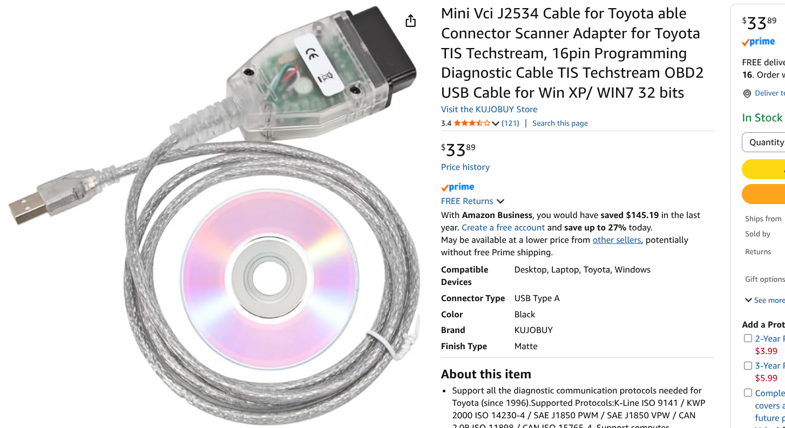
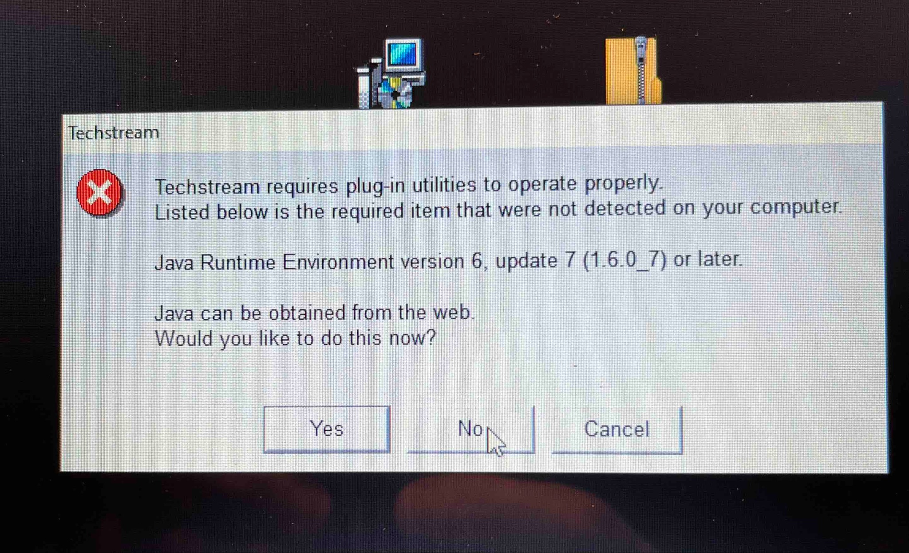
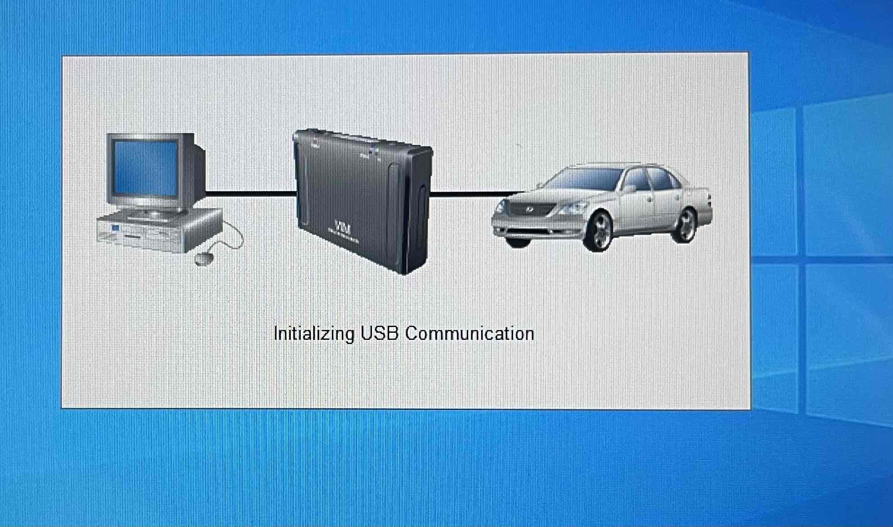
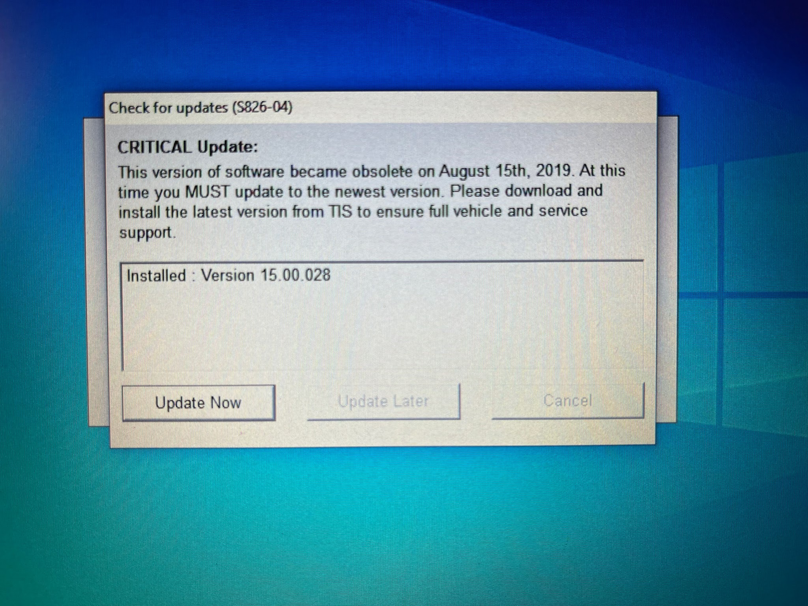

# SMT - Techstream Installation 

[Return to index](../README.md)

This procedure shows how to download a copy of Techstream software directly from Toyota’s website. 

Then download and run a batch file that Asela wrote. The batch file bypasses the registration screen (and the \$\$\$ fee). I think this method is safer than using the chinese software that comes with the J2534 cable from Amazon. I’ve read that those discs can be loaded with spyware.

It’s best to run this software on a spare / old windows laptop that is dedicated for that purpose. You need to set the computer’s date-clock to something like 2005 to fool the software. It’s also helpful to keep the laptop’s WiFi access turned off so it won’t keep prompting you to download a newer version.

### Techstream File links, Drivers Download and Instructions: [here](https://www.aselafernando.com/files/20211208_MVCI_drivers.zip)

Asela's batch file will work fine with Windows 7,8,10 and 11. It will work on 32 or 64 bit laptops.

---

## My Notes and Tips

### OBD Cable from Amazon

Mini Vci J2534 Cable for Toyota... [https://www.amazon.com/dp/B07ZCC8QG9?ref=ppx_pop_mob_ap_share](https://www.amazon.com/dp/B07ZCC8QG9?ref=ppx_pop_mob_ap_share)

### Techstream “Setup” Step Problems

Instructions say to select “X-Horse M-VCI” from the “setup” pulldown tab. However “X-Horse M-VCI” did not appear in the Techstream/Setup pull-down. So I ran the install.bat file again, but THIS time I ran the installation as administrator (like the instructions say), and the system gave me warnings about virus and unsafe software. That fixed it! “X-Horse M-VCI” then appeared in the pulldown under “Setup” per the instructions.

### “Java Runtime Required” Error Message

Ignore this. Hit “no”.

### Tip Regarding USB Communication

If Techstream will not connect to the car (gets stuck on the “initializing USB Communication” screen show below), then perform the “update driver” steps again. (Steps 2c, 2d, 2e, and 2f).

### Cable

Order a “VCI J2534 cable for TIS Techstream” about \$45 from Amazon, ebay…or about \$5 from Aliexpress. It usually has a clear plastic case on the plug and the cable. The search terms seem to be “J2534”, “VCI”, and “Toyota”. I’d recommend NOT installing the software that may be provided on a disc, and shipped with your cable. Rumors they are filled with spyware. I think it’s safer to follow Asela’s instructions and download a clean copy from Toyota, then use his batch file to bypass the log-in screens.

### Critical Update Error

When you run techstream, you may get an error saying “this version is obsolete”. It will try to force you to register a new version of techstream. Bypass this error by changing the system clock/time on your laptop to an old date like 1990. Turn off the “automatically update time/date” option on your laptop.

Note, Old versions of Techstream will work fine on our 20 year old Spyders! Also note: Recent copies of Techstream will also allow you to change settings and read codes on a Lexus.

Here is the “obsolete version” error message:

## Alternative Download

I got his link from a Toyota 4 Runner site. I have not tried it. Please let me know if it works!

https://forum.ih8mud.com/threads/how-to-techstream-in-5-minutes.1034923/

---

[Return to index](../README.md)
