[← Chapter index](../README.md)

# Tighten and Repair the Soft Top Latches

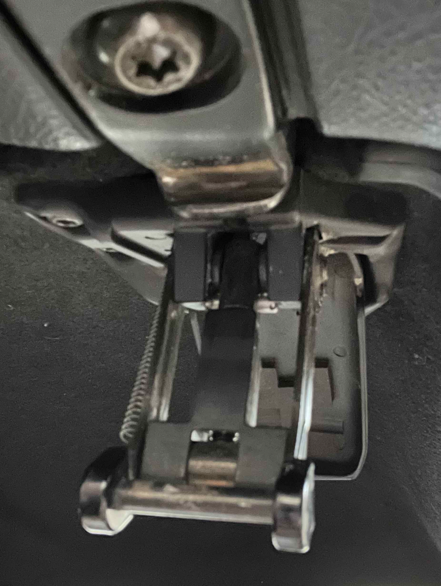

**Written by Cyclehead21@gmail.com**

**Feel free to share, copy, and duplicate**

**Just give me a little credit**

## Contents

- Tighten latches
- A: Barrel adjuster
- B: Latch range mod
- C: Latch nub repair

## Tighten the Latches (Increase Travel)

### A: Barrel Adjuster

If you need your latches to pull the top tighter to the windshield frame, you can tighten them by turning the hex sided barrel nut.

1.  Open the latch, pull the plastic lock away using your fingers. It is hinged at the bottom.

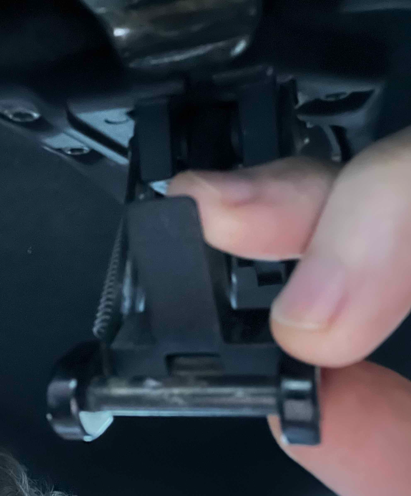

2.  When it’s out of the way, you can see the long barrel nut with hex sides.

3.  Turn the hex to tighten or loosen the latch.

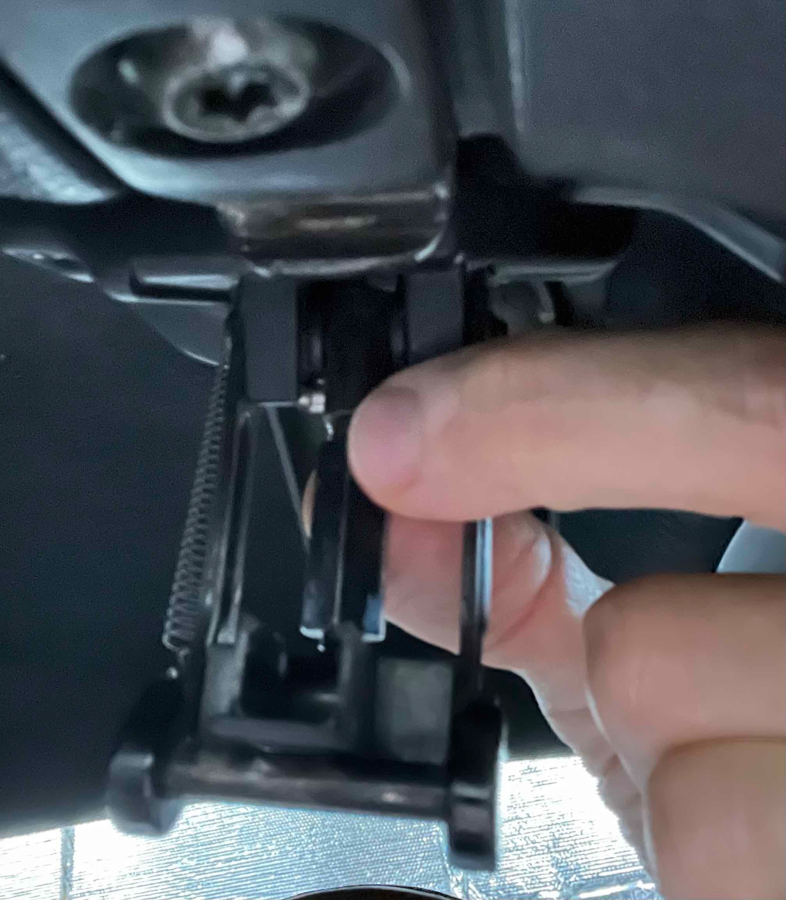

### B: Latch Range Mod

If your latch is still too loose, you can disassemble the latch and get some extra travel (pulling the top down even tighter). The latch can be disassembled without removing it from the car. Pry the round push-nut off using a small screwdriver. Try not to mangle it so you can reinstall it when you’re finished.

Pull the pin (that had the push nut installed) and remove the pivoting hook arms and barrel adjuster.

Unthread the parts of the barrel adjuster and start grinding.

There seem to be three limits you get by cutting on things. \#1 is the least amount of extra travel. \#3 is the most extra travel.

1\. Grind the adjuster barrel to about 1.12 inch overall length. This will get you about .08 inch extra travel.

2\. Grind the adjuster barrel to about 1.08 inch overall length. To take advantage of the shorter barrel, you also need to grind the tip of the reverse-thread bolt. (Because it will bottom out inside the adjuster barrel if you don’t). I didn’t measure how much to grind the end of the bolt. Just thread it into the barrel and see if it bottoms out. If so, grind a little more. This will get you about .12 inch extra travel.

3\. Grind both parts as above, but also extend the length of the slots. If you keep grinding the tip of the reverse-thread bolt, you will eventually exceed the range of the slots. To get extra travel, you’ll need to lengthen the slots (on the meaty end of course).

Tips:

Break the edges of the threads on the barrel adjuster with a countersink tool. They’ll have shards that will make it hard to thread the reverse-thread bolt.

I re-used the push nuts. If they’re too bent, you can flatten them with pliers for more bite.

Pictures below….

Pry off the push nut

Remove the pin

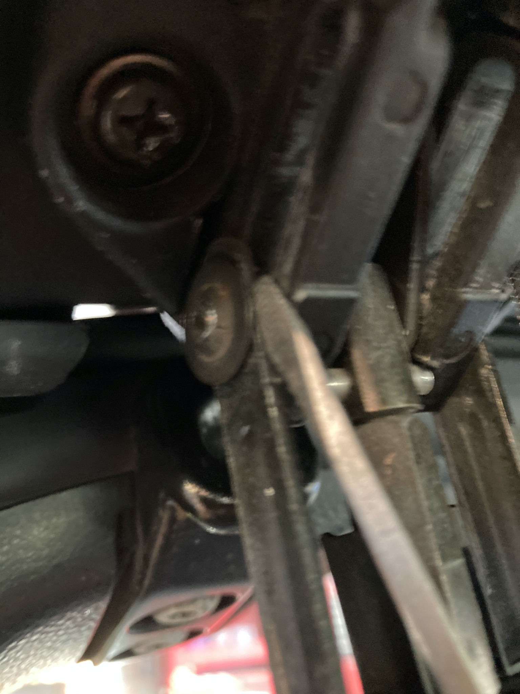

Remove the pivot hook arms

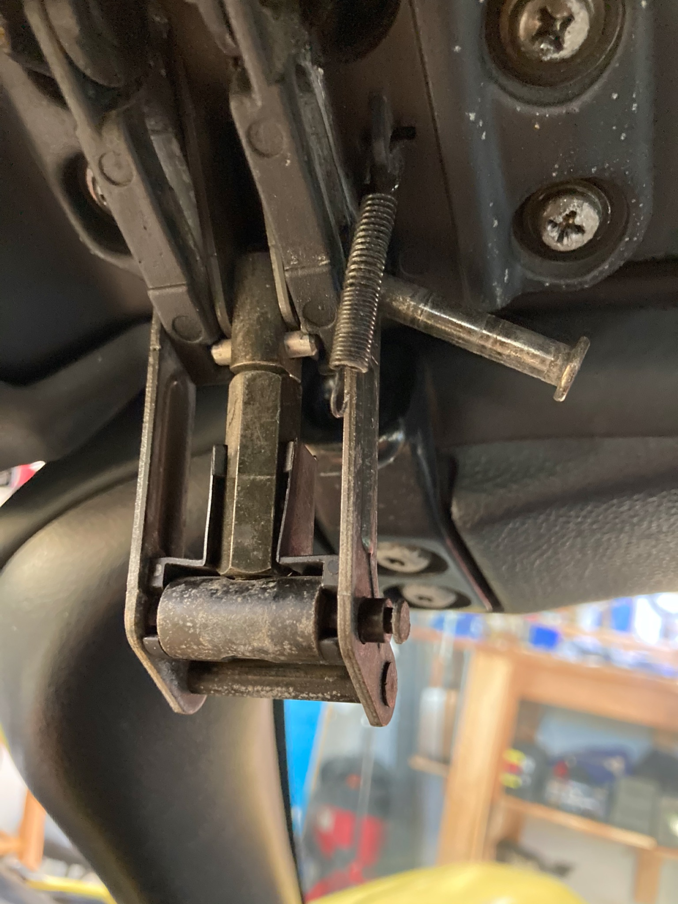

The barrel adjuster nut

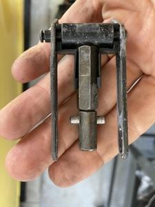

Adjuster barrel before and after trimming

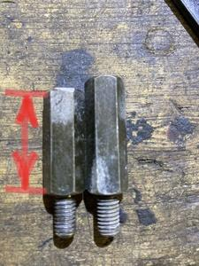

Break the sharp edges of the threads

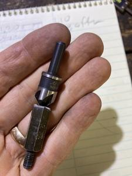

Trim the end of the reverse-thread bolt (so it won’t bottom out inside the barrel adjuster)

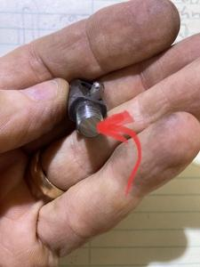

Extend the length of the slot cutout to get the maximum travel

(I did a sloppy job, but it seemed to work fine)

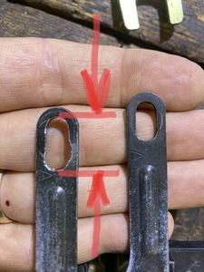

Reinstalling the old press nut, a small socket and a giant pair of channel locks works well.

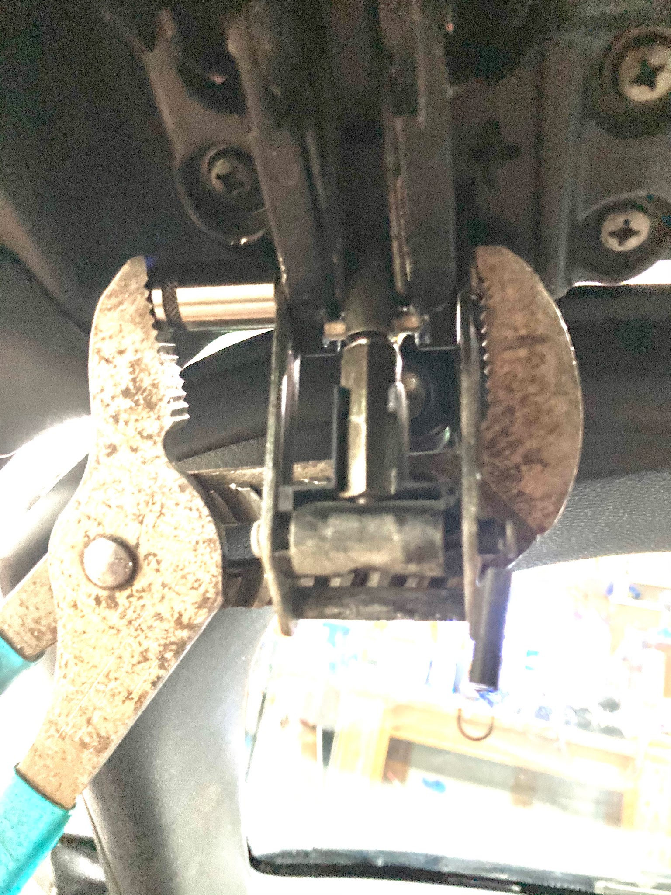

Add a little grease in the tracks to make the latch work more smoothly

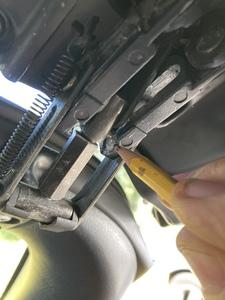

## C: Latch Nub Repair

### How to Repair a Worn Out Latch Nub

**(Created by Mike V. Thanks Mike!)**

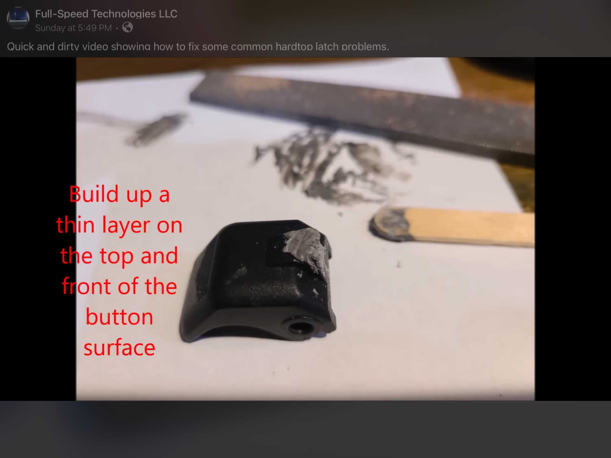

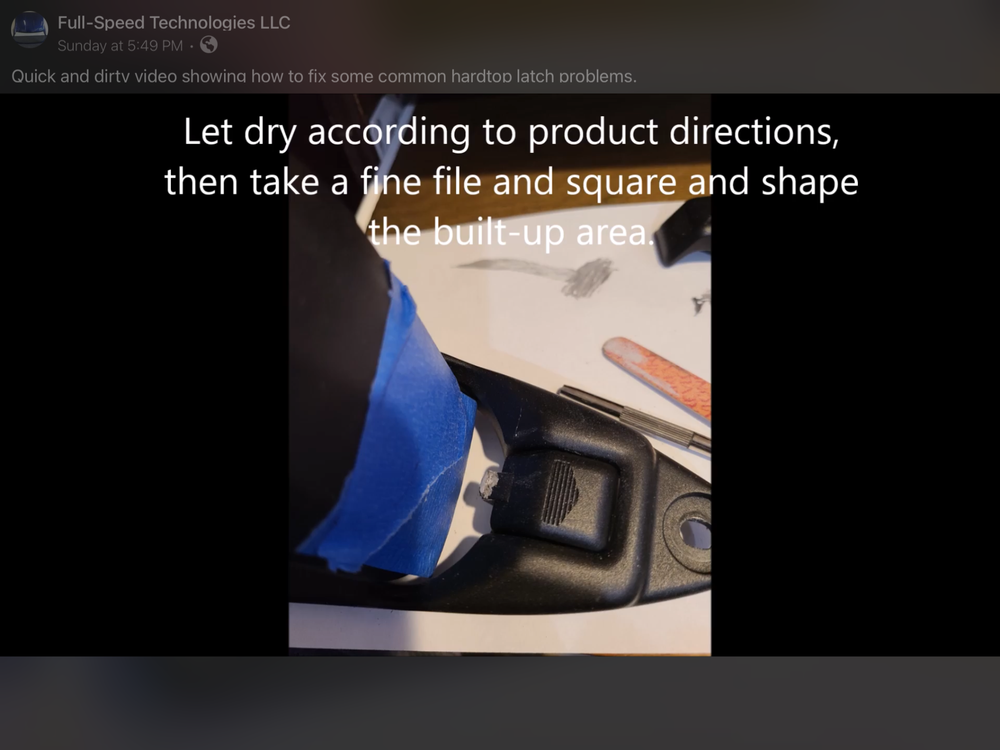

---

*Publication status: Initial conversion 0.1. Formatting and cursory editorial check only; detailed technical review is pending.*
