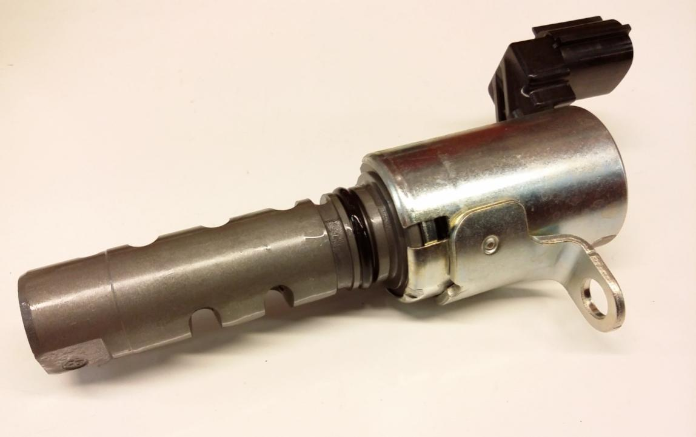
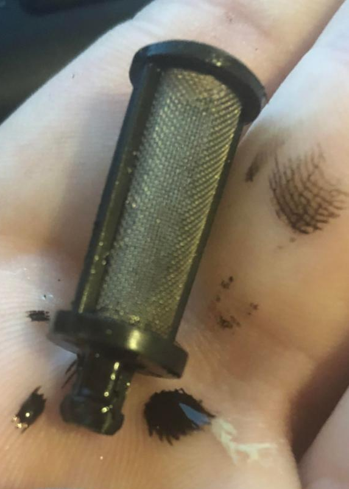
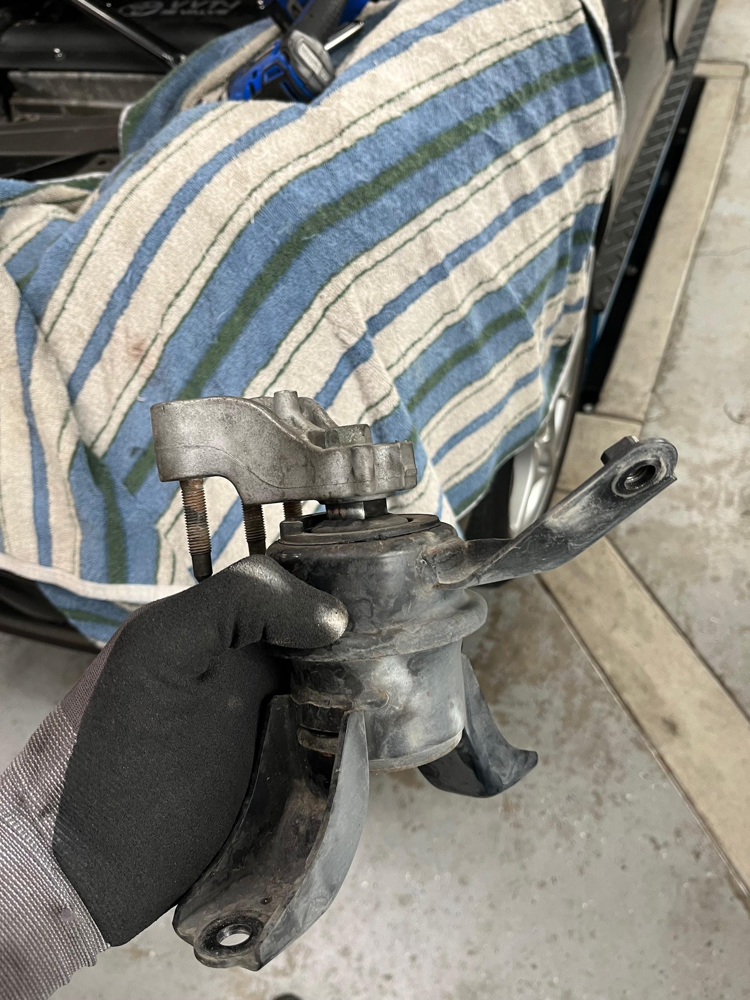
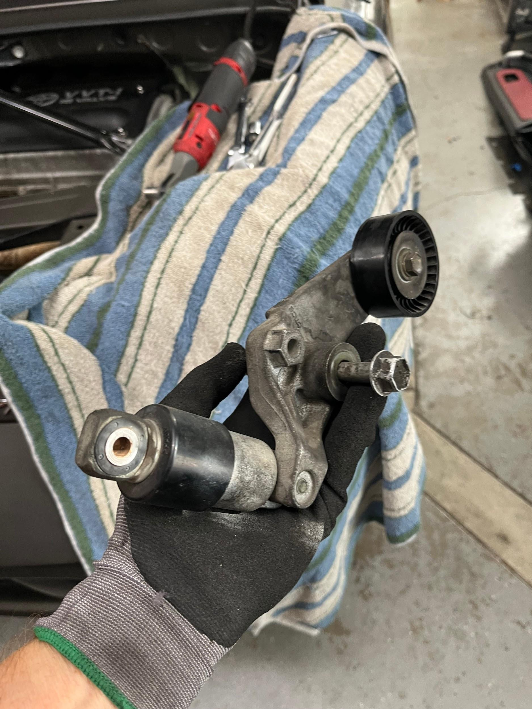
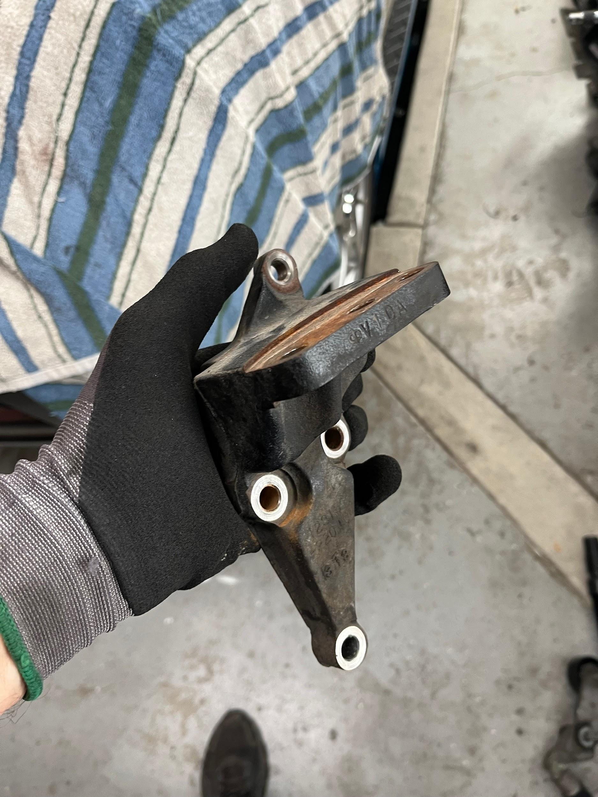
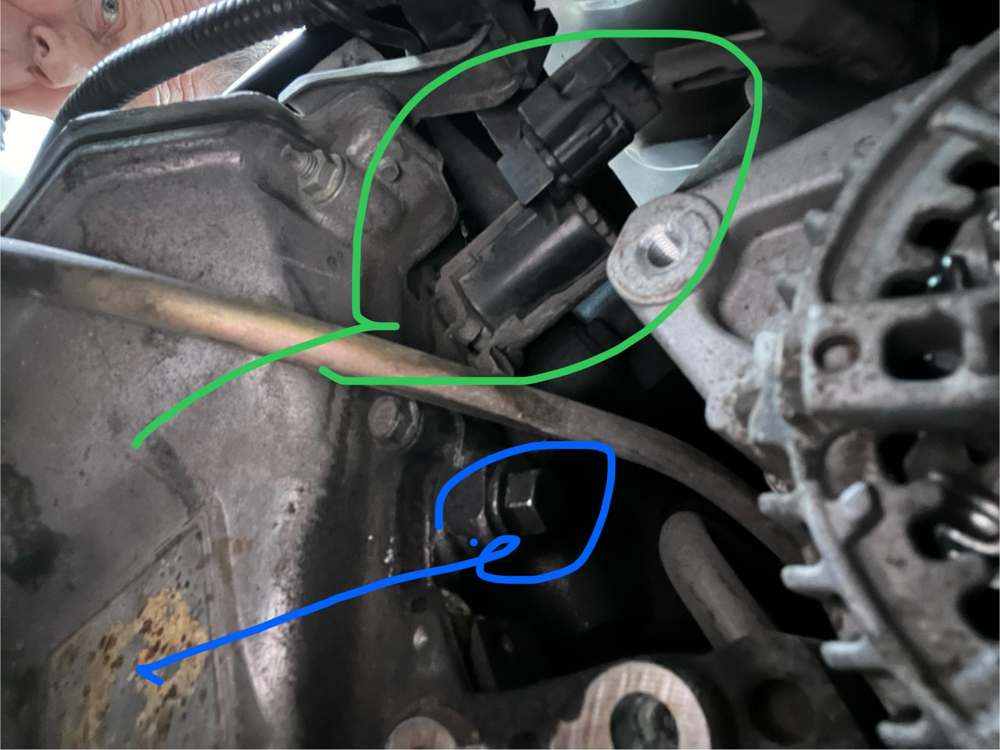

# VVTi Solenoid and Filter

## To replace solenoid only

Remove electrical connector from the solenoid. Remove one 10 mm bolt. Remove the solenoid, replace and reassemble.

## How to remove VVTi filter and solenoid

1. Support the right side of the engine with a jack and wood block under the oil pan.
2. Remove the RH engine mount tripod
   - 3 nuts 14 mm, reach from below with deep well socket
   - 3 bolts 14 mm (two inside engine compartment, one inside RH wheel well)
3. Remove the serpentine belt
4. Remove the serpentine belt idler arm and shock absorber
5. Remove the RH engine mounting plate attached to the engine block
   - 3 bolts 14 mm
   - 1 nut 12 mm
6. NOW you can reach the 14 mm VVTi filter cap, and the 10 mm nut holding the VVTi solenoid
7. Unclip the electrical connector on the VVTi solenoid

You can cycle the solenoid on the bench with 12 V.

The VVTi filter is a tiny cylindrical oil screen. If it doesn’t come out with the cap - you can grab it with some small pliers or hemostats.

## Problem

I had a rattle coming from the right side of the car.

Videos:

- <https://youtube.com/shorts/48Hkj3pupf0>
- <https://youtube.com/shorts/B7M4GpQZqHg>

It was so loud and intense that I thought something was banging against the sheetmetal firewall behind the passenger seat. I could feel the vibrations when I touched the sheetmetal by the fuel pump access door. It was random at mid-range RPM, but very loud at 4200 RPM while feathering the throttle. It would quit when I applied throttle.

In desperation, I removed the VVTi solenoid and filter. The filter was clean but I rinsed it with brake cleaner and blew it off anyway. The solenoid looked fine so I cycled it maybe 10 times on the bench with 12 V, wiped it off and reinstalled it.

Magically the noise went away!

## VVTi filter

Toyota Part Number: **15678-21010**

<https://www.amazon.com/dp/B01GOQJX0Q?psc=1&ref=ppx_yo2ov_dt_b_product_details>

## VVTi solenoid

Toyota Part Number: **13540-22022**

<https://www.amazon.com/dp/B06XH2FH4V?psc=1&ref=ppx_yo2ov_dt_b_product_details>

## Photographs

Remove the engine mount tripod

Remove the serpentine belt idler arm

Remove the engine mount plate from the engine block

VVTi filter is under the 14 mm cap (blue). VVTi solenoid is held by one 10 mm bolt (green)

