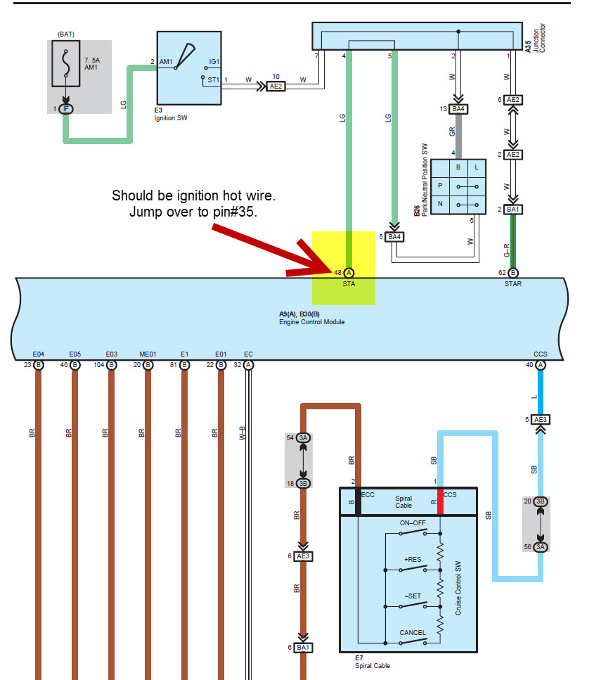
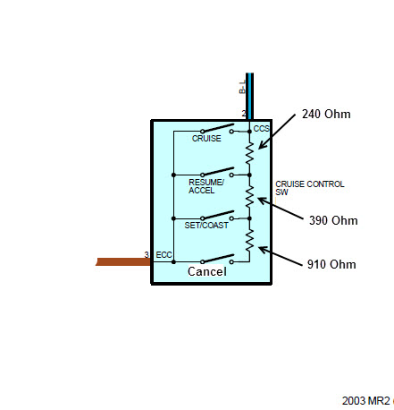
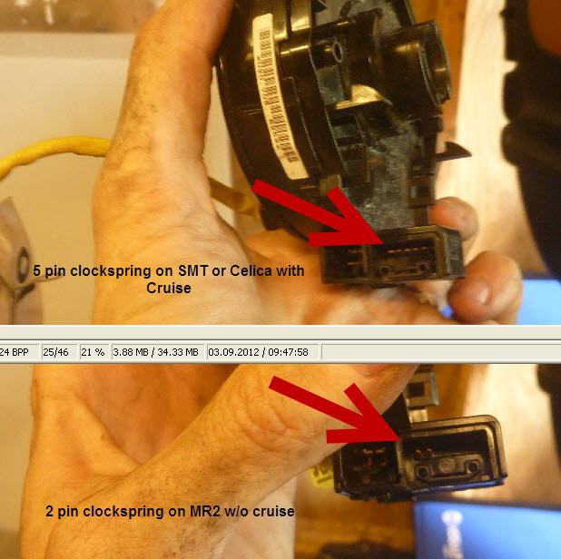
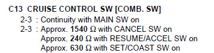
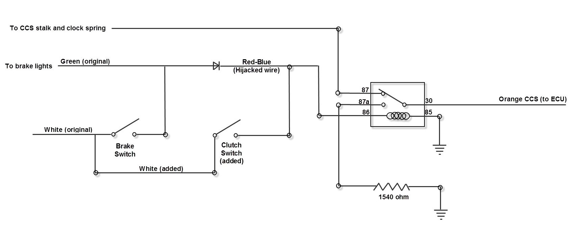
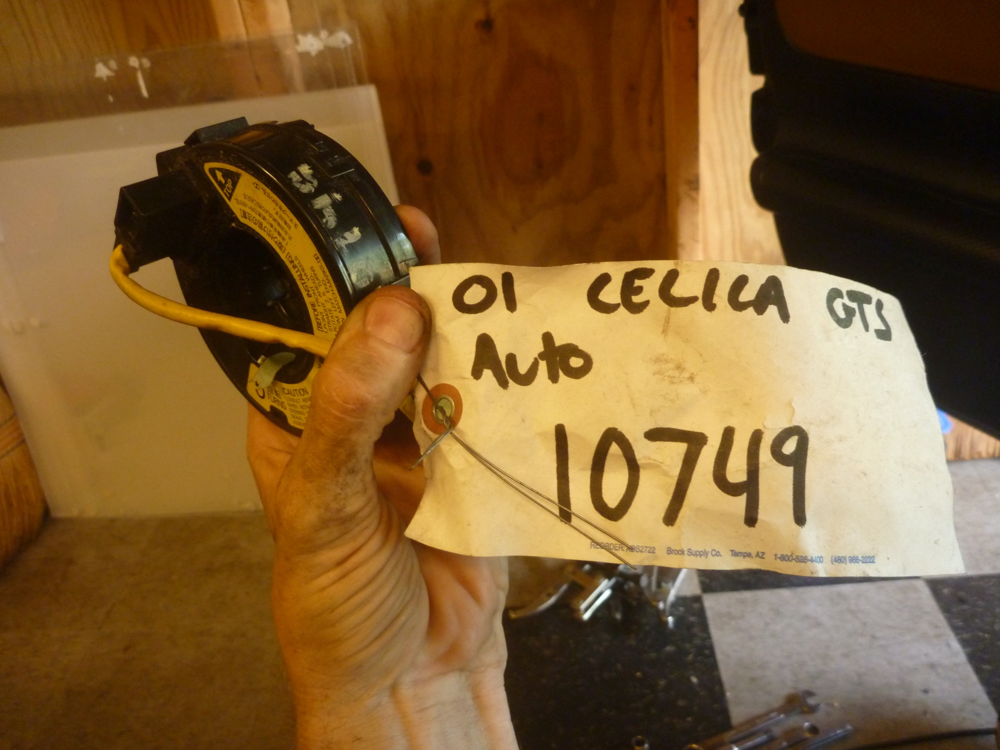

[← Chapter index](../README.md)

# Wiring Notes for Cruise Control

## SMT Clock Spring

84306-32030

### Also Used In

| 12/1999-12/2004 | TOYOTA MR2 | ZZW30                    | 84-01: SWITCH & RELAY & COMPUTER |                                  |
|-----------------|-------------------|--------------------------|----------------------------------|----------------------------------|
|                 | 08/1999-06/2005   | TOYOTA CELICA     | ZZT23\*                          | 84-01: SWITCH & RELAY & COMPUTER |
|                 | 11/2000-04/2007   | TOYOTA HIGHLANDER | ACU2\*,MCU2\*                    | 84-01: SWITCH & RELAY & COMPUTER |
|                 | 08/2000-10/2005   | TOYOTA RAV4       | ACA2\*                           |                                  |

ECU has one white wire for cruise input into 2GR ECU.
It wants the signal from the cruise stalk – ground to turn on/off; three different resistances to toggle set/cruise/cancel.

ECU also wants a hot from brakes to pause the cruise.

ECU also wants an interrupt-the-12V-from-brakes to pause the cruise (normally hot 12V).

My idea is to run 12v (switched on with ignition) to the brakes-hot ECU input; and leave the 12V-when-braking pin empty at the ECU.

My circuit switches a 1540 ohm resistor into the CCS wire circuit, whenever the clutch or brakes are pressed.

I wired this by adding a switch to the clutch pedal, then wiring the brake and clutch switches together with a diode. Diode prevents clutch from lighting up the brake lights. Either brake or clutch pedal activates a relay. Relay runs normally straight through to carry the signals from cruise stalk. When energized with clutch or brake, the relay switches over to a fixed 1540 ohm resistors, to match the “cancel” signal that would normally come from the cruise stalk.

I hijacked one red-blue wire at the brake switch. Spyder wiring is funny, portions of the wire harness have everything you need for the cruise circuit from the clock spring down to the driver’s kick panel. Then the wires disappear at a connector junction – a wire you need goes into the connector, but doesn’t come out. Red-blue at the brake light was nonfunctional (only two pins in the brake switch – but four wires). Red-blue terminated at LH kick panel.

Final output from the relay and clutch/brake/diode circuit is one orange wire that runs to the engine compt. It carries signal from the cruise stalk, unless you hit the brake or clutch, when the orange wire will switch to 1540 ohms to put the cruise into “cancel”. I added a relay in the LH kick panel.

If you ever need to replace the clutch switch, a four-pin switch is not required. Only two pins are used. Brake switch uses two pins only.

While I was under the dash, I removed the dashboard switch that controlled power to the 1ZZ ECU. (required manual switching every time you start/stop the engine). Replaced the switch with a relay.

I also cut out and resoldered a few feet of extra wire cluttering up the place. Tidied up the wire bundle feeding into the engine bay, and wrapped some antichafe tubing around the through-hole.

## MR2 Spyder CCS Resistance Values

## Celica Cruise Switch Resistance Values (?)

## Homemade Circuit for Brake/Clutch Kill Inputs

---
